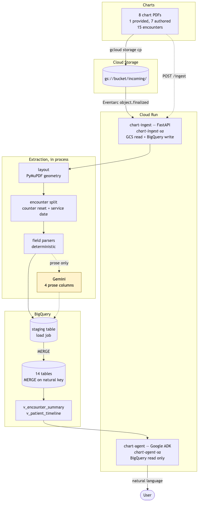

# Clinical Document Ingestion Pipeline

Orthopedic chart PDFs → a queryable BigQuery warehouse → a conversational agent.

GCS → Cloud Run → BigQuery, with a Google ADK agent answering questions in plain
language over two curated views.



*Diagram source: [`docs/architecture.mmd`](docs/architecture.mmd), rendered
inline in [`docs/architecture.md`](docs/architecture.md).*

## What this does

A chart PDF lands in Cloud Storage. Eventarc wakes a FastAPI service on Cloud
Run, which reads each page by **geometry** rather than by reading order, splits
the document into the encounters it actually contains, extracts every
high-stakes fact deterministically, calls Gemini once per encounter for four
prose-derived columns and nothing else, validates every row through Pydantic, and
`MERGE`s the result into BigQuery on keys derived from clinical identity — so
re-ingesting the same chart, or a re-export that overlaps it, updates rows
instead of duplicating them.

Three things in the provided chart shaped the whole design:

- **One PDF is not one visit.** The sample is a single five-page export holding
  two encounters, with the page counter restarting at the boundary. The grain of
  the warehouse is the encounter, never the document.
- **The left rail carries two different kinds of fact.** The medication list
  changes between visits — meloxicam is absent in July and present in August
  because it was prescribed in between — so it is stored per encounter. The
  medical, surgical, family and social history beside it does not change, so it
  is stored per patient. Same six inches of paper, two different grains.
- **Extraction is positional, not textual.** The header prints its labels on one
  row and their values on the row beneath. Flattened to text it reads
  `... MRN: 4820917 Male ...` where that number is the *PMS ID*. It is right on
  this chart only because both identifiers happen to carry the same value.

## Results

| | |
| --- | --- |
| Charts ingested | 8 — 1 provided, 7 authored — 31 pages |
| Patients / encounters | 8 / 15 |
| Deterministic accuracy, authored corpus | **100.0%** (584/584 scored fields) |
| Deterministic accuracy, **provided chart** | **90.2%** (74/82) |
| LLM-derived accuracy | not scored without Vertex AI credentials — see below |
| Tables / views | 14 / 2 |
| Tests | 303 passing, 5 more against live BigQuery |
| Extraction errors across all 8 charts | 0 |

The provided chart is the number that means something: it is the only chart this
project did not generate. Its ten-point gap is one deliberate refusal, explained
in [`eval/report.md`](eval/report.md) and in [decision 14](docs/decisions.md).

## Quickstart

### 1. Local — no cloud account needed

```bash
python3.11 -m venv .venv && source .venv/bin/activate
pip install -r requirements.txt -r requirements-dev.txt

pytest                       # 307 tests, including the provided chart end to end
python scripts/run_local.py  # every chart through the real pipeline, no GCP
python -m eval.accuracy      # regenerates eval/report.md
```

`scripts/run_local.py` runs the shipped extraction code over all eight charts
and applies the same merge contract the warehouse uses — `rows_for()` and
`MERGE_KEYS`, the declarations that drive BigQuery — into an in-memory
warehouse. It prints the row counts, the recorded gaps, and re-ingests
everything twice (once verbatim, once under different file names) to show the
counts do not move.

> **macOS:** rendering the corpus needs Pango and Cairo —
> `brew install pango cairo gdk-pixbuf libffi`, then run with
> `DYLD_FALLBACK_LIBRARY_PATH=/opt/homebrew/lib`. Without them
> `tests/test_render.py` skips itself. Nothing else needs them, and nothing
> deployed renders a PDF.

### 2. Google Cloud

Full walkthrough, including IAM and the failure modes worth expecting, in
**[DEPLOYMENT.md](DEPLOYMENT.md)**. The short version:

```bash
cp .env.example .env          # fill in GCP_PROJECT_ID and GCS_BUCKET
set -a; source .env; set +a

./scripts/setup_infra.sh      # APIs, bucket, dataset, two service accounts
./scripts/apply_ddl.sh        # 14 tables, 2 views, drug-class seed
./scripts/deploy_ingest.sh    # Cloud Run + Eventarc trigger
./scripts/deploy_agent.sh     # ADK agent, read-only service account

gcloud storage cp charts/source/*.pdf charts/generated/*.pdf \
  "gs://$GCS_BUCKET/incoming/"
```

Dropping a PDF into `gs://$GCS_BUCKET/incoming/` ingests it automatically.

## Asking questions

```bash
adk run agent           # or open the deployed service's UI
```

The four question kinds the brief names, with the answers **measured** from the
shipped corpus. Full set including grounding traps, with the SQL for each, in
[`eval/questions.md`](eval/questions.md).

**A fact about one patient.** *"What was Trey Barlow prescribed at his July
visit?"* → meloxicam 15 mg tablet PO, 1 po qd for 2 weeks then PRN, quantity 30,
2 refills, at the 2025-07-23 visit. "Trey Barlow" appears nowhere in the chart
except inside the parentheses of `BARLOW, TREMAINE (Trey Barlow)`.

**An aggregate across the population.** *"How many patients presented with knee
complaints?"* → 1 patient, 3 encounters. Grouped on `body_region_effective`,
which prefers the region decoded from the ICD-10 code over the model's reading,
so the answer does not depend on whether the classifier ran.

**An open question about the practice.** *"What are the most common conditions
we treat, and how do we usually treat them?"* → right knee osteoarthritis
(M17.11, 3 encounters, meloxicam and acetaminophen), right shoulder pain
(M25.511, 2, meloxicam), severe right hip osteoarthritis (M16.11, 2,
acetaminophen and celecoxib), lumbar disc herniation (M51.16, 2, methocarbamol,
gabapentin, tramadol).

**A question spanning more than one table.** *"Which patients on an
anti-inflammatory had imaging on the same day?"* → 5 encounters. Only Mari
Delacroix was *already* taking one (ibuprofen); the other four were prescribed
one that day. The view answers both readings separately, and resolves the drug
class from the seeded `ref_drug_class` table so nothing has to know from memory
that meloxicam is an NSAID.

**A trap it must not fall into.** *"What was Trey Barlow's blood pressure at his
first visit?"* → "not recorded". That vitals row has height, weight, BMI and BSA
and nothing else, because the chart left the other cells blank. The agent is
instructed never to read an absence as a normal reading.

## The corpus

Eight charts: the provided sample, plus seven authored here.

**How they were made.** Each authored chart is a JSON spec under
`corpus/specs/`. The clinical prose in those specs — presenting complaints, HPI
narratives, imaging interpretations, plans — was **drafted with an LLM and then
edited by hand** for internal consistency (dates, laterality, drug/diagnosis
agreement). The physical exam is *templated*, not authored: `corpus/exam.py`
fills a per-region template and the spec overrides only the abnormal findings,
which is how the source EMR fills an exam too. Rendering is fully deterministic —
`corpus/render.py` drives Jinja2 and WeasyPrint, and an unchanged spec re-renders
byte-identically.

```bash
python -m corpus.render corpus/specs/chart_0*.json --out charts/generated
```

**They are built to look like the sample's system**, because §5.2 asks for that:
the same section labels (`Chief Complaints:`, `HPI: This is a NN year old …`,
`Vitals:`, `Exam:`, `Tests`, `Impression/Plan:`, `Note:`, `Staff:`,
`Electronically Signed By:`), the same left rail (`Medications`,
`Medical History`, `Musculoskeletal History`, `Musculoskeletal Family History`,
`Musculoskeletal Surgery`, `Surgical History`, `Social History`), the same
bordered vitals table with its merged BMI/BSA cell, the same two-column exam,
the same repeating header band and footer. `tests/test_render.py` asserts those
labels are present, so the corpus cannot drift away from the sample silently.

Coverage against §5.2: seven distinct regions (knee, lumbar spine, wrist, foot,
hip, elbow, cervical spine); two charts with three visits and three with one;
one operative note; one chart seen by a different provider; and three deliberate
imperfections — a chart with no vitals table, one with no phone number, one with
no imaging section.

## Technology choices

| Choice | Alternative | Why |
| --- | --- | --- |
| **PyMuPDF** for extraction | Document AI / Form Parser | These PDFs are real text, not scans, so OCR buys nothing and costs per page. PyMuPDF gives exact glyph coordinates, which is what the header grid and the sparse vitals table actually require. A Form Parser would need a labelled training corpus that does not exist here, and its output would be probabilistic where an MRN must not be. Document AI becomes the right answer the moment a chart arrives scanned — noted in [decisions](docs/decisions.md). |
| **Deterministic parsers** for identity, codes, doses | LLM extraction of everything | Being wrong about a refill count is unacceptable, and a model cannot promise not to be. The LLM writes four nullable columns of prose classification and nothing else. |
| **Gemini via Vertex AI**, structured output, temperature 0 | Free-form prompting | An enum-constrained schema makes out-of-vocabulary answers rejectable rather than plausible. |
| **BigQuery load job + MERGE** | Streaming inserts | Rows in the streaming buffer are not reliably visible to `MERGE`, so the same chart ingested twice would sometimes duplicate — intermittently, and only under load. |
| **Buildpacks** (`--source .`) | A Dockerfile | No local Docker daemon, no base image to keep patched. `.python-version` pins the runtime so PyMuPDF gets a wheel. |
| **Two Cloud Run services** | One service | Different IAM: the ingester needs GCS read plus BigQuery write, the agent needs BigQuery read only. |
| **Google ADK** | A hand-rolled tool loop | Mandated by the brief, and its function-calling and dev UI are what make the agent demonstrable without a frontend. |

## Documentation

- [Deployment](DEPLOYMENT.md) — GCP setup, IAM, verification, teardown
- [Handoff](HANDOFF.md) — repo tour, current state, what is left, how to pick it up
- [Schema](docs/schema.md) — grain per table, every column, what NULL means
- [Architecture](docs/architecture.md) — components, both trigger paths, where failures go
- [Decisions](docs/decisions.md) — the non-obvious calls and what each costs
- [Accuracy](eval/report.md) — measured, field by field, split by method
- [Questions](eval/questions.md) — the four question kinds with measured answers

## Testing

```bash
pytest                                   # 307 tests, no credentials needed
pytest -m golden -v                      # just the provided chart, end to end
python -m eval.accuracy                  # regenerates eval/report.md
RUN_LIVE_TESTS=1 pytest tests/test_warehouse_live.py   # needs GCP + a sourced .env
```

Four of these carry most of the weight:

**`tests/test_golden_sample.py`** runs the whole extractor against the provided
chart and asserts facts printed on its pages — the two encounters and their page
ranges, the sparse vitals row that must not shift, the medication snapshot that
differs between July and August, the exam findings that must not swap sides.
Nothing here generated that PDF, so it is the only test that can say whether the
parser generalises.

**`tests/test_pipeline.py`** covers what must hold for every chart: a missing
section still lands with the gap recorded, every child row points at an
encounter that exists, re-extraction produces identical keys, a re-export under
a different name reuses every clinical key, and a stubbed classifier changes the
four LLM columns and *nothing else* — asserted by diffing full row dicts.

**`tests/test_schema_contract.py`** reads `sql/ddl/schema.sql` directly and fails
if a model field, a merge key, or `docs/schema.md` drifts from it. A load job
matches on column name, so a drifted field lands NULL rather than raising:
nothing else would catch it until a query came back empty.

**`tests/test_warehouse_live.py`** is the only one that can prove idempotency
against BigQuery itself, because load-job visibility to `MERGE` and the
streaming-buffer caveat are properties of the service rather than of this code.

## Assumptions and limitations

- **Seven of eight charts are self-generated**, rendered from the specs they are
  scored against, so parser and generator share layout assumptions. What bounds
  it: the provided chart is scored by the same harness against a hand-labelled
  truth file; the authored charts carry deliberate imperfections; and
  `follow_up_interval_days` is scored against an author-declared integer that is
  never rendered. `eval/report.md` states the residue plainly.
- **The LLM-derived columns are not scored in the committed report.** Scoring
  them needs a Vertex AI call; without credentials they are NULL, and publishing
  a 0% would report a missing API key rather than a classifier. The harness and
  ground truth for all four are in place — `python -m eval.accuracy --llm`. The
  deterministic `primary_body_region` exists so population questions do not
  depend on that call having run.
- **No agent transcript is committed.** The answers above are computed from the
  warehouse the pipeline produces, not recorded from a model turn. Running the
  agent needs credentials; see [HANDOFF.md](HANDOFF.md).
- **`write_document` is not atomic.** Each table merges in its own statement, so
  a warehouse failure mid-document can leave it half-written. The run is recorded
  `failed` and re-ingesting converges, but wrapping the merges in a single
  BigQuery transaction is the correct fix and is not done.
- **`patient_id = mrn`** is correct for one practice. A multi-practice deployment
  would key on `(practice_id, mrn)`.
- **Signature timestamps are stored as printed.** The provided chart stamps a
  clinic-local zone (CDT) that a single-site warehouse has no reason to convert.
- **`icd10_description` is the chart's wording**, not a canonical label; group
  conditions by `icd10_code`. A seeded `ref_icd10` table would fix it.
- **The parser refuses one fact the ground-truth file asserts** — a prescription
  at the August visit whose dosing the page never prints. See
  [decision 14](docs/decisions.md).
- **Not built:** de-identification (the corpus is synthetic by construction),
  CI/CD, monitoring and alerting, a frontend beyond the ADK dev UI, and any
  handling of scanned or image-only PDFs — every chart here is real text.

## Data handling

Every record in this repository is synthetic. The provided sample chart is
de-identified and fictional; the seven additional charts were authored for this
assessment as described under **The corpus** above. No real patient data appears
at any stage.

No project IDs, bucket names, dataset names or credentials are committed — see
[`.env.example`](.env.example) for the variable names.
`ingestion/config.py` is the only module that reads them, and
`tests/test_schema_contract.py` fails if a deployment literal appears anywhere in
shipped source.
