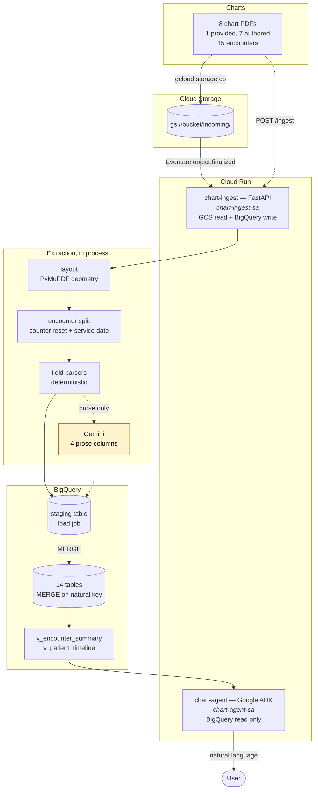

# Architecture

## The path a chart takes

1. A PDF is copied into `gs://<bucket>/incoming/`.
2. Eventarc fires `object.finalized` and posts a CloudEvent to `POST /events` on
   the `chart-ingest` Cloud Run service. The same work is reachable at
   `POST /ingest` for backfill and re-runs.
3. The service downloads the object and runs extraction in-process:
   - **layout** turns each page into three regions — header band, sidebar rail,
     body — using the page's own whitespace rather than fixed offsets;
   - **encounter split** groups pages into visits on two independent signals,
     the page counter resetting to 1 and the date of service changing;
   - **field parsers** read identifiers, vitals, diagnoses, prescriptions,
     imaging, medications, follow-up and exam findings deterministically;
   - **Gemini** is called once per encounter, at temperature 0, for four prose
     columns and nothing else.
4. Every row is validated through Pydantic. A row that fails validation is
   dropped and recorded; the rest of the document still lands.
5. Rows are written to a per-run staging table with a **load job**, then
   `MERGE`d into the target tables on their natural keys. Derived columns that
   span documents — `encounter_seq`, `drug_class`, `first_seen_date` — are
   recomputed warehouse-wide afterwards.
6. The `chart-agent` service, a Google ADK `LlmAgent`, answers questions over
   two curated views. It never reads the base tables and never re-reads a PDF.

## Why two Cloud Run services

They need different IAM. The ingester needs GCS read and BigQuery write; the
agent needs BigQuery read only, and runs under its own service account with
exactly that. They also scale and fail differently: ingestion is bursty,
minutes-long and retried; querying is interactive and cheap.

## Why both trigger paths

The brief leaves the trigger open and asks for justification, so both are built
onto one code path:

| Path | Used for | Failure behaviour |
| --- | --- | --- |
| Eventarc `object.finalized` → `POST /events` | production shape; a PDF lands, rows appear | **always 2xx** — a non-2xx makes Eventarc redeliver, and a deterministically failing chart would retry forever against live billing |
| `POST /ingest` | backfill, re-running a fixed parser, demos | 500 to the caller, who is a human and should see it |

Both call the same `ingest_object()`. Both record a row in `ingest_runs`
whatever happens, so a download that never produced a document is still visible
to SQL.

## Where failures go

| Failure | Behaviour |
| --- | --- |
| Unreadable file | `documents` row with `parse_status='failed'`, an `error` issue naming the exception, and no fabricated patient. Nothing raises. |
| Missing section | `warn` row in `ingestion_issues`; the encounter still lands |
| Field fails validation | `error` row; that field's row is dropped, the rest of the document lands |
| One bad encounter | guarded independently; its siblings are unaffected |
| Download or warehouse error | `ingest_runs` row with `status='failed'` and the exception text |

## Configuration

Project ID, dataset, bucket, region and model name appear in **no source file**.
They are read from the environment through `ingestion/config.py`, which is the
only module that knows they exist. The local run and the deployed service are
the same code with different environment variables, and `.env` is gitignored.

## What runs where

| Component | Where | Entry point |
| --- | --- | --- |
| Ingest service | Cloud Run (`chart-ingest`) | `ingestion/app.py`, via `Procfile` |
| Extraction | in the ingest process | `ingestion/extract/pipeline.py` |
| Warehouse writer | in the ingest process | `ingestion/warehouse.py` |
| Agent | Cloud Run (`chart-agent`) | `agent/agent.py` |
| Corpus renderer | developer machine only | `corpus/render.py` |
| Accuracy report | developer machine or CI | `eval/accuracy.py` |
