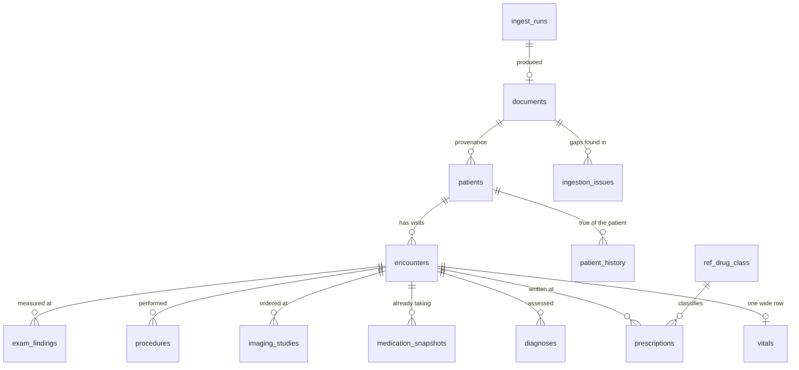

# Schema

Fourteen tables and two views in one BigQuery dataset. Every column below is
generated from [`sql/ddl/schema.sql`](../sql/ddl/schema.sql), which is the only
definition of the warehouse; `tests/test_schema_contract.py` fails if the DDL,
the Pydantic models and this document drift apart.

All data is synthetic.

## The shape of the model

## Grain, one line each

| Table | One row per… |
| --- | --- |
| `documents` | ingested PDF |
| `patients` | patient, natural key MRN |
| `encounters` | **visit — the spine of the model** |
| `vitals` | encounter (wide, every column nullable) |
| `diagnoses` | diagnosis within an encounter |
| `prescriptions` | prescription *written* at an encounter |
| `medication_snapshots` | (encounter × medication the patient was *already* on) |
| `patient_history` | (patient × history type × item) — **patient-level, not visit-level** |
| `procedures` | surgical procedure recorded at an encounter |
| `imaging_studies` | imaging study within an encounter |
| `exam_findings` | (encounter × body part × side × finding type × measure) |
| `ingestion_issues` | gap or failure detected while parsing a document |
| `ingest_runs` | ingest attempt, successful or not |
| `ref_drug_class` | drug (seed data) |

The encounter is the spine. Everything clinical hangs off a visit, because a
visit is what actually happened: a patient was seen on a date by a provider, and
facts were recorded.

## Why the grain is the encounter and not the document

One PDF is not one visit. The provided chart is a single five-page export
containing two encounters, with the page counter restarting at the boundary.
Keying anything on the document would have collapsed those two visits into one
row and lost the July → August progression that the chart exists to show.

The inverse also holds: a later export could contain both of those visits again
plus a third. Because `encounter_id = sha256(patient_id ‖ encounter_date ‖
provider_name)`, that export merges onto the two rows that already exist and
inserts one. Nothing about the file it arrived in enters the key.

## The one place the grain is *not* the encounter

The chart's left rail carries two different kinds of fact side by side, and they
are modelled differently on purpose.

**`medication_snapshots` is per encounter.** In the provided chart meloxicam is
absent from the July rail and present in the August one, because it was
prescribed in between. A patient-level medication list erases exactly that.

**`patient_history` is per patient.** A cholecystectomy, a family history of
knee replacement, a smoking status — these do not change between two visits
three weeks apart, and storing them per encounter would multiply one fact by
however many times the rail happened to reprint it.

Both are read from the same six inches of paper. Which grain each belongs at is
a judgment about the fact, not about the layout.

## What is NULL, and what NULL means

NULL means the chart did not record it. It never means zero, normal, or absent
in the clinical sense.

The provided chart's vitals table is the clearest case: it prints Ht, Wt, BMI
and BSA and leaves BP, Pulse, Resp, O2 Sat and Temp empty. Those five columns
are NULL for that encounter, and `ingestion_issues` does not complain, because
nothing went wrong — the clinic did not take them. The agent is instructed to
answer "not recorded in the chart" rather than to present the absence as a
normal reading.

Where a gap *is* notable — a whole missing section, an unreadable field, a
prescribing action with no printed dosing — a row lands in `ingestion_issues`
alongside the data, so "which charts are incomplete?" is a SQL question.

## Which columns a language model produced

Exactly four, all on `encounters`: `body_region`, `laterality`, `visit_type`,
`hpi_summary`. `llm_model` and `llm_confidence` describe that set of four and
nothing else. Every other column in every table is deterministically parsed.

This is stated as a rule rather than a per-column flag so the boundary is
unambiguous when reading a row, and `tests/test_schema_contract.py` asserts that
no other table carries those columns.

`diagnoses.body_region` and `diagnoses.laterality` are explicitly *not* in that
set: they are decoded from the ICD-10 code where the code carries the
information (M25.511 encodes right shoulder), and left NULL where it does not.
`v_encounter_summary` surfaces that deterministic value as
`primary_body_region`, so a population question never has to depend on whether
the classifier ran.

## Partitioning and clustering

`encounters` is partitioned by `encounter_date` and clustered by `patient_id`,
because every question in the brief filters by one or the other.

At fifteen encounters this makes no measurable difference and it would be
dishonest to imply otherwise. It is here because it costs nothing now, it is
the thing you would otherwise have to retrofit onto the one table that grows
without bound, and retrofitting partitioning means rewriting the table.

## Column reference

### `documents`

One row per ingested PDF. Provenance and audit anchor.

| Column | Type | Mode | Notes |
| --- | --- | --- | --- |
| `document_id` | STRING | REQUIRED | sha256 of the file bytes |
| `gcs_uri` | STRING | REQUIRED |  |
| `file_name` | STRING | REQUIRED |  |
| `file_bytes` | INT64 | NULLABLE |  |
| `page_count` | INT64 | NULLABLE |  |
| `mrn_from_filename` | STRING | NULLABLE | MRN parsed from the filename, for cross-check |
| `pms_id_from_filename` | STRING | NULLABLE |  |
| `ingested_at` | TIMESTAMP | REQUIRED |  |
| `ingest_run_id` | STRING | REQUIRED |  |
| `pipeline_version` | STRING | NULLABLE |  |
| `parse_status` | STRING | NULLABLE | ok \| partial \| failed |

### `patients`

One row per patient, natural key MRN.

| Column | Type | Mode | Notes |
| --- | --- | --- | --- |
| `patient_id` | STRING | REQUIRED | = MRN; single-practice key |
| `mrn` | STRING | REQUIRED |  |
| `pms_id` | STRING | NULLABLE |  |
| `legal_name` | STRING | NULLABLE | as printed, e.g. 'BARLOW, TREMAINE (Trey Barlow)' |
| `family_name` | STRING | NULLABLE |  |
| `given_name` | STRING | NULLABLE |  |
| `preferred_name` | STRING | NULLABLE | parenthetical name; required to answer 'Trey Barlow' |
| `date_of_birth` | DATE | NULLABLE |  |
| `sex` | STRING | NULLABLE |  |
| `phone_home` | STRING | NULLABLE |  |
| `phone_work` | STRING | NULLABLE |  |
| `first_seen_date` | DATE | NULLABLE |  |
| `last_seen_date` | DATE | NULLABLE |  |
| `source_document_id` | STRING | NULLABLE |  |
| `ingested_at` | TIMESTAMP | NULLABLE |  |

### `encounters`

One row per visit. The spine of the model.

*Partitioned by `encounter_date`, clustered by `patient_id`.*

| Column | Type | Mode | Notes |
| --- | --- | --- | --- |
| `encounter_id` | STRING | REQUIRED | sha256(patient_id, encounter_date, provider_name) |
| `patient_id` | STRING | REQUIRED |  |
| `encounter_date` | DATE | REQUIRED |  |
| `encounter_seq` | INT64 | NULLABLE | 1-based visit ordinal for this patient |
| `provider_name` | STRING | NULLABLE |  |
| `provider_role` | STRING | NULLABLE |  |
| `is_primary_provider` | BOOL | NULLABLE |  |
| `location_name` | STRING | NULLABLE |  |
| `chief_complaint_raw` | STRING | NULLABLE |  |
| `body_region` | STRING | NULLABLE | LLM-derived |
| `laterality` | STRING | NULLABLE | LLM-derived: left \| right \| bilateral \| none |
| `visit_type` | STRING | NULLABLE | LLM-derived: new \| follow_up \| post_op |
| `hpi_text` | STRING | NULLABLE |  |
| `hpi_summary` | STRING | NULLABLE | LLM-derived one-sentence summary |
| `note_text` | STRING | NULLABLE |  |
| `follow_up_interval_days` | INT64 | NULLABLE |  |
| `follow_up_raw` | STRING | NULLABLE |  |
| `signed_by` | STRING | NULLABLE |  |
| `signed_at` | TIMESTAMP | NULLABLE |  |
| `source_document_id` | STRING | NULLABLE |  |
| `source_page_start` | INT64 | NULLABLE |  |
| `source_page_end` | INT64 | NULLABLE |  |
| `llm_model` | STRING | NULLABLE | model behind body_region, laterality, visit_type, hpi_summary |
| `llm_confidence` | FLOAT64 | NULLABLE |  |

### `diagnoses`

One row per diagnosis within an encounter.

| Column | Type | Mode | Notes |
| --- | --- | --- | --- |
| `diagnosis_id` | STRING | REQUIRED |  |
| `encounter_id` | STRING | REQUIRED |  |
| `patient_id` | STRING | REQUIRED |  |
| `icd10_code` | STRING | NULLABLE |  |
| `icd10_description` | STRING | NULLABLE |  |
| `diagnosis_text` | STRING | NULLABLE |  |
| `is_primary` | BOOL | NULLABLE |  |
| `body_region` | STRING | NULLABLE | deterministic: ICD-10 lookup, else inherited from encounter |
| `laterality` | STRING | NULLABLE | deterministic: from the ICD-10 code where encoded |
| `source` | STRING | NULLABLE | impression \| imaging |
| `source_document_id` | STRING | NULLABLE |  |
| `source_page` | INT64 | NULLABLE |  |

### `prescriptions`

One row per prescription WRITTEN at an encounter.

| Column | Type | Mode | Notes |
| --- | --- | --- | --- |
| `prescription_id` | STRING | REQUIRED |  |
| `encounter_id` | STRING | REQUIRED |  |
| `patient_id` | STRING | REQUIRED |  |
| `drug_name` | STRING | NULLABLE |  |
| `strength` | STRING | NULLABLE |  |
| `strength_unit` | STRING | NULLABLE |  |
| `dose_form` | STRING | NULLABLE |  |
| `route` | STRING | NULLABLE |  |
| `sig_text` | STRING | NULLABLE |  |
| `quantity` | FLOAT64 | NULLABLE |  |
| `quantity_unit` | STRING | NULLABLE |  |
| `refills` | INT64 | NULLABLE |  |
| `duration_days` | INT64 | NULLABLE |  |
| `is_prn` | BOOL | NULLABLE |  |
| `drug_class` | STRING | NULLABLE | joined from ref_drug_class, never LLM-derived |
| `action` | STRING | NULLABLE | new \| modify \| continue |
| `source_document_id` | STRING | NULLABLE |  |
| `source_page` | INT64 | NULLABLE |  |

### `medication_snapshots`

One row per (encounter x medication the patient was ALREADY on). Sidebar list.

| Column | Type | Mode | Notes |
| --- | --- | --- | --- |
| `encounter_id` | STRING | REQUIRED |  |
| `patient_id` | STRING | REQUIRED |  |
| `medication_name` | STRING | REQUIRED |  |
| `strength` | STRING | NULLABLE |  |
| `strength_unit` | STRING | NULLABLE |  |
| `dose_form` | STRING | NULLABLE |  |
| `route` | STRING | NULLABLE |  |
| `source_document_id` | STRING | NULLABLE |  |
| `source_page` | INT64 | NULLABLE |  |

### `imaging_studies`

One row per imaging study within an encounter.

| Column | Type | Mode | Notes |
| --- | --- | --- | --- |
| `imaging_id` | STRING | REQUIRED |  |
| `encounter_id` | STRING | REQUIRED |  |
| `patient_id` | STRING | REQUIRED |  |
| `modality` | STRING | NULLABLE |  |
| `body_part` | STRING | NULLABLE |  |
| `laterality` | STRING | NULLABLE |  |
| `performed_date` | DATE | NULLABLE |  |
| `interpretation_text` | STRING | NULLABLE |  |
| `impression` | STRING | NULLABLE |  |
| `source_document_id` | STRING | NULLABLE |  |
| `source_page` | INT64 | NULLABLE |  |

### `procedures`

One row per surgical procedure recorded at an encounter. Distinct from a diagnosis and from a prescription: it is a thing that was done.

| Column | Type | Mode | Notes |
| --- | --- | --- | --- |
| `procedure_id` | STRING | REQUIRED |  |
| `encounter_id` | STRING | REQUIRED |  |
| `patient_id` | STRING | REQUIRED |  |
| `procedure_name` | STRING | REQUIRED |  |
| `body_part` | STRING | NULLABLE |  |
| `laterality` | STRING | NULLABLE |  |
| `performed_date` | DATE | NULLABLE | the date of the operation, which is not always the encounter date |
| `surgeon_name` | STRING | NULLABLE |  |
| `note_text` | STRING | NULLABLE |  |
| `source_document_id` | STRING | NULLABLE |  |
| `source_page` | INT64 | NULLABLE |  |

### `vitals`

One row per encounter, wide. NULL columns record the gap.

| Column | Type | Mode | Notes |
| --- | --- | --- | --- |
| `encounter_id` | STRING | REQUIRED |  |
| `patient_id` | STRING | REQUIRED |  |
| `taken_by` | STRING | NULLABLE |  |
| `taken_date` | DATE | NULLABLE |  |
| `bp_systolic` | INT64 | NULLABLE |  |
| `bp_diastolic` | INT64 | NULLABLE |  |
| `pulse` | INT64 | NULLABLE |  |
| `respirations` | INT64 | NULLABLE |  |
| `o2_sat` | INT64 | NULLABLE |  |
| `temperature_f` | FLOAT64 | NULLABLE |  |
| `height_in` | FLOAT64 | NULLABLE |  |
| `weight_lbs` | FLOAT64 | NULLABLE |  |
| `bmi` | FLOAT64 | NULLABLE |  |
| `bsa` | FLOAT64 | NULLABLE |  |
| `is_patient_reported` | BOOL | NULLABLE |  |
| `source_document_id` | STRING | NULLABLE |  |
| `source_page` | INT64 | NULLABLE |  |

### `exam_findings`

One row per measurement (encounter x body part x test). Populated in Task 19.

| Column | Type | Mode | Notes |
| --- | --- | --- | --- |
| `finding_id` | STRING | REQUIRED |  |
| `encounter_id` | STRING | REQUIRED |  |
| `patient_id` | STRING | REQUIRED |  |
| `body_part` | STRING | NULLABLE |  |
| `laterality` | STRING | NULLABLE |  |
| `finding_type` | STRING | NULLABLE | rom_active\|rom_passive\|strength\|special_test\|inspection\|skin\|stability\|narrative |
| `measure_name` | STRING | NULLABLE |  |
| `value_numeric` | FLOAT64 | NULLABLE |  |
| `value_text` | STRING | NULLABLE |  |
| `unit` | STRING | NULLABLE |  |
| `source_document_id` | STRING | NULLABLE |  |
| `source_page` | INT64 | NULLABLE |  |

### `ingestion_issues`

Queryable record of every gap. A missing section lands here, not in a log.

| Column | Type | Mode | Notes |
| --- | --- | --- | --- |
| `issue_id` | STRING | REQUIRED |  |
| `document_id` | STRING | NULLABLE |  |
| `encounter_id` | STRING | NULLABLE |  |
| `severity` | STRING | NULLABLE | warn \| error |
| `issue_type` | STRING | NULLABLE | missing_section\|unparsed_field\|low_confidence\|validation_failed\|identifier_mismatch |
| `field_name` | STRING | NULLABLE |  |
| `detail` | STRING | NULLABLE |  |
| `created_at` | TIMESTAMP | NULLABLE |  |
| `ingest_run_id` | STRING | NULLABLE |  |

### `patient_history`

One row per recorded history item for a patient. Patient-level, not visit-level: the left rail carries context true of the patient rather than of the encounter.

| Column | Type | Mode | Notes |
| --- | --- | --- | --- |
| `history_id` | STRING | REQUIRED |  |
| `patient_id` | STRING | REQUIRED |  |
| `history_type` | STRING | NULLABLE | medical\|musculoskeletal\|family\|musculoskeletal_surgery\|surgical\|social\|allergy |
| `item_text` | STRING | REQUIRED |  |
| `source_document_id` | STRING | NULLABLE |  |
| `source_page` | INT64 | NULLABLE |  |

### `ingest_runs`

One row per ingest attempt. The audit trail for both trigger paths.

| Column | Type | Mode | Notes |
| --- | --- | --- | --- |
| `run_id` | STRING | REQUIRED |  |
| `document_id` | STRING | NULLABLE | null when the file never parsed |
| `gcs_uri` | STRING | NULLABLE |  |
| `trigger_source` | STRING | NULLABLE | eventarc \| manual \| backfill |
| `status` | STRING | NULLABLE | succeeded \| partial \| failed |
| `started_at` | TIMESTAMP | REQUIRED |  |
| `finished_at` | TIMESTAMP | NULLABLE |  |
| `encounters_written` | INT64 | NULLABLE |  |
| `issues_warn` | INT64 | NULLABLE |  |
| `issues_error` | INT64 | NULLABLE |  |
| `pipeline_version` | STRING | NULLABLE |  |
| `error_detail` | STRING | NULLABLE |  |

### `ref_drug_class`

| Column | Type | Mode | Notes |
| --- | --- | --- | --- |
| `drug_name` | STRING | REQUIRED |  |
| `drug_class` | STRING | NULLABLE |  |
| `is_anti_inflammatory` | BOOL | NULLABLE |  |

## Views

The agent reads these two and nothing else. The joins a clinical question needs
live here rather than in generated SQL: the model picks columns, not join keys.

### `v_encounter_summary`

One row per encounter, pre-joined to the patient and to that encounter's primary
diagnosis, with counts and flags for population questions.

The grain is *guaranteed*, not assumed. A `LEFT JOIN … ON d.is_primary` would
duplicate the encounter once per primary diagnosis, so a single chart flagging
two diagnoses primary would inflate every count built on the view. The primary
diagnosis is therefore picked with `ARRAY_AGG(… ORDER BY is_primary DESC LIMIT 1)`,
which can only ever return one.

Three columns answer "what body part was this visit about", and each says where
it came from:

| Column | Source |
| --- | --- |
| `primary_body_region` | deterministic — decoded from the primary diagnosis's ICD-10 code |
| `body_region` | model-derived — NULL whenever the classifier was not run |
| `body_region_effective` | `COALESCE` of the two, preferring the code |

Population questions should group by `body_region_effective` or by
`primary_icd10_code`. Grouping by free-text description splits one condition
across the several ways clinicians phrase it.

Three boolean columns cover both honest readings of "on an anti-inflammatory" —
`anti_inflammatory_on_arrival` (already taking one), `anti_inflammatory_prescribed`
(prescribed one at this visit), and `anti_inflammatory_active` (either). All
three resolve the class from the seeded `ref_drug_class` table, so nothing has
to know from memory that meloxicam is an NSAID.

### `v_patient_timeline`

One row per encounter, oldest first, with everything recorded at that visit
attached as nested arrays: diagnoses, prescriptions written, medications on
arrival, imaging, procedures, exam findings, and a vitals struct. `patient_history`
is patient-level and so repeats on every row for that patient.

Two array columns are deliberately named apart:

- `prescriptions_written` — what was prescribed *at* this visit.
- `medications_on_arrival` — what the patient was *already* taking when they
  arrived, valid only as of `encounter_date`.

Both carry `is_anti_inflammatory`, resolved from `ref_drug_class`, so
"was this patient already on an NSAID when we prescribed another one?" is a
query rather than an inference.
