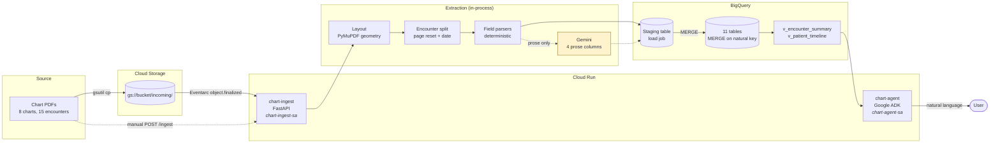

# Clinical Document Ingestion Pipeline Implementation Plan

> **For agentic workers:** REQUIRED SUB-SKILL: Use superpowers:subagent-driven-development (recommended) or superpowers:executing-plans to implement this plan task-by-task. Steps use checkbox (`- [ ]`) syntax for tracking.

**Goal:** Build a GCS → Cloud Run → BigQuery pipeline that extracts structured clinical facts from orthopedic chart PDFs, plus an ADK agent that answers natural-language questions over the resulting warehouse.

**Architecture:** A chart PDF lands in GCS; Eventarc (or a manual `POST /ingest`) wakes one FastAPI service on Cloud Run, which parses the PDF by page geometry with PyMuPDF, splits it into encounters, extracts every high-stakes field deterministically, calls Gemini once per encounter for four prose-derived columns only, validates through Pydantic, and upserts into eleven BigQuery tables via a staging load job plus `MERGE` on deterministic business keys. A second Cloud Run service hosts an ADK `LlmAgent` with four read-only tools over two curated views.

**Tech Stack:** Python 3.11 · FastAPI + uvicorn · PyMuPDF (`fitz`) · Jinja2 + WeasyPrint · Pydantic v2 · `google-cloud-bigquery` · `google-cloud-storage` · `google-genai` (Vertex AI) · `google-adk` · pytest · `gcloud` CLI (source-based deploy, no Docker)

**Design spec:** [`docs/superpowers/specs/2026-08-06-clinical-document-ingestion-pipeline-design.md`](../specs/2026-08-06-clinical-document-ingestion-pipeline-design.md). Every section reference below (`§4.3`, `§6.4`, …) points there.

## Global Constraints

These apply to every task. A task's requirements implicitly include this section.

- **Fixed platform.** GCS → Cloud Run → BigQuery. These three are non-negotiable per the brief.
- **No real PHI.** Every record is synthetic. Do not introduce real patient data at any stage.
- **No literals in code.** Project ID, bucket name, dataset name, region, and Gemini model name appear in **no source file** — only in `.env` (gitignored) and Cloud Run env vars, read through `ingestion/config.py`.
- **Exactly four LLM-derived columns**, all on `encounters`: `body_region`, `laterality`, `visit_type`, `hpi_summary`. Everything else in every table is deterministically parsed. An LLM value never overwrites a deterministically-parsed field. (§6.3)
- **Deterministic keys.** (§4.3)
  - `encounter_id  = sha256(patient_id ‖ encounter_date ‖ provider_name)`
  - `diagnosis_id  = sha256(encounter_id ‖ icd10_code ‖ diagnosis_text)`
  - `prescription_id = sha256(encounter_id ‖ drug_name ‖ strength ‖ sig_text)`
  - `patient_id = mrn`
- **Idempotency by MERGE, never delete-and-reinsert.** Writes go to a per-run staging table via a **load job** (never a streaming insert — streaming-buffer rows are not reliably visible to `MERGE`), then `MERGE` on the natural key.
- **Always return 2xx to Eventarc.** A non-2xx triggers redelivery; a deterministically failing chart would retry forever against live billing. Failures are acked and recorded in `ingestion_issues`, never re-thrown. (§6.4)
- **Partial data still lands.** A chart missing a section produces a `warn` issue row and an encounter row; a field that fails validation is nulled with an `error` issue row; one bad encounter never takes down its siblings.
- **Geometry, not pixels.** The sidebar/body boundary and the header band are derived from page geometry so they survive a different page size. No hardcoded coordinate constants. (§6.1)
- **Agent queries views, not raw tables.** `v_encounter_summary` and `v_patient_timeline`. `run_sql` is SELECT-only, dataset-scoped, LIMIT-injected, dry-run byte-capped. (§7)
- **ICD-10 pattern:** `[A-Z]\d{2}(\.\d{1,4})?`. **Follow-up intervals normalize to days** (`"Follow up in 3 weeks"` → 21).
- **Python 3.11.** Type hints on every public function. `from __future__ import annotations` not needed at 3.11 for the syntax used here.
- **Commit after every task**, conventional-commit prefixes (`feat:`, `test:`, `docs:`, `chore:`, `fix:`). Clean history is graded (§6.5).
- **The provided sample chart is never edited.** `charts/source/EMA_20250723T140400_0000_MRN4820917_PMS4820917_PID18442091_PatientChart_400112.pdf` is the golden test the parser must pass unmodified.

## File Structure

```
zcs-clinical-pipeline/
├── .env.example                     env var names only, no values
├── requirements.txt                 runtime deps (Cloud Run buildpack reads this)
├── requirements-dev.txt             pytest, weasyprint — not deployed
├── pyproject.toml                   pytest config, ruff config
├── README.md                        the graded artifact (Task 18)
├── docs/
│   ├── architecture.md              diagram + trigger/service decisions (Task 18)
│   ├── schema.md                    table-by-table schema doc (Task 18)
│   └── decisions.md                 the five defended decisions (Task 18)
├── charts/
│   ├── source/                      provided sample chart — never modified
│   └── generated/                   7 rendered PDFs (Tasks 3–4)
├── corpus/
│   ├── spec_model.py                Pydantic model of a chart spec (Task 3)
│   ├── render.py                    JSON spec → PDF via Jinja2 + WeasyPrint (Task 3)
│   ├── templates/chart.html.j2      EMR layout: header band, sidebar, body (Task 3)
│   ├── templates/chart.css          print CSS, repeating header (Task 3)
│   ├── specs/chart_01..07.json      authored charts = ground truth (Tasks 3–4)
│   └── sample_truth.json            hand-labelled truth for the provided chart (Task 4)
├── ingestion/
│   ├── config.py                    env-driven Config (Task 1)
│   ├── issues.py                    IssueDraft + warn()/error() helpers (Task 7)
│   ├── keys.py                      sha256 business keys (Task 11)
│   ├── models.py                    Pydantic warehouse contracts (Task 11)
│   ├── warehouse.py                 staging load job + MERGE (Task 12)
│   ├── app.py                       FastAPI: /ingest, /events, /healthz (Task 13)
│   └── extract/
│       ├── layout.py                PyMuPDF blocks → header/sidebar/body (Task 5)
│       ├── encounters.py            page ranges per encounter (Task 6)
│       ├── sections.py              heading detection within body (Task 7)
│       ├── llm.py                   single Gemini call per encounter (Task 10)
│       ├── pipeline.py              document assembly (Task 11)
│       └── fields/
│           ├── identifiers.py       header + filename identity (Task 7)
│           ├── diagnoses.py         ICD-10, body region, laterality (Task 8)
│           ├── prescriptions.py     drug, sig, quantity, refills (Task 8)
│           ├── medications.py       sidebar snapshot (Task 9)
│           ├── vitals.py            wide vitals row (Task 9)
│           ├── imaging.py           imaging studies (Task 9)
│           ├── followup.py          follow-up interval → days (Task 9)
│           └── exam.py              exam findings (Task 19, cut candidate)
├── Procfile                         uvicorn entrypoint for the buildpack (Task 13)
├── .gcloudignore                    keeps .env, tests, PDFs out of the image (Task 14)
├── agent/
│   ├── __init__.py                  re-exports root_agent for ADK (Task 16)
│   ├── tools.py                     4 BigQuery-backed tools (Task 15)
│   ├── agent.py                     ADK LlmAgent + grounding prompt (Task 16)
│   └── requirements.txt             agent-only deps for adk deploy (Task 15)
├── sql/
│   ├── ddl/schema.sql               11 tables (Task 2)
│   ├── ddl/views.sql                2 curated views (Task 2)
│   └── ddl/seed_ref_drug_class.sql  drug → class seed (Task 2)
├── eval/
│   ├── __init__.py                  (Task 17)
│   ├── accuracy.py                  extracted vs ground truth (Task 17)
│   ├── report.md                    generated accuracy report (Task 17)
│   └── questions.md                 4 question types + grounding traps (Task 16)
├── scripts/
│   ├── setup_infra.sh               APIs, bucket, dataset, service accounts (Task 2)
│   ├── apply_ddl.sh                 run DDL against the dataset (Task 2)
│   ├── deploy_ingest.sh             gcloud run deploy --source (Task 14)
│   └── deploy_agent.sh              adk deploy cloud_run (Task 16)
└── tests/
    ├── conftest.py                  shared fixtures (Task 1)
    ├── test_config.py               (Task 1)
    ├── test_render.py               (Task 3)
    ├── test_corpus.py               (Task 4)
    ├── test_layout.py               (Task 5)
    ├── test_encounters.py           (Task 6)
    ├── test_sections.py             (Task 7)
    ├── test_identifiers.py          (Task 7)
    ├── test_diagnoses.py            (Task 8)
    ├── test_prescriptions.py        (Task 8)
    ├── test_fields_misc.py          (Task 9)
    ├── test_llm.py                  (Task 10)
    ├── test_keys.py                 (Task 11)
    ├── test_models.py               (Task 11)
    ├── test_warehouse.py            (Task 12)
    ├── test_warehouse_live.py       needs GCP creds; skipped without (Task 12)
    ├── test_app.py                  (Task 13)
    ├── test_agent_tools.py          (Task 15)
    ├── test_agent.py                (Task 16)
    ├── test_accuracy.py             (Task 17)
    ├── test_exam.py                 (Task 19, cut candidate)
    └── test_golden_sample.py        provided chart, end-to-end (Task 11)
```

**Import convention:** the repo root is the package root. Modules import as `from ingestion.config import load_config`. Cloud Run's buildpack starts `uvicorn ingestion.app:app` via the `Procfile` created in Task 13.

---

## Task 1: Project scaffolding and configuration

Establishes the package layout, the dependency set, and the env-driven `Config` that every later task imports. Nothing else can be tested until `pytest` runs.

**Files:**
- Create: `requirements.txt`, `requirements-dev.txt`, `pyproject.toml`, `.env.example`
- Create: `ingestion/__init__.py`, `ingestion/config.py`, `ingestion/extract/__init__.py`, `ingestion/extract/fields/__init__.py`
- Create: `tests/__init__.py`, `tests/conftest.py`, `tests/test_config.py`

**Interfaces:**
- Consumes: nothing.
- Produces: `Config` (frozen dataclass with `project_id: str`, `dataset: str`, `bucket: str`, `location: str`, `gemini_model: str`, `pipeline_version: str`) and `load_config(env: Mapping[str, str] | None = None) -> Config`. Every later task takes a `Config` rather than reading `os.environ` directly.

- [ ] **Step 1: Create the virtualenv and dependency files**

```bash
cd ~/Documents/GitHub/zcs-clinical-pipeline
python3.11 -m venv .venv
source .venv/bin/activate
python -V   # expect Python 3.11.x
```

`requirements.txt` (runtime — this is what Cloud Build installs):

```
fastapi==0.115.6
uvicorn[standard]==0.34.0
pydantic==2.10.4
PyMuPDF==1.25.2
google-cloud-storage==2.19.0
google-cloud-bigquery==3.27.0
google-genai==1.2.0
cloudevents==1.11.0
```

`requirements-dev.txt`:

```
-r requirements.txt
pytest==8.3.4
Jinja2==3.1.5
weasyprint==63.1
ruff==0.9.2
```

- [ ] **Step 2: Create `pyproject.toml` and the package `__init__.py` files**

```toml
[tool.pytest.ini_options]
testpaths = ["tests"]
pythonpath = ["."]
addopts = "-q"

[tool.ruff]
line-length = 100
target-version = "py311"
```

```bash
mkdir -p ingestion/extract/fields tests
touch ingestion/__init__.py ingestion/extract/__init__.py ingestion/extract/fields/__init__.py tests/__init__.py
pip install -r requirements-dev.txt
```

- [ ] **Step 3: Write the failing test for `load_config`**

`tests/test_config.py`:

```python
import pytest

from ingestion.config import Config, load_config


def test_load_config_reads_required_values():
    cfg = load_config({
        "GCP_PROJECT_ID": "proj-x",
        "BQ_DATASET": "cumberland",
        "GCS_BUCKET": "proj-x-charts-raw",
    })
    assert isinstance(cfg, Config)
    assert cfg.project_id == "proj-x"
    assert cfg.dataset == "cumberland"
    assert cfg.bucket == "proj-x-charts-raw"


def test_load_config_applies_defaults():
    cfg = load_config({
        "GCP_PROJECT_ID": "proj-x",
        "BQ_DATASET": "cumberland",
        "GCS_BUCKET": "b",
    })
    assert cfg.location == "us-central1"
    assert cfg.gemini_model.startswith("gemini-")
    assert cfg.pipeline_version


def test_load_config_overrides_defaults():
    cfg = load_config({
        "GCP_PROJECT_ID": "p", "BQ_DATASET": "d", "GCS_BUCKET": "b",
        "GCP_LOCATION": "us-east4", "GEMINI_MODEL": "gemini-2.5-pro",
        "PIPELINE_VERSION": "9.9.9",
    })
    assert cfg.location == "us-east4"
    assert cfg.gemini_model == "gemini-2.5-pro"
    assert cfg.pipeline_version == "9.9.9"


def test_load_config_names_every_missing_variable():
    with pytest.raises(ValueError) as exc:
        load_config({"GCP_PROJECT_ID": "p"})
    message = str(exc.value)
    assert "BQ_DATASET" in message
    assert "GCS_BUCKET" in message


def test_config_is_immutable():
    cfg = load_config({"GCP_PROJECT_ID": "p", "BQ_DATASET": "d", "GCS_BUCKET": "b"})
    with pytest.raises(Exception):
        cfg.project_id = "other"  # type: ignore[misc]
```

- [ ] **Step 4: Run the test to verify it fails**

Run: `pytest tests/test_config.py -v`
Expected: FAIL — `ModuleNotFoundError: No module named 'ingestion.config'`

- [ ] **Step 5: Write `ingestion/config.py`**

```python
"""Environment-driven configuration. No deployment literal appears anywhere else."""

import os
from collections.abc import Mapping
from dataclasses import dataclass

REQUIRED_VARS = ("GCP_PROJECT_ID", "BQ_DATASET", "GCS_BUCKET")

DEFAULT_LOCATION = "us-central1"
DEFAULT_GEMINI_MODEL = "gemini-2.5-flash"
DEFAULT_PIPELINE_VERSION = "0.1.0"


@dataclass(frozen=True)
class Config:
    """Everything the pipeline needs to know about where it is running."""

    project_id: str
    dataset: str
    bucket: str
    location: str
    gemini_model: str
    pipeline_version: str

    @property
    def dataset_ref(self) -> str:
        return f"{self.project_id}.{self.dataset}"

    def table(self, name: str) -> str:
        return f"{self.project_id}.{self.dataset}.{name}"


def load_config(env: Mapping[str, str] | None = None) -> Config:
    """Build a Config from a mapping, defaulting to the process environment.

    Raises ValueError naming every missing variable at once, so a misconfigured
    deploy fails on the first request with a complete message instead of one
    variable per attempt.
    """
    source: Mapping[str, str] = os.environ if env is None else env
    missing = [name for name in REQUIRED_VARS if not source.get(name)]
    if missing:
        raise ValueError(
            "missing required environment variables: " + ", ".join(sorted(missing))
        )
    return Config(
        project_id=source["GCP_PROJECT_ID"],
        dataset=source["BQ_DATASET"],
        bucket=source["GCS_BUCKET"],
        location=source.get("GCP_LOCATION") or DEFAULT_LOCATION,
        gemini_model=source.get("GEMINI_MODEL") or DEFAULT_GEMINI_MODEL,
        pipeline_version=source.get("PIPELINE_VERSION") or DEFAULT_PIPELINE_VERSION,
    )
```

- [ ] **Step 6: Run the test to verify it passes**

Run: `pytest tests/test_config.py -v`
Expected: 5 passed

- [ ] **Step 7: Write `.env.example` and `tests/conftest.py`**

`.env.example` — **names only, no values:**

```bash
# Copy to .env and fill in. .env is gitignored; these values live nowhere else.
GCP_PROJECT_ID=
GCP_LOCATION=us-central1
BQ_DATASET=cumberland
GCS_BUCKET=
GEMINI_MODEL=gemini-2.5-flash
PIPELINE_VERSION=0.1.0
```

`tests/conftest.py`:

```python
from pathlib import Path

import pytest

from ingestion.config import Config

REPO_ROOT = Path(__file__).resolve().parent.parent
SAMPLE_CHART = (
    REPO_ROOT
    / "charts/source"
    / "EMA_20250723T140400_0000_MRN4820917_PMS4820917_PID18442091_PatientChart_400112.pdf"
)


@pytest.fixture
def cfg() -> Config:
    """A Config with obviously-fake values, for tests that never touch GCP."""
    return Config(
        project_id="test-project",
        dataset="test_dataset",
        bucket="test-bucket",
        location="us-central1",
        gemini_model="gemini-2.5-flash",
        pipeline_version="test",
    )


@pytest.fixture
def sample_pdf_bytes() -> bytes:
    if not SAMPLE_CHART.exists():
        pytest.skip(f"provided sample chart not present at {SAMPLE_CHART}")
    return SAMPLE_CHART.read_bytes()
```

- [ ] **Step 8: Copy in the provided sample chart and commit**

```bash
mkdir -p charts/source charts/generated
cp ~/Desktop/Employment/EMA_20250723T140400_0000_MRN4820917_PMS4820917_PID18442091_PatientChart_400112.pdf charts/source/
pytest -v
git add requirements.txt requirements-dev.txt pyproject.toml .env.example ingestion tests charts
git commit -m "chore: scaffold package, env-driven config, sample chart fixture"
```

---

## Task 2: GCP infrastructure and BigQuery schema

The schema is 30% of the grade — the single heaviest item. This task lands all eleven tables, both views, the seed reference data, and the scripts that create them, against the real project.

**Files:**
- Create: `scripts/setup_infra.sh`, `scripts/apply_ddl.sh`
- Create: `sql/ddl/schema.sql`, `sql/ddl/views.sql`, `sql/ddl/seed_ref_drug_class.sql`
- Modify: `.env` (local, gitignored — created from `.env.example`)

**Interfaces:**
- Consumes: `Config` field names from Task 1 (`GCP_PROJECT_ID`, `BQ_DATASET`, `GCS_BUCKET`, `GCP_LOCATION`).
- Produces: the physical dataset. Task 12 writes to these exact table names and column orders; Task 15 reads the two views. Column names here are authoritative for every later task.

- [ ] **Step 1: Install and authenticate `gcloud`, then bind the project**

```bash
brew install --cask google-cloud-sdk   # skip if `gcloud version` already works
gcloud auth login
gcloud auth application-default login
gcloud projects list                    # pick the existing billing-enabled project
gcloud config set project <YOUR_PROJECT_ID>
```

Then create `.env` (gitignored) from the template, filling in the project ID and a bucket name of `<project-id>-charts-raw`:

```bash
cp .env.example .env
$EDITOR .env
```

- [ ] **Step 2: Write and run `scripts/setup_infra.sh`**

```bash
#!/usr/bin/env bash
# Enable APIs, create the bucket, dataset, and two least-privilege service accounts.
# Idempotent: safe to re-run.
set -euo pipefail
set -a; source "$(dirname "$0")/../.env"; set +a

: "${GCP_PROJECT_ID:?set in .env}" "${GCS_BUCKET:?}" "${BQ_DATASET:?}" "${GCP_LOCATION:?}"

gcloud config set project "$GCP_PROJECT_ID"

gcloud services enable \
  run.googleapis.com cloudbuild.googleapis.com eventarc.googleapis.com \
  bigquery.googleapis.com storage.googleapis.com aiplatform.googleapis.com \
  artifactregistry.googleapis.com pubsub.googleapis.com

gcloud storage buckets describe "gs://${GCS_BUCKET}" >/dev/null 2>&1 || \
  gcloud storage buckets create "gs://${GCS_BUCKET}" \
    --location="$GCP_LOCATION" --uniform-bucket-level-access

bq --location="$GCP_LOCATION" show "${GCP_PROJECT_ID}:${BQ_DATASET}" >/dev/null 2>&1 || \
  bq --location="$GCP_LOCATION" mk --dataset \
    --description="Cumberland Orthopedics clinical warehouse (synthetic data)" \
    "${GCP_PROJECT_ID}:${BQ_DATASET}"

# Ingester: read GCS, write BigQuery. Agent: read BigQuery only. (§3)
for SA in chart-ingest-sa chart-agent-sa; do
  gcloud iam service-accounts describe \
    "${SA}@${GCP_PROJECT_ID}.iam.gserviceaccount.com" >/dev/null 2>&1 || \
    gcloud iam service-accounts create "$SA" --display-name="$SA"
done

INGEST_SA="chart-ingest-sa@${GCP_PROJECT_ID}.iam.gserviceaccount.com"
AGENT_SA="chart-agent-sa@${GCP_PROJECT_ID}.iam.gserviceaccount.com"

gcloud storage buckets add-iam-policy-binding "gs://${GCS_BUCKET}" \
  --member="serviceAccount:${INGEST_SA}" --role=roles/storage.objectViewer
for ROLE in roles/bigquery.dataEditor roles/bigquery.jobUser roles/aiplatform.user; do
  gcloud projects add-iam-policy-binding "$GCP_PROJECT_ID" \
    --member="serviceAccount:${INGEST_SA}" --role="$ROLE" --condition=None >/dev/null
done
for ROLE in roles/bigquery.dataViewer roles/bigquery.jobUser roles/aiplatform.user; do
  gcloud projects add-iam-policy-binding "$GCP_PROJECT_ID" \
    --member="serviceAccount:${AGENT_SA}" --role="$ROLE" --condition=None >/dev/null
done

echo "infra ready: gs://${GCS_BUCKET}, ${GCP_PROJECT_ID}:${BQ_DATASET}"
```

```bash
chmod +x scripts/setup_infra.sh && ./scripts/setup_infra.sh
```

- [ ] **Step 3: Write `sql/ddl/schema.sql` — all eleven tables**

Placeholders `${PROJECT}` and `${DATASET}` are substituted by `apply_ddl.sh`, keeping deployment literals out of source (Global Constraints).

```sql
-- Cumberland Orthopedics clinical warehouse. All data synthetic.
-- Grain is stated on every table; see docs/schema.md for column-level notes.

CREATE TABLE IF NOT EXISTS `${PROJECT}.${DATASET}.documents` (
  document_id STRING NOT NULL OPTIONS(description="sha256 of the file bytes"),
  gcs_uri STRING NOT NULL,
  file_name STRING NOT NULL,
  file_bytes INT64,
  page_count INT64,
  mrn_from_filename STRING OPTIONS(description="MRN parsed from the filename, for cross-check"),
  pms_id_from_filename STRING,
  ingested_at TIMESTAMP NOT NULL,
  ingest_run_id STRING NOT NULL,
  pipeline_version STRING,
  parse_status STRING OPTIONS(description="ok | partial | failed")
) OPTIONS(description="One row per ingested PDF. Provenance and audit anchor.");

CREATE TABLE IF NOT EXISTS `${PROJECT}.${DATASET}.patients` (
  patient_id STRING NOT NULL OPTIONS(description="= MRN; single-practice key"),
  mrn STRING NOT NULL,
  pms_id STRING,
  legal_name STRING OPTIONS(description="as printed, e.g. 'BARLOW, TREMAINE (Trey Barlow)'"),
  family_name STRING,
  given_name STRING,
  preferred_name STRING OPTIONS(description="parenthetical name; required to answer 'Trey Barlow'"),
  date_of_birth DATE,
  sex STRING,
  phone_home STRING,
  phone_work STRING,
  first_seen_date DATE,
  last_seen_date DATE,
  source_document_id STRING,
  ingested_at TIMESTAMP
) OPTIONS(description="One row per patient, natural key MRN.");

CREATE TABLE IF NOT EXISTS `${PROJECT}.${DATASET}.encounters` (
  encounter_id STRING NOT NULL OPTIONS(description="sha256(patient_id, encounter_date, provider_name)"),
  patient_id STRING NOT NULL,
  encounter_date DATE NOT NULL,
  encounter_seq INT64 OPTIONS(description="1-based visit ordinal for this patient"),
  provider_name STRING,
  provider_role STRING,
  is_primary_provider BOOL,
  location_name STRING,
  chief_complaint_raw STRING,
  body_region STRING OPTIONS(description="LLM-derived"),
  laterality STRING OPTIONS(description="LLM-derived: left | right | bilateral | none"),
  visit_type STRING OPTIONS(description="LLM-derived: new | follow_up | post_op"),
  hpi_text STRING,
  hpi_summary STRING OPTIONS(description="LLM-derived one-sentence summary"),
  note_text STRING,
  follow_up_interval_days INT64,
  follow_up_raw STRING,
  signed_by STRING,
  signed_at TIMESTAMP,
  source_document_id STRING,
  source_page_start INT64,
  source_page_end INT64,
  llm_model STRING OPTIONS(description="model behind body_region, laterality, visit_type, hpi_summary"),
  llm_confidence FLOAT64
)
PARTITION BY encounter_date
CLUSTER BY patient_id
OPTIONS(description="One row per visit. The spine of the model.");

CREATE TABLE IF NOT EXISTS `${PROJECT}.${DATASET}.diagnoses` (
  diagnosis_id STRING NOT NULL,
  encounter_id STRING NOT NULL,
  patient_id STRING NOT NULL,
  icd10_code STRING,
  icd10_description STRING,
  diagnosis_text STRING,
  is_primary BOOL,
  body_region STRING OPTIONS(description="deterministic: ICD-10 lookup, else inherited from encounter"),
  laterality STRING OPTIONS(description="deterministic: from the ICD-10 code where encoded"),
  source STRING OPTIONS(description="impression | imaging"),
  source_document_id STRING,
  source_page INT64
) OPTIONS(description="One row per diagnosis within an encounter.");

CREATE TABLE IF NOT EXISTS `${PROJECT}.${DATASET}.prescriptions` (
  prescription_id STRING NOT NULL,
  encounter_id STRING NOT NULL,
  patient_id STRING NOT NULL,
  drug_name STRING,
  strength STRING,
  strength_unit STRING,
  dose_form STRING,
  route STRING,
  sig_text STRING,
  quantity FLOAT64,
  quantity_unit STRING,
  refills INT64,
  duration_days INT64,
  is_prn BOOL,
  drug_class STRING OPTIONS(description="joined from ref_drug_class, never LLM-derived"),
  action STRING OPTIONS(description="new | modify | continue"),
  source_document_id STRING,
  source_page INT64
) OPTIONS(description="One row per prescription WRITTEN at an encounter.");

CREATE TABLE IF NOT EXISTS `${PROJECT}.${DATASET}.medication_snapshots` (
  encounter_id STRING NOT NULL,
  patient_id STRING NOT NULL,
  medication_name STRING NOT NULL,
  route STRING,
  source_document_id STRING,
  source_page INT64
) OPTIONS(description="One row per (encounter x medication the patient was ALREADY on). Sidebar list.");

CREATE TABLE IF NOT EXISTS `${PROJECT}.${DATASET}.imaging_studies` (
  imaging_id STRING NOT NULL,
  encounter_id STRING NOT NULL,
  patient_id STRING NOT NULL,
  modality STRING,
  body_part STRING,
  laterality STRING,
  performed_date DATE,
  interpretation_text STRING,
  impression STRING,
  source_document_id STRING,
  source_page INT64
) OPTIONS(description="One row per imaging study within an encounter.");

CREATE TABLE IF NOT EXISTS `${PROJECT}.${DATASET}.vitals` (
  encounter_id STRING NOT NULL,
  patient_id STRING NOT NULL,
  taken_by STRING,
  taken_date DATE,
  bp_systolic INT64,
  bp_diastolic INT64,
  pulse INT64,
  respirations INT64,
  o2_sat INT64,
  temperature_f FLOAT64,
  height_in FLOAT64,
  weight_lbs FLOAT64,
  bmi FLOAT64,
  bsa FLOAT64,
  is_patient_reported BOOL,
  source_document_id STRING,
  source_page INT64
) OPTIONS(description="One row per encounter, wide. NULL columns record the gap.");

CREATE TABLE IF NOT EXISTS `${PROJECT}.${DATASET}.exam_findings` (
  finding_id STRING NOT NULL,
  encounter_id STRING NOT NULL,
  patient_id STRING NOT NULL,
  body_part STRING,
  laterality STRING,
  finding_type STRING OPTIONS(description="rom_active|rom_passive|strength|special_test|inspection|skin|stability"),
  measure_name STRING,
  value_numeric FLOAT64,
  value_text STRING,
  unit STRING,
  source_document_id STRING,
  source_page INT64
) OPTIONS(description="One row per measurement (encounter x body part x test). Populated in Task 19.");

CREATE TABLE IF NOT EXISTS `${PROJECT}.${DATASET}.ingestion_issues` (
  issue_id STRING NOT NULL,
  document_id STRING,
  encounter_id STRING,
  severity STRING OPTIONS(description="warn | error"),
  issue_type STRING OPTIONS(description="missing_section|unparsed_field|low_confidence|validation_failed|identifier_mismatch"),
  field_name STRING,
  detail STRING,
  created_at TIMESTAMP,
  ingest_run_id STRING
) OPTIONS(description="Queryable record of every gap. A missing section lands here, not in a log.");

CREATE TABLE IF NOT EXISTS `${PROJECT}.${DATASET}.ref_drug_class` (
  drug_name STRING NOT NULL,
  drug_class STRING,
  is_anti_inflammatory BOOL
) OPTIONS(description="Seed lookup. Deterministic drug classification; the LLM never assigns a class.");
```

- [ ] **Step 4: Write `sql/ddl/views.sql` — the two curated views the agent reads**

```sql
CREATE OR REPLACE VIEW `${PROJECT}.${DATASET}.v_encounter_summary` AS
SELECT
  e.encounter_id,
  e.patient_id,
  p.legal_name,
  p.preferred_name,
  p.given_name,
  p.family_name,
  p.mrn,
  p.date_of_birth,
  p.sex,
  e.encounter_date,
  e.encounter_seq,
  e.provider_name,
  e.location_name,
  e.body_region,
  e.laterality,
  e.visit_type,
  e.chief_complaint_raw,
  e.hpi_summary,
  e.follow_up_interval_days,
  d.icd10_code    AS primary_icd10_code,
  d.diagnosis_text AS primary_diagnosis,
  (SELECT COUNT(*) FROM `${PROJECT}.${DATASET}.prescriptions` rx
     WHERE rx.encounter_id = e.encounter_id) AS prescription_count,
  (SELECT COUNT(*) FROM `${PROJECT}.${DATASET}.imaging_studies` im
     WHERE im.encounter_id = e.encounter_id) AS imaging_count
FROM `${PROJECT}.${DATASET}.encounters` e
JOIN `${PROJECT}.${DATASET}.patients` p USING (patient_id)
LEFT JOIN `${PROJECT}.${DATASET}.diagnoses` d
  ON d.encounter_id = e.encounter_id AND d.is_primary;

CREATE OR REPLACE VIEW `${PROJECT}.${DATASET}.v_patient_timeline` AS
SELECT
  e.patient_id,
  p.preferred_name,
  p.legal_name,
  e.encounter_date,
  e.encounter_seq,
  e.provider_name,
  e.body_region,
  e.visit_type,
  e.chief_complaint_raw,
  ARRAY(SELECT AS STRUCT d.icd10_code, d.diagnosis_text, d.is_primary
        FROM `${PROJECT}.${DATASET}.diagnoses` d
        WHERE d.encounter_id = e.encounter_id) AS diagnoses,
  ARRAY(SELECT AS STRUCT rx.drug_name, rx.strength, rx.strength_unit, rx.sig_text,
                         rx.quantity, rx.refills, rx.drug_class, rx.action
        FROM `${PROJECT}.${DATASET}.prescriptions` rx
        WHERE rx.encounter_id = e.encounter_id) AS prescriptions,
  ARRAY(SELECT AS STRUCT im.modality, im.body_part, im.laterality, im.impression
        FROM `${PROJECT}.${DATASET}.imaging_studies` im
        WHERE im.encounter_id = e.encounter_id) AS imaging,
  e.follow_up_interval_days
FROM `${PROJECT}.${DATASET}.encounters` e
JOIN `${PROJECT}.${DATASET}.patients` p USING (patient_id)
ORDER BY e.patient_id, e.encounter_date;
```

- [ ] **Step 5: Write `sql/ddl/seed_ref_drug_class.sql`**

Covers every drug used anywhere in the corpus (Task 4 must not introduce a drug missing from this list).

```sql
MERGE `${PROJECT}.${DATASET}.ref_drug_class` T
USING (
  SELECT * FROM UNNEST([
    STRUCT('meloxicam'   AS drug_name, 'NSAID'            AS drug_class, TRUE  AS is_anti_inflammatory),
    ('ibuprofen',        'NSAID',                    TRUE),
    ('naproxen',         'NSAID',                    TRUE),
    ('diclofenac',       'NSAID',                    TRUE),
    ('celecoxib',        'NSAID (COX-2)',            TRUE),
    ('indomethacin',     'NSAID',                    TRUE),
    ('methylprednisolone','corticosteroid',          TRUE),
    ('prednisone',       'corticosteroid',           TRUE),
    ('triamcinolone',    'corticosteroid',           TRUE),
    ('dexamethasone',    'corticosteroid',           TRUE),
    ('acetaminophen',    'analgesic',                FALSE),
    ('tramadol',         'opioid analgesic',         FALSE),
    ('hydrocodone-acetaminophen', 'opioid analgesic', FALSE),
    ('cyclobenzaprine',  'muscle relaxant',          FALSE),
    ('methocarbamol',    'muscle relaxant',          FALSE),
    ('tizanidine',       'muscle relaxant',          FALSE),
    ('gabapentin',       'anticonvulsant / neuropathic', FALSE),
    ('duloxetine',       'SNRI',                     FALSE),
    ('nebivolol',        'beta blocker',             FALSE),
    ('olmesartan-amlodipin-hcthiazid', 'antihypertensive combination', FALSE),
    ('lisinopril',       'ACE inhibitor',            FALSE),
    ('metformin',        'biguanide',                FALSE),
    ('atorvastatin',     'statin',                   FALSE),
    ('levothyroxine',    'thyroid hormone',          FALSE),
    ('omeprazole',       'proton pump inhibitor',    FALSE),
    ('vitamin d3',       'supplement',               FALSE),
    ('calcium carbonate','supplement',               FALSE),
    ('alendronate',      'bisphosphonate',           FALSE)
  ])
) S
ON LOWER(T.drug_name) = LOWER(S.drug_name)
WHEN MATCHED THEN UPDATE SET
  drug_class = S.drug_class, is_anti_inflammatory = S.is_anti_inflammatory
WHEN NOT MATCHED THEN INSERT (drug_name, drug_class, is_anti_inflammatory)
  VALUES (S.drug_name, S.drug_class, S.is_anti_inflammatory);
```

- [ ] **Step 6: Write and run `scripts/apply_ddl.sh`**

```bash
#!/usr/bin/env bash
# Substitute ${PROJECT}/${DATASET} from .env and apply every DDL file, in order.
set -euo pipefail
cd "$(dirname "$0")/.."
set -a; source .env; set +a
: "${GCP_PROJECT_ID:?}" "${BQ_DATASET:?}" "${GCP_LOCATION:?}"

for f in sql/ddl/schema.sql sql/ddl/views.sql sql/ddl/seed_ref_drug_class.sql; do
  echo "applying $f"
  sed -e "s/\${PROJECT}/${GCP_PROJECT_ID}/g" -e "s/\${DATASET}/${BQ_DATASET}/g" "$f" \
    | bq query --location="$GCP_LOCATION" --use_legacy_sql=false --project_id="$GCP_PROJECT_ID"
done
echo "schema applied to ${GCP_PROJECT_ID}:${BQ_DATASET}"
```

```bash
chmod +x scripts/apply_ddl.sh && ./scripts/apply_ddl.sh
```

- [ ] **Step 7: Verify the dataset matches the design, then commit**

```bash
set -a; source .env; set +a
bq ls "${GCP_PROJECT_ID}:${BQ_DATASET}"          # expect 11 tables + 2 views
bq show --schema --format=prettyjson "${GCP_PROJECT_ID}:${BQ_DATASET}.encounters" | head -40
bq query --use_legacy_sql=false \
  "SELECT COUNT(*) AS drugs, COUNTIF(is_anti_inflammatory) AS anti_inflammatory
   FROM \`${GCP_PROJECT_ID}.${BQ_DATASET}.ref_drug_class\`"   # expect 28 / 10
bq query --use_legacy_sql=false \
  "SELECT COUNT(*) FROM \`${GCP_PROJECT_ID}.${BQ_DATASET}.v_encounter_summary\`"  # expect 0, no error
```

```bash
git add scripts sql
git commit -m "feat: BigQuery schema, curated views, drug-class seed, infra scripts"
```

---

## Task 3: Chart spec model and PDF renderer — one chart end-to-end

Proves the riskiest local dependency (WeasyPrint on macOS) and locks the corpus data contract. The spec JSON authored here *is* the ground truth Task 17 measures against, so its field names must match the warehouse columns exactly.

**Files:**
- Create: `corpus/spec_model.py`, `corpus/render.py`
- Create: `corpus/templates/chart.html.j2`, `corpus/templates/chart.css`
- Create: `corpus/specs/chart_01.json`
- Create: `tests/test_render.py`

**Interfaces:**
- Consumes: nothing from earlier tasks (the corpus is standalone tooling).
- Produces: `ChartSpec`, `EncounterSpec`, `PatientSpec`, `VitalsSpec`, `DiagnosisSpec`, `PrescriptionSpec`, `ImagingSpec`, `MedicationSpec` (Pydantic v2 models in `corpus/spec_model.py`); `load_spec(path: Path) -> ChartSpec`; `render_chart(spec: ChartSpec, out_dir: Path) -> Path`. Task 4 authors more JSON against these models; Task 17 reads them as ground truth.

- [ ] **Step 1: Install WeasyPrint's system libraries and prove it renders**

```bash
brew install pango gdk-pixbuf libffi cairo
source .venv/bin/activate
python -c "
from weasyprint import HTML
pdf = HTML(string='<h1>ok</h1>').write_pdf()
print('weasyprint ok', len(pdf), 'bytes')
"
```

If this fails after 20 minutes of dependency chasing, stop and switch to the Playwright fallback (§12): `pip install playwright && playwright install chromium`, and replace only `render.py`'s `html_to_pdf()` body — the template, model, and tests are unchanged.

- [ ] **Step 2: Write `corpus/spec_model.py`**

```python
"""Pydantic model of an authored chart. Field names mirror the BigQuery columns
so eval/accuracy.py can diff spec against warehouse without a mapping layer."""

import json
from datetime import date, datetime
from pathlib import Path

from pydantic import BaseModel, Field


class VitalsSpec(BaseModel):
    taken_by: str | None = None
    taken_date: date | None = None
    bp_systolic: int | None = None
    bp_diastolic: int | None = None
    pulse: int | None = None
    respirations: int | None = None
    o2_sat: int | None = None
    temperature_f: float | None = None
    height_in: float | None = None
    weight_lbs: float | None = None
    bmi: float | None = None
    bsa: float | None = None
    is_patient_reported: bool = False


class MedicationSpec(BaseModel):
    medication_name: str
    route: str | None = None


class DiagnosisSpec(BaseModel):
    icd10_code: str | None = None
    icd10_description: str | None = None
    diagnosis_text: str
    is_primary: bool = False
    source: str = "impression"


class PrescriptionSpec(BaseModel):
    drug_name: str
    strength: str | None = None
    strength_unit: str | None = None
    dose_form: str | None = None
    route: str | None = None
    sig_text: str
    quantity: float | None = None
    quantity_unit: str | None = None
    refills: int | None = None
    action: str = "new"  # new | modify | continue


class ImagingSpec(BaseModel):
    modality: str
    body_part: str
    laterality: str | None = None
    performed_date: date | None = None
    interpretation_text: str | None = None
    impression: str | None = None


class EncounterSpec(BaseModel):
    encounter_date: date
    provider_name: str
    provider_role: str = "MD"
    is_primary_provider: bool = True
    chief_complaint: str
    hpi_text: str
    exam_text: str | None = None
    note_text: str | None = None
    operative_note: str | None = None
    follow_up_raw: str | None = None
    signed_by: str | None = None
    signed_at: datetime | None = None
    vitals: VitalsSpec | None = None
    current_medications: list[MedicationSpec] = Field(default_factory=list)
    diagnoses: list[DiagnosisSpec] = Field(default_factory=list)
    prescriptions: list[PrescriptionSpec] = Field(default_factory=list)
    imaging: list[ImagingSpec] = Field(default_factory=list)
    # Ground truth for the four LLM-derived columns (§6.3):
    body_region: str
    laterality: str
    visit_type: str


class PatientSpec(BaseModel):
    mrn: str
    pms_id: str
    family_name: str
    given_name: str
    preferred_name: str | None = None
    date_of_birth: date
    sex: str
    phone_home: str | None = None

    @property
    def legal_name(self) -> str:
        base = f"{self.family_name}, {self.given_name}"
        return f"{base} ({self.preferred_name})" if self.preferred_name else base


class ChartSpec(BaseModel):
    chart_id: str
    file_name: str
    location_name: str
    location_address: str
    patient: PatientSpec
    encounters: list[EncounterSpec]


def load_spec(path: Path) -> ChartSpec:
    return ChartSpec.model_validate(json.loads(Path(path).read_text()))
```

- [ ] **Step 3: Write `corpus/templates/chart.css`**

The three-region geometry here is what `extract/layout.py` (Task 5) discovers from the page, and it deliberately matches the provided chart: a repeating header band, a narrow left sidebar, a wide body column.

```css
@page {
  size: Letter;
  margin: 1.55in 0.5in 0.7in 0.5in;
}
body { font-family: "Helvetica", "Arial", sans-serif; font-size: 8.5pt; color: #111; }

.header {
  position: fixed; top: -1.45in; left: 0; right: 0; height: 1.3in;
  border-bottom: 1.5pt solid #444; padding-bottom: 4pt;
}
.header .practice { font-size: 12pt; font-weight: bold; }
.header .addr { font-size: 7.5pt; color: #444; }
.header .patient-name { font-size: 11pt; font-weight: bold; margin-top: 5pt; }
.header .idline { font-size: 8pt; }
.header .idline span { margin-right: 18pt; }

.sidebar {
  position: fixed; top: 0; left: 0; width: 1.75in; bottom: 0.2in;
  border-right: 0.75pt solid #999; padding-right: 8pt; font-size: 7.5pt;
}
.sidebar h3 { font-size: 8pt; text-transform: uppercase; margin: 8pt 0 3pt; }
.sidebar ul { list-style: none; padding-left: 0; margin: 0; }
.sidebar li { margin-bottom: 2pt; }

.content { margin-left: 2.0in; }
.content h2 {
  font-size: 9.5pt; text-transform: uppercase; border-bottom: 0.75pt solid #666;
  margin: 10pt 0 4pt; padding-bottom: 1pt;
}
table.vitals { border-collapse: collapse; width: 100%; font-size: 8pt; }
table.vitals th, table.vitals td { border: 0.5pt solid #bbb; padding: 2pt 4pt; text-align: left; }
.rx { margin-bottom: 6pt; }
.rx .drug { font-weight: bold; }

.footer {
  position: fixed; bottom: -0.55in; left: 0; right: 0;
  font-size: 7pt; color: #555; border-top: 0.5pt solid #bbb; padding-top: 2pt;
}
.footer .pageno::after { content: "Page " counter(page); }
```

- [ ] **Step 4: Write `corpus/templates/chart.html.j2`**

One encounter per rendered document — that is what makes the page counter reset between encounters, exactly as the provided chart does.

```jinja
<!DOCTYPE html>
<html><head><meta charset="utf-8"><style>{{ css }}</style></head>
<body>
<div class="header">
  <div class="practice">Cumberland Orthopedics &amp; Sports Medicine</div>
  <div class="addr">{{ chart.location_name }} &middot; {{ chart.location_address }}</div>
  <div class="patient-name">{{ chart.patient.legal_name }}</div>
  <div class="idline">
    <span>DOB: {{ chart.patient.date_of_birth.strftime('%m/%d/%Y') }}</span>
    <span>Sex: {{ chart.patient.sex }}</span>
    <span>MRN: {{ chart.patient.mrn }}</span>
    <span>PMS ID: {{ chart.patient.pms_id }}</span>
    <span>Home: {{ chart.patient.phone_home }}</span>
  </div>
  <div class="idline"><span>Date of Service: {{ enc.encounter_date.strftime('%m/%d/%Y') }}</span>
    <span>Provider: {{ enc.provider_name }}, {{ enc.provider_role }}</span></div>
</div>

<div class="sidebar">
  <h3>Current Medications</h3>
  <ul>
  <li>{{ m.medication_name }} — {{ m.route }}</li>
  <li>None recorded</li>
  </ul>
  <h3>Allergies</h3><ul><li>No Known Drug Allergies</li></ul>
  <h3>Location</h3><ul><li>{{ chart.location_name }}</li></ul>
</div>

<div class="content">
  <h2>Chief Complaint</h2>
  <p>{{ enc.chief_complaint }}</p>

  <h2>History of Present Illness</h2>
  <p>{{ enc.hpi_text }}</p>

  
  <h2>Vitals</h2>
  <table class="vitals">
    <tr><th>BP</th><th>Pulse</th><th>Resp</th><th>O2 Sat</th><th>Temp</th>
        <th>Ht (in)</th><th>Wt (lbs)</th><th>BMI</th><th>BSA</th></tr>
    <tr>
      <td>{{ enc.vitals.bp_systolic }}/{{ enc.vitals.bp_diastolic }}</td>
      <td>{{ enc.vitals.pulse or '' }}</td><td>{{ enc.vitals.respirations or '' }}</td>
      <td>{{ enc.vitals.o2_sat or '' }}</td><td>{{ enc.vitals.temperature_f or '' }}</td>
      <td>{{ enc.vitals.height_in or '' }}</td><td>{{ enc.vitals.weight_lbs or '' }}</td>
      <td>{{ enc.vitals.bmi or '' }}</td><td>{{ enc.vitals.bsa or '' }}</td>
    </tr>
  </table>
  <p>* Patient Reported</p>
  

  <h2>Physical Exam</h2><p>{{ enc.exam_text }}</p>

  
  <h2>Imaging</h2>
  
  <p><b>{{ im.modality }} {{ im.body_part }} ({{ im.laterality }})</b>
     — performed {{ im.performed_date.strftime('%m/%d/%Y') }}<br>
     {{ im.interpretation_text }}<br>Impression: {{ im.impression }}</p>
  
  

  <h2>Operative Note</h2><p>{{ enc.operative_note }}</p>

  <h2>Assessment</h2>
  <ul>
  
    <li>{{ d.diagnosis_text }} ({{ d.icd10_code }})
         [Primary]</li>
  
  </ul>

  
  <h2>Prescriptions</h2>
  
  <div class="rx">
    <span class="drug">{{ rx.drug_name }} {{ rx.strength }} {{ rx.strength_unit }} {{ rx.dose_form }}</span>
    — {{ rx.route }}<br>
    Sig: {{ rx.sig_text }}<br>
    Quantity: {{ rx.quantity }} {{ rx.quantity_unit }} &nbsp; Refills: {{ rx.refills }}
    &nbsp; Action: {{ rx.action }}
  </div>
  
  

  <h2>Plan</h2>
  <p>{{ enc.note_text }}</p>
  <p>{{ enc.follow_up_raw }}</p>

  
  <h2>Signature</h2>
  <p>Electronically signed by {{ enc.signed_by }} on
     {{ enc.signed_at.strftime('%m/%d/%Y %I:%M %p') }}</p>
  
</div>

<div class="footer">
  <span>{{ chart.patient.legal_name }} &middot; MRN {{ chart.patient.mrn }}
        &middot; DOS {{ enc.encounter_date.strftime('%m/%d/%Y') }}</span>
  <span class="pageno" style="float:right"></span>
</div>
</body></html>
```

- [ ] **Step 5: Write `corpus/render.py`**

```python
"""Render a chart spec to a PDF: one WeasyPrint document per encounter, merged
with PyMuPDF. Per-encounter documents are what reset the page counter, matching
the provided chart's behaviour."""

import argparse
from pathlib import Path

import fitz
from jinja2 import Environment, FileSystemLoader, select_autoescape
from weasyprint import HTML

from corpus.spec_model import ChartSpec, EncounterSpec, load_spec

TEMPLATE_DIR = Path(__file__).parent / "templates"


def _env() -> Environment:
    return Environment(
        loader=FileSystemLoader(TEMPLATE_DIR),
        autoescape=select_autoescape(["html", "xml"]),
    )


def html_to_pdf(html: str) -> bytes:
    return HTML(string=html, base_url=str(TEMPLATE_DIR)).write_pdf()


def render_encounter(spec: ChartSpec, enc: EncounterSpec) -> bytes:
    template = _env().get_template("chart.html.j2")
    css = (TEMPLATE_DIR / "chart.css").read_text()
    return html_to_pdf(template.render(chart=spec, enc=enc, css=css))


def merge_pdfs(parts: list[bytes]) -> bytes:
    out = fitz.open()
    for part in parts:
        with fitz.open(stream=part, filetype="pdf") as doc:
            out.insert_pdf(doc)
    data = out.tobytes()
    out.close()
    return data


def render_chart(spec: ChartSpec, out_dir: Path) -> Path:
    out_dir.mkdir(parents=True, exist_ok=True)
    pdf = merge_pdfs([render_encounter(spec, enc) for enc in spec.encounters])
    target = out_dir / spec.file_name
    target.write_bytes(pdf)
    return target


def main() -> None:
    parser = argparse.ArgumentParser(description="Render chart specs to PDFs.")
    parser.add_argument("specs", nargs="+", type=Path)
    parser.add_argument("--out", type=Path, default=Path("charts/generated"))
    args = parser.parse_args()
    for spec_path in args.specs:
        target = render_chart(load_spec(spec_path), args.out)
        print(f"{spec_path.name} -> {target}")


if __name__ == "__main__":
    main()
```

- [ ] **Step 6: Write the failing render test**

`tests/test_render.py`:

```python
import fitz
import pytest

from corpus.render import render_chart
from corpus.spec_model import load_spec

SPEC = "corpus/specs/chart_01.json"


@pytest.fixture(scope="module")
def rendered(tmp_path_factory):
    spec = load_spec(SPEC)
    return spec, render_chart(spec, tmp_path_factory.mktemp("charts"))


def test_renders_one_pdf_with_pages_for_every_encounter(rendered):
    spec, path = rendered
    with fitz.open(path) as doc:
        assert doc.page_count >= len(spec.encounters)


def test_header_repeats_identity_on_every_page(rendered):
    spec, path = rendered
    with fitz.open(path) as doc:
        for page in doc:
            assert spec.patient.mrn in page.get_text()


def test_page_counter_resets_per_encounter(rendered):
    spec, path = rendered
    with fitz.open(path) as doc:
        page_ones = sum("Page 1" in page.get_text() for page in doc)
    assert page_ones == len(spec.encounters)


def test_sidebar_sits_left_of_the_body_column(rendered):
    """The parser's geometry assumption (Task 5) must hold in generated charts."""
    _, path = rendered
    with fitz.open(path) as doc:
        page = doc[0]
        sidebar_hits = page.search_for("Current Medications")
        body_hits = page.search_for("Chief Complaint")
    assert sidebar_hits and body_hits
    assert sidebar_hits[0].x1 < body_hits[0].x0


def test_every_prescription_appears_in_the_text(rendered):
    spec, path = rendered
    with fitz.open(path) as doc:
        text = "".join(page.get_text() for page in doc)
    for enc in spec.encounters:
        for rx in enc.prescriptions:
            assert rx.drug_name in text
            assert rx.sig_text[:20] in text
```

- [ ] **Step 7: Run it to verify it fails**

Run: `pytest tests/test_render.py -v`
Expected: FAIL — `FileNotFoundError: corpus/specs/chart_01.json`

- [ ] **Step 8: Author `corpus/specs/chart_01.json` (knee, 3 visits)**

```json
{
  "chart_id": "chart_01",
  "file_name": "EMA_20250611T091500_0000_MRN5193064_PMS8830471_PID19042771_PatientChart_400118.pdf",
  "location_name": "Cumberland Brentwood",
  "location_address": "4410 Maryland Farms, Brentwood TN 37027",
  "patient": {
    "mrn": "5193064", "pms_id": "8830471",
    "family_name": "GRISWOLD", "given_name": "ANNETTE", "preferred_name": "Annie Griswold",
    "date_of_birth": "1968-04-02", "sex": "Female", "phone_home": "(615) 555-0148"
  },
  "encounters": [
    {
      "encounter_date": "2025-06-11",
      "provider_name": "Dorian Vance", "provider_role": "MD", "is_primary_provider": true,
      "chief_complaint": "Right knee pain, worse with stairs, 8 months.",
      "hpi_text": "Patient reports insidious onset right knee pain over eight months, medial-sided, worse descending stairs and after prolonged sitting. Denies locking or giving way. No injury. Has tried over-the-counter acetaminophen with partial relief.",
      "exam_text": "Right knee: mild effusion, medial joint line tenderness, ROM 5-125 degrees, ligamentously stable, no patellar apprehension.",
      "note_text": "Discussed osteoarthritis, activity modification, quadriceps strengthening. Start meloxicam. Home exercise program provided.",
      "follow_up_raw": "Follow up in 4 weeks",
      "signed_by": "Dorian Vance, MD", "signed_at": "2025-06-11T17:42:00",
      "body_region": "knee", "laterality": "right", "visit_type": "new",
      "vitals": {
        "taken_by": "K. Ruiz, MA", "taken_date": "2025-06-11",
        "bp_systolic": 132, "bp_diastolic": 84, "pulse": 76, "respirations": 16,
        "o2_sat": 98, "temperature_f": 98.2, "height_in": 64.0, "weight_lbs": 181.4,
        "bmi": 31.1, "bsa": 1.9, "is_patient_reported": false
      },
      "current_medications": [
        {"medication_name": "lisinopril", "route": "Oral"},
        {"medication_name": "atorvastatin", "route": "Oral"}
      ],
      "diagnoses": [
        {"icd10_code": "M17.11", "icd10_description": "Unilateral primary osteoarthritis, right knee",
         "diagnosis_text": "Primary osteoarthritis of right knee", "is_primary": true, "source": "impression"}
      ],
      "prescriptions": [
        {"drug_name": "meloxicam", "strength": "15", "strength_unit": "mg", "dose_form": "tablet",
         "route": "PO", "sig_text": "Take 1 po qd x 4 weeks with food", "quantity": 30,
         "quantity_unit": "Tablet", "refills": 1, "action": "new"}
      ],
      "imaging": [
        {"modality": "XR", "body_part": "knee", "laterality": "right", "performed_date": "2025-06-11",
         "interpretation_text": "Three views of the right knee. Medial compartment joint space narrowing with subchondral sclerosis and small marginal osteophytes. No acute fracture.",
         "impression": "Moderate medial compartment osteoarthritis, right knee."}
      ]
    },
    {
      "encounter_date": "2025-07-09",
      "provider_name": "Dorian Vance", "provider_role": "MD", "is_primary_provider": true,
      "chief_complaint": "Follow up right knee osteoarthritis.",
      "hpi_text": "Four weeks on meloxicam with roughly forty percent improvement. Stairs remain difficult. Tolerating medication without GI upset. Performing home exercises three times weekly.",
      "exam_text": "Right knee: effusion resolved, mild medial joint line tenderness, ROM 3-130 degrees.",
      "note_text": "Continue meloxicam, increase refills. Add formal physical therapy twice weekly for six weeks.",
      "follow_up_raw": "Follow up in 6 weeks",
      "signed_by": "Dorian Vance, MD", "signed_at": "2025-07-09T16:05:00",
      "body_region": "knee", "laterality": "right", "visit_type": "follow_up",
      "vitals": {
        "taken_by": "K. Ruiz, MA", "taken_date": "2025-07-09",
        "bp_systolic": 128, "bp_diastolic": 80, "pulse": 72, "respirations": 16,
        "o2_sat": 99, "temperature_f": 98.0, "height_in": 64.0, "weight_lbs": 179.8,
        "bmi": 30.9, "bsa": 1.9, "is_patient_reported": false
      },
      "current_medications": [
        {"medication_name": "lisinopril", "route": "Oral"},
        {"medication_name": "atorvastatin", "route": "Oral"},
        {"medication_name": "meloxicam", "route": "Oral"}
      ],
      "diagnoses": [
        {"icd10_code": "M17.11", "icd10_description": "Unilateral primary osteoarthritis, right knee",
         "diagnosis_text": "Primary osteoarthritis of right knee", "is_primary": true, "source": "impression"}
      ],
      "prescriptions": [
        {"drug_name": "meloxicam", "strength": "15", "strength_unit": "mg", "dose_form": "tablet",
         "route": "PO", "sig_text": "Take 1 po qd with food", "quantity": 30,
         "quantity_unit": "Tablet", "refills": 3, "action": "modify"}
      ],
      "imaging": []
    },
    {
      "encounter_date": "2025-08-20",
      "provider_name": "Dorian Vance", "provider_role": "MD", "is_primary_provider": true,
      "chief_complaint": "Follow up right knee, post physical therapy.",
      "hpi_text": "Completed six weeks of physical therapy with continued improvement. Pain now intermittent and activity related. Wishes to reduce daily medication use.",
      "exam_text": "Right knee: no effusion, trace medial tenderness, ROM 0-135 degrees, strength 5/5.",
      "note_text": "Transition to as-needed acetaminophen. Continue independent home program. Return as needed or sooner if symptoms escalate.",
      "follow_up_raw": "Follow up in 3 months",
      "signed_by": "Dorian Vance, MD", "signed_at": "2025-08-20T15:20:00",
      "body_region": "knee", "laterality": "right", "visit_type": "follow_up",
      "vitals": {
        "taken_by": "K. Ruiz, MA", "taken_date": "2025-08-20",
        "bp_systolic": 126, "bp_diastolic": 78, "pulse": 70, "respirations": 16,
        "o2_sat": 99, "temperature_f": 97.9, "height_in": 64.0, "weight_lbs": 177.2,
        "bmi": 30.4, "bsa": 1.9, "is_patient_reported": false
      },
      "current_medications": [
        {"medication_name": "lisinopril", "route": "Oral"},
        {"medication_name": "atorvastatin", "route": "Oral"},
        {"medication_name": "meloxicam", "route": "Oral"}
      ],
      "diagnoses": [
        {"icd10_code": "M17.11", "icd10_description": "Unilateral primary osteoarthritis, right knee",
         "diagnosis_text": "Primary osteoarthritis of right knee", "is_primary": true, "source": "impression"}
      ],
      "prescriptions": [
        {"drug_name": "acetaminophen", "strength": "650", "strength_unit": "mg", "dose_form": "tablet",
         "route": "PO", "sig_text": "Take 1 po q8h PRN pain", "quantity": 90,
         "quantity_unit": "Tablet", "refills": 2, "action": "new"}
      ],
      "imaging": []
    }
  ]
}
```

- [ ] **Step 9: Run the tests to verify they pass, then eyeball the PDF**

Run: `pytest tests/test_render.py -v`
Expected: 5 passed

```bash
python -m corpus.render corpus/specs/chart_01.json --out charts/generated
open charts/generated/EMA_20250611T091500_0000_MRN5193064_PMS8830471_PID19042771_PatientChart_400118.pdf
```

Compare side by side with `charts/source/`. The header band, left sidebar, and section headings should read as the same document family.

- [ ] **Step 10: Commit**

```bash
git add corpus tests/test_render.py charts/generated
git commit -m "feat: chart spec model and WeasyPrint renderer, first authored chart"
```

---

## Task 4: Complete the synthetic corpus

Seven authored charts plus the hand-labelled truth for the provided one. This satisfies §5.2 of the brief and produces the ground truth that makes extraction accuracy *computed* rather than estimated.

**Files:**
- Create: `corpus/specs/chart_02.json` … `corpus/specs/chart_07.json`
- Create: `corpus/sample_truth.json`
- Create: `charts/generated/*.pdf` (7 files)
- Create: `tests/test_corpus.py`

**Interfaces:**
- Consumes: `ChartSpec`, `load_spec`, `render_chart` from Task 3.
- Produces: `corpus/specs/*.json` (8 files including chart_01) as the ground-truth set; `corpus/sample_truth.json` with the same `ChartSpec` shape describing the provided chart. Task 17 loads all of them.

- [ ] **Step 1: Write the corpus-invariant test first**

`tests/test_corpus.py` — this is the §5.2 compliance check, executable:

```python
from pathlib import Path

import pytest

from corpus.spec_model import load_spec

SPEC_DIR = Path("corpus/specs")
SPECS = sorted(SPEC_DIR.glob("chart_*.json"))


def specs():
    return [load_spec(p) for p in SPECS]


def test_seven_authored_charts_exist():
    assert len(SPECS) == 7


@pytest.mark.parametrize("path", SPECS, ids=lambda p: p.name)
def test_spec_parses(path):
    load_spec(path)


def test_no_shared_mrns_and_none_collide_with_the_sample():
    mrns = [s.patient.mrn for s in specs()]
    assert len(set(mrns)) == len(mrns)
    assert "4820917" not in mrns  # the provided chart's MRN


def test_seven_distinct_body_regions_none_of_them_shoulder():
    regions = {e.body_region for s in specs() for e in s.encounters}
    assert len(regions) == 7
    assert "shoulder" not in regions  # the provided chart covers shoulder


def test_visit_count_distribution():
    counts = sorted(len(s.encounters) for s in specs())
    assert sum(c >= 3 for c in counts) >= 2
    assert sum(c == 1 for c in counts) >= 3
    assert sum(counts) == 13  # 13 authored + 2 in the provided chart = 15


def test_one_chart_carries_an_operative_note():
    assert sum(any(e.operative_note for e in s.encounters) for s in specs()) >= 1


def test_at_least_two_providers_across_the_corpus():
    providers = {e.provider_name for s in specs() for e in s.encounters}
    assert len(providers) >= 3


def test_two_deliberate_imperfections_are_present():
    missing_vitals = [s.chart_id for s in specs()
                      if any(e.vitals is None for e in s.encounters)]
    missing_imaging = [s.chart_id for s in specs()
                       if all(not e.imaging for e in s.encounters)]
    missing_phone = [s.chart_id for s in specs() if not s.patient.phone_home]
    assert missing_vitals and missing_imaging and missing_phone


def test_every_prescribed_drug_is_in_the_seeded_drug_class_table():
    seeded = Path("sql/ddl/seed_ref_drug_class.sql").read_text().lower()
    for spec in specs():
        for enc in spec.encounters:
            for rx in enc.prescriptions:
                assert f"'{rx.drug_name.lower()}'" in seeded, rx.drug_name


def test_anti_inflammatory_and_same_day_imaging_case_exists():
    """The brief's multi-table question must have a non-empty answer."""
    nsaids = {"meloxicam", "ibuprofen", "naproxen", "diclofenac", "celecoxib"}
    hits = [
        (s.chart_id, e.encounter_date)
        for s in specs() for e in s.encounters
        if any(rx.drug_name.lower() in nsaids for rx in e.prescriptions)
        and any(im.performed_date == e.encounter_date for im in e.imaging)
    ]
    assert len(hits) >= 2
```

- [ ] **Step 2: Run it to verify it fails**

Run: `pytest tests/test_corpus.py -v`
Expected: FAIL — `test_seven_authored_charts_exist` sees 1 spec, not 7.

- [ ] **Step 3: Author charts 02–07 against this content table**

Each file uses the exact JSON shape of `chart_01.json` (Task 3, Step 8) with the values below. Clinical prose (`hpi_text`, `exam_text`, `note_text`, `interpretation_text`, `impression`, `operative_note`) is LLM-authored per §5 — write it directly, 2–4 sentences each, and keep it internally consistent with the diagnosis. Every `signed_by` matches the visit's provider; every `signed_at` is the encounter date at a plausible clinic hour.

| Field | chart_02 | chart_03 | chart_04 | chart_05 | chart_06 | chart_07 |
|---|---|---|---|---|---|---|
| region | lumbar spine | hand/wrist | foot/ankle | hip | elbow | cervical spine |
| MRN | 6027418 | 7345209 | 8210377 | 9184255 | 3096841 | 4471982 |
| PMS ID | 9114063 | 4402118 | 5560934 | 6673012 | 7729450 | 8815337 |
| name | OKONKWO, ADEBAYO (Ade Okonkwo) | DELACROIX, MARISOL (Mari Delacroix) | NAKAGAWA, HIROSHI (Hiro Nakagawa) | ABERNATHY, ROSALIND (Roz Abernathy) | FONTAINE, DESMOND (Des Fontaine) | PETROVA, LIUDMILA (Mila Petrova) |
| DOB / sex | 1974-11-23 / Male | 1989-02-17 / Female | 1955-08-30 / Male | 1951-12-05 / Female | 1982-06-14 / Male | 1979-09-09 / Female |
| phone | (615) 555-0192 | (615) 555-0161 | **null** | (615) 555-0117 | (615) 555-0138 | (615) 555-0155 |
| location | Cumberland Brentwood | Cumberland Brentwood | Cumberland Murfreesboro, 1720 Medical Center Pkwy, Murfreesboro TN 37129 | Cumberland Brentwood | Cumberland Brentwood | Cumberland Murfreesboro |
| visits | 2025-05-14, 2025-06-25, 2025-07-16 | 2025-07-02 | 2025-06-03 | 2025-04-22, 2025-05-27 | 2025-07-08, 2025-08-05 | 2025-08-01 |
| provider(s) | Dorian Vance, MD (all) | Marla Whitcomb, NP | Marla Whitcomb, NP | Yusuf Halloran, DO; then Marla Whitcomb, NP (`is_primary_provider: false`) | Dorian Vance, MD (both) | Yusuf Halloran, DO |
| visit_type | new, follow_up, post_op | new | new | new, follow_up | new, follow_up | new |
| laterality | none | right | left | right | right | none |
| primary dx | M51.16 — Intervertebral disc disorders with radiculopathy, lumbar region | M65.4 — Radial styloid tenosynovitis [de Quervain] | M72.2 — Plantar fascial fibromatosis | M16.11 — Unilateral primary osteoarthritis, right hip | M77.11 — Lateral epicondylitis, right elbow | M50.122 — Cervical disc disorder with radiculopathy, mid-cervical region |
| secondary dx | M54.16 — Radiculopathy, lumbar region | M25.531 — Pain in right wrist | M79.672 — Pain in left foot | — | — | M54.12 — Radiculopathy, cervical region |
| imaging | XR lumbar 2 views 2025-05-14; MRI lumbar w/o contrast 2025-05-20 | XR right wrist 3 views 2025-07-02 | XR left foot weight-bearing 2025-06-03 | XR pelvis + right hip 2 views 2025-04-22 | **none — omit the `imaging` array entirely on both visits** | MRI cervical spine w/o contrast 2025-08-01 |
| prescriptions | v1 methocarbamol 750 mg tablet PO "Take 1 po tid x 10 days" qty 30 refills 0 new · v2 gabapentin 300 mg capsule PO "Take 1 po tid" qty 90 refills 1 new · v3 tramadol 50 mg tablet PO "Take 1 po q6h PRN pain" qty 20 refills 0 new | naproxen 500 mg tablet PO "Take 1 po bid x 2 weeks with food" qty 28 refills 1 new | diclofenac 75 mg tablet PO "Take 1 po bid x 3 weeks with food" qty 42 refills 0 new | v1 acetaminophen 650 mg tablet PO "Take 1 po tid" qty 90 refills 2 new · v2 celecoxib 200 mg capsule PO "Take 1 po qd" qty 30 refills 1 new | v1 ibuprofen 800 mg tablet PO "Take 1 po tid x 2 weeks with food" qty 42 refills 1 new · v2 ibuprofen 600 mg tablet PO "Take 1 po tid PRN with food" qty 30 refills 1 **modify** | cyclobenzaprine 10 mg tablet PO "Take 1 po qhs x 2 weeks" qty 14 refills 0 new · prednisone 10 mg tablet PO "Take 4 tabs day 1, taper by 1 tab daily" qty 21 refills 0 new |
| sidebar meds | omeprazole Oral, metformin Oral (+ each prior visit's drug added on later visits) | levothyroxine Oral | metformin Oral, atorvastatin Oral | alendronate Oral, calcium carbonate Oral, vitamin d3 Oral | none recorded on v1; ibuprofen Oral on v2 | omeprazole Oral |
| vitals | present on all 3 | present | **omit the `vitals` object entirely** | present on both; `is_patient_reported: true` on v2 | present on both | present |
| follow-up | "Follow up in 6 weeks" · "Follow up in 3 weeks" · "Follow up in 2 weeks" | "Follow up in 4 weeks" | "Follow up in 6 weeks" | "Follow up in 5 weeks" · "Follow up in 3 months" | "Follow up in 4 weeks" · "Follow up in 8 weeks" | "Follow up in 3 weeks" |
| operative note | **v3 only** — "Left L5-S1 microdiscectomy performed 07/02/2025 under general anesthesia. Estimated blood loss 25 mL. Fragment of extruded disc material removed from the left lateral recess. No dural tear. Patient tolerated the procedure well." | — | — | — | — | — |

`file_name` for each chart follows the provided chart's pattern, using the first encounter's date:
`EMA_<YYYYMMDD>T<HHMMSS>_0000_MRN<mrn>_PMS<pms>_PID<8 digits>_PatientChart_<6 digits>.pdf`

- [ ] **Step 4: Render the whole corpus and re-run the invariants**

```bash
python -m corpus.render corpus/specs/chart_*.json --out charts/generated
ls -1 charts/generated | wc -l     # expect 7
pytest tests/test_corpus.py tests/test_render.py -v
```

Expected: all pass. If `test_every_prescribed_drug_is_in_the_seeded_drug_class_table` fails, add the drug to `sql/ddl/seed_ref_drug_class.sql` and re-run `./scripts/apply_ddl.sh` — do not weaken the test.

- [ ] **Step 5: Hand-label the provided chart into `corpus/sample_truth.json`**

Open `charts/source/EMA_20250723T140400_...pdf` and transcribe it into the same `ChartSpec` shape. These values are read off the PDF, not invented — the known ones are below; fill the prose fields from the document text.

```json
{
  "chart_id": "chart_00_provided",
  "file_name": "EMA_20250723T140400_0000_MRN4820917_PMS4820917_PID18442091_PatientChart_400112.pdf",
  "location_name": "Cumberland Brentwood",
  "location_address": "4410 Maryland Farms, Brentwood TN 37027",
  "patient": {
    "mrn": "4820917", "pms_id": "4820917",
    "family_name": "BARLOW", "given_name": "TREMAINE", "preferred_name": "Trey Barlow",
    "date_of_birth": "1991-09-15", "sex": "Male", "phone_home": "(615) 555-0173"
  },
  "encounters": [
    {
      "encounter_date": "2025-07-23",
      "provider_name": "Marla Whitcomb", "provider_role": "NP", "is_primary_provider": true,
      "chief_complaint": "<transcribe from the PDF>",
      "hpi_text": "<transcribe from the PDF>",
      "note_text": "<transcribe from the PDF>",
      "follow_up_raw": "Follow up in 3 weeks", "follow_up_days": 21,
      "body_region": "shoulder", "laterality": "right", "visit_type": "new",
      "vitals": {
        "height_in": 67.0, "weight_lbs": 273.2, "bmi": 42.8, "bsa": 2.3,
        "is_patient_reported": true
      },
      "current_medications": [
        {"medication_name": "nebivolol", "route": "Oral"},
        {"medication_name": "olmesartan-amlodipin-hcthiazid", "route": "Oral"}
      ],
      "diagnoses": [
        {"icd10_code": "M25.511", "icd10_description": "Pain in right shoulder",
         "diagnosis_text": "Pain in right shoulder", "is_primary": true, "source": "impression"},
        {"icd10_code": null, "icd10_description": null,
         "diagnosis_text": "Acromioclavicular arthritis", "is_primary": false, "source": "impression"}
      ],
      "prescriptions": [
        {"drug_name": "meloxicam", "strength": "15", "strength_unit": "mg", "dose_form": "tablet",
         "route": "PO",
         "sig_text": "Take 1 po qd x 2 weeks then PRN- take with food - don't take ibuprofen or naproxen",
         "quantity": 30, "quantity_unit": "Tablet", "refills": 2, "action": "new"}
      ],
      "imaging": []
    },
    {
      "encounter_date": "2025-08-13",
      "provider_name": "Marla Whitcomb", "provider_role": "NP", "is_primary_provider": true,
      "chief_complaint": "<transcribe from the PDF>",
      "hpi_text": "<transcribe from the PDF>",
      "note_text": "<transcribe from the PDF>",
      "follow_up_raw": "Follow up in 4 weeks",
      "body_region": "shoulder", "laterality": "right", "visit_type": "follow_up",
      "vitals": null,
      "current_medications": [
        {"medication_name": "nebivolol", "route": "Oral"},
        {"medication_name": "olmesartan-amlodipin-hcthiazid", "route": "Oral"},
        {"medication_name": "meloxicam", "route": "Oral"}
      ],
      "diagnoses": [
        {"icd10_code": "M25.511", "icd10_description": "Pain in right shoulder",
         "diagnosis_text": "Pain in right shoulder", "is_primary": true, "source": "impression"}
      ],
      "prescriptions": [
        {"drug_name": "meloxicam", "strength": "15", "strength_unit": "mg", "dose_form": "tablet",
         "route": "PO", "sig_text": "<transcribe the v2 sig from the PDF>", "quantity": 30,
         "quantity_unit": "Tablet", "refills": 2, "action": "modify"}
      ],
      "imaging": []
    }
  ]
}
```

Verify while transcribing: `uvx --from pymupdf python -c "import fitz,sys; d=fitz.open(sys.argv[1]); [print(f'--- page {i+1} ---', p.get_text()) for i,p in enumerate(d)]" charts/source/EMA_*.pdf`

Then assert it loads: `python -c "from corpus.spec_model import load_spec; print(load_spec('corpus/sample_truth.json').patient.legal_name)"` → `BARLOW, TREMAINE (Trey Barlow)`

- [ ] **Step 6: Upload the corpus to GCS and commit**

```bash
set -a; source .env; set +a
gcloud storage cp charts/source/*.pdf charts/generated/*.pdf "gs://${GCS_BUCKET}/incoming/"
gcloud storage ls "gs://${GCS_BUCKET}/incoming/"   # expect 8 objects
git add corpus/specs corpus/sample_truth.json charts/generated tests/test_corpus.py
git commit -m "feat: complete 8-chart synthetic corpus with ground-truth specs"
```

---

## Task 5: Page layout — geometry-derived regions

PyMuPDF returns text in a positionally scrambled order, so every later parser depends on this task turning a page into three ordered regions. The boundaries are **derived from the page**, never hardcoded (Global Constraints).

**Files:**
- Create: `ingestion/extract/layout.py`
- Create: `tests/test_layout.py`

**Interfaces:**
- Consumes: nothing.
- Produces:
  - `Block(text: str, x0: float, y0: float, x1: float, y1: float, page: int)` — frozen dataclass
  - `PageLayout(page: int, width: float, height: float, header: list[Block], sidebar: list[Block], body: list[Block], page_label: int | None)` — frozen dataclass
  - `load_pages(pdf_bytes: bytes) -> list[PageLayout]`
  - `split_regions(blocks: list[Block], width: float, height: float) -> tuple[list[Block], list[Block], list[Block]]`
  - `reading_order(blocks: list[Block]) -> list[Block]`
  - `text_of(blocks: list[Block]) -> str`
  - `page_label_of(blocks: list[Block]) -> int | None`

- [ ] **Step 1: Write the failing tests**

`tests/test_layout.py`:

```python
import fitz
import pytest

from ingestion.extract.layout import (
    Block, load_pages, page_label_of, reading_order, split_regions, text_of,
)


def block(text, x0, y0, x1=None, y1=None, page=1):
    return Block(text=text, x0=x0, y0=y0, x1=x1 if x1 is not None else x0 + 50,
                 y1=y1 if y1 is not None else y0 + 10, page=page)


def test_reading_order_sorts_top_to_bottom_then_left_to_right():
    blocks = [block("c", 300, 200), block("a", 40, 100), block("b", 300, 101)]
    assert [b.text for b in reading_order(blocks)] == ["a", "b", "c"]


def test_text_of_joins_in_reading_order():
    blocks = [block("world", 300, 100), block("hello", 40, 100)]
    assert text_of(blocks) == "hello world"


def test_split_regions_finds_the_gutter_from_whitespace():
    width, height = 612.0, 792.0
    blocks = (
        [block("MRN: 123", 40, 20), block("Patient Name", 40, 40)]          # header band
        + [block(f"side {i}", 30, 200 + i * 20, 120, 210 + i * 20) for i in range(6)]
        + [block(f"body {i}", 260, 200 + i * 20, 560, 210 + i * 20) for i in range(6)]
    )
    header, sidebar, body = split_regions(blocks, width, height)
    assert {b.text for b in header} == {"MRN: 123", "Patient Name"}
    assert all(b.text.startswith("side") for b in sidebar)
    assert all(b.text.startswith("body") for b in body)


def test_split_regions_survives_a_wider_page():
    """Same document scaled to A3-ish width must split the same way."""
    scale = 1.5
    width, height = 612.0 * scale, 792.0 * scale
    blocks = (
        [block("MRN: 123", 40 * scale, 20 * scale)]
        + [block(f"side {i}", 30 * scale, (200 + i * 20) * scale, 120 * scale,
                 (210 + i * 20) * scale) for i in range(6)]
        + [block(f"body {i}", 260 * scale, (200 + i * 20) * scale, 560 * scale,
                 (210 + i * 20) * scale) for i in range(6)]
    )
    _, sidebar, body = split_regions(blocks, width, height)
    assert len(sidebar) == 6 and len(body) == 6


def test_page_label_reads_the_footer_counter():
    assert page_label_of([block("Page 2 of 3", 40, 760)]) == 2
    assert page_label_of([block("no counter here", 40, 760)]) is None


def test_load_pages_on_the_provided_chart(sample_pdf_bytes):
    pages = load_pages(sample_pdf_bytes)
    assert len(pages) == 5
    for page in pages:
        assert "4820917" in text_of(page.header)          # header band repeats identity
        assert page.width > 0 and page.height > 0
    assert "shoulder" in text_of(pages[0].body).lower()
    assert any(page.sidebar for page in pages)


def test_load_pages_keeps_every_block(sample_pdf_bytes):
    """No block may be dropped by the region split."""
    pages = load_pages(sample_pdf_bytes)
    with fitz.open(stream=sample_pdf_bytes, filetype="pdf") as doc:
        for page, layout in zip(doc, pages):
            raw = len([l for b in page.get_text("dict")["blocks"]
                       if b.get("type") == 0 for l in b["lines"]])
            assert len(layout.header) + len(layout.sidebar) + len(layout.body) == raw
```

- [ ] **Step 2: Run to verify it fails**

Run: `pytest tests/test_layout.py -v`
Expected: FAIL — `ModuleNotFoundError: No module named 'ingestion.extract.layout'`

- [ ] **Step 3: Write `ingestion/extract/layout.py`**

```python
"""Turn a PDF page into three ordered regions: header band, sidebar, body.

PyMuPDF hands back text in an arbitrary order, so nothing downstream may read
raw block order. Both boundaries are computed from the page's own whitespace,
which keeps the parser working if a chart is rendered at a different page size.
"""

import re
from dataclasses import dataclass

import fitz

PAGE_LABEL_RE = re.compile(r"\bPage\s+(\d+)\b", re.IGNORECASE)

# Fractions of the page used only as fallbacks when whitespace analysis finds
# nothing — never as the primary boundary.
FALLBACK_HEADER_FRACTION = 0.18
FALLBACK_GUTTER_FRACTION = 0.28
GUTTER_SEARCH_MIN = 0.10
GUTTER_SEARCH_MAX = 0.45
HEADER_SEARCH_MAX = 0.35
ROW_TOLERANCE = 3.0  # points; lines within this vertical distance are one row


@dataclass(frozen=True)
class Block:
    """One text line with its bounding box, in PDF points."""

    text: str
    x0: float
    y0: float
    x1: float
    y1: float
    page: int


@dataclass(frozen=True)
class PageLayout:
    page: int
    width: float
    height: float
    header: list[Block]
    sidebar: list[Block]
    body: list[Block]
    page_label: int | None


def reading_order(blocks: list[Block]) -> list[Block]:
    return sorted(blocks, key=lambda b: (round(b.y0 / ROW_TOLERANCE), b.x0))


def text_of(blocks: list[Block]) -> str:
    return " ".join(b.text for b in reading_order(blocks)).strip()


def page_label_of(blocks: list[Block]) -> int | None:
    for b in blocks:
        match = PAGE_LABEL_RE.search(b.text)
        if match:
            return int(match.group(1))
    return None


def _blocks_of_page(page: "fitz.Page", page_number: int) -> list[Block]:
    out: list[Block] = []
    for raw in page.get_text("dict")["blocks"]:
        if raw.get("type") != 0:  # skip images
            continue
        for line in raw["lines"]:
            text = "".join(span["text"] for span in line["spans"]).strip()
            x0, y0, x1, y1 = line["bbox"]
            out.append(Block(text=text, x0=x0, y0=y0, x1=x1, y1=y1, page=page_number))
    return out


def header_cut_y(blocks: list[Block], height: float) -> float:
    """Bottom of the repeating header band: the first substantial vertical gap
    in the top third of the page."""
    candidates = sorted({round(b.y0, 1) for b in blocks if b.y0 < height * HEADER_SEARCH_MAX})
    if len(candidates) < 2:
        return height * FALLBACK_HEADER_FRACTION
    gaps = [(candidates[i + 1] - candidates[i], i) for i in range(len(candidates) - 1)]
    typical = sorted(g for g, _ in gaps)[len(gaps) // 2]
    for gap, i in gaps:
        if gap > max(typical * 2.0, 6.0):
            return candidates[i] + gap / 2
    return height * FALLBACK_HEADER_FRACTION


def gutter_x(blocks: list[Block], width: float) -> float:
    """Sidebar/body boundary: the midpoint of the widest empty vertical band in
    the left portion of the page."""
    bins = 200
    bin_width = width / bins
    occupied = [False] * bins
    for b in blocks:
        start = max(0, int(b.x0 / bin_width))
        end = min(bins - 1, int(b.x1 / bin_width))
        for i in range(start, end + 1):
            occupied[i] = True

    lo, hi = int(bins * GUTTER_SEARCH_MIN), int(bins * GUTTER_SEARCH_MAX)
    best_len, best_mid, run_start = 0, None, None
    for i in range(lo, hi + 1):
        if not occupied[i]:
            run_start = i if run_start is None else run_start
            length = i - run_start + 1
            if length > best_len:
                best_len, best_mid = length, (run_start + i) / 2
        else:
            run_start = None
    if best_mid is None or best_len < 2:
        return width * FALLBACK_GUTTER_FRACTION
    return best_mid * bin_width


def split_regions(
    blocks: list[Block], width: float, height: float
) -> tuple[list[Block], list[Block], list[Block]]:
    """Partition blocks into (header, sidebar, body). Every block lands in
    exactly one region — nothing is discarded."""
    cut = header_cut_y(blocks, height)
    header = [b for b in blocks if b.y0 < cut]
    below = [b for b in blocks if b.y0 >= cut]
    gutter = gutter_x(below, width) if below else width * FALLBACK_GUTTER_FRACTION
    sidebar = [b for b in below if b.x1 <= gutter]
    body = [b for b in below if b.x1 > gutter]
    return reading_order(header), reading_order(sidebar), reading_order(body)


def load_pages(pdf_bytes: bytes) -> list[PageLayout]:
    pages: list[PageLayout] = []
    with fitz.open(stream=pdf_bytes, filetype="pdf") as doc:
        for index, page in enumerate(doc, start=1):
            blocks = _blocks_of_page(page, index)
            header, sidebar, body = split_regions(blocks, page.rect.width, page.rect.height)
            pages.append(
                PageLayout(
                    page=index,
                    width=page.rect.width,
                    height=page.rect.height,
                    header=header,
                    sidebar=sidebar,
                    body=body,
                    page_label=page_label_of(blocks),
                )
            )
    return pages
```

- [ ] **Step 4: Run to verify it passes**

Run: `pytest tests/test_layout.py -v`
Expected: 7 passed.

If `test_load_pages_on_the_provided_chart` fails on the sidebar assertion, print the geometry before changing thresholds:

```bash
python -c "
from ingestion.extract.layout import load_pages, gutter_x, header_cut_y
data = open('charts/source/EMA_20250723T140400_0000_MRN4820917_PMS4820917_PID18442091_PatientChart_400112.pdf','rb').read()
for p in load_pages(data):
    print(p.page, 'w', round(p.width), 'header', len(p.header), 'side', len(p.sidebar), 'body', len(p.body), 'label', p.page_label)
"
```

- [ ] **Step 5: Commit**

```bash
git add ingestion/extract/layout.py tests/test_layout.py
git commit -m "feat: geometry-derived page layout with header/sidebar/body split"
```

---

## Task 6: Encounter splitting

The provided chart holds two visits in one PDF with the page counter resetting between them. Getting this wrong collapses two visits into one row and destroys the encounter grain, so it gets its own task and its own tests.

**Files:**
- Create: `ingestion/extract/encounters.py`
- Create: `tests/test_encounters.py`

**Interfaces:**
- Consumes: `PageLayout`, `Block`, `text_of` from Task 5.
- Produces:
  - `EncounterPages(encounter_date: date | None, page_start: int, page_end: int, pages: list[PageLayout])` — frozen dataclass
  - `split_encounters(pages: list[PageLayout], date_of_birth: date | None = None) -> list[EncounterPages]`
  - `find_dates(text: str) -> list[date]`
  - `service_date_of(page: PageLayout, date_of_birth: date | None) -> date | None`

- [ ] **Step 1: Write the failing tests**

`tests/test_encounters.py`:

```python
from datetime import date

from ingestion.extract.encounters import find_dates, split_encounters
from ingestion.extract.layout import Block, PageLayout, load_pages


def page(number, header_text, label, body_text="body"):
    def blk(text, x0, y0):
        return Block(text=text, x0=x0, y0=y0, x1=x0 + 100, y1=y0 + 10, page=number)
    return PageLayout(
        page=number, width=612.0, height=792.0,
        header=[blk(header_text, 40, 20)],
        sidebar=[blk("meds", 30, 200)],
        body=[blk(body_text, 260, 200)],
        page_label=label,
    )


def test_find_dates_parses_us_format_and_ignores_junk():
    assert find_dates("DOS: 07/23/2025 and 8/13/2025") == [date(2025, 7, 23), date(2025, 8, 13)]
    assert find_dates("no dates 13/45/2025") == []


def test_page_counter_reset_starts_a_new_encounter():
    pages = [
        page(1, "Date of Service: 07/23/2025", 1),
        page(2, "Date of Service: 07/23/2025", 2),
        page(3, "Date of Service: 07/23/2025", 3),
        page(4, "Date of Service: 08/13/2025", 1),
        page(5, "Date of Service: 08/13/2025", 2),
    ]
    result = split_encounters(pages)
    assert [(e.page_start, e.page_end) for e in result] == [(1, 3), (4, 5)]
    assert [e.encounter_date for e in result] == [date(2025, 7, 23), date(2025, 8, 13)]


def test_changed_service_date_splits_even_without_a_counter_reset():
    pages = [
        page(1, "Date of Service: 05/14/2025", 1),
        page(2, "Date of Service: 06/25/2025", 2),
    ]
    assert [(e.page_start, e.page_end) for e in split_encounters(pages)] == [(1, 1), (2, 2)]


def test_single_encounter_document_stays_whole():
    pages = [page(n, "Date of Service: 07/02/2025", n) for n in (1, 2)]
    result = split_encounters(pages)
    assert len(result) == 1
    assert (result[0].page_start, result[0].page_end) == (1, 2)


def test_date_of_birth_is_never_mistaken_for_the_service_date():
    pages = [page(1, "DOB: 09/15/1991 Date of Service: 07/23/2025", 1)]
    result = split_encounters(pages, date_of_birth=date(1991, 9, 15))
    assert result[0].encounter_date == date(2025, 7, 23)


def test_document_with_no_dates_still_yields_one_encounter():
    pages = [page(1, "no dates at all", None)]
    result = split_encounters(pages)
    assert len(result) == 1 and result[0].encounter_date is None


def test_provided_chart_splits_into_two_encounters(sample_pdf_bytes):
    result = split_encounters(load_pages(sample_pdf_bytes), date_of_birth=date(1991, 9, 15))
    assert len(result) == 2
    assert [e.encounter_date for e in result] == [date(2025, 7, 23), date(2025, 8, 13)]
    assert result[0].page_start == 1
    assert result[1].page_end == 5
```

- [ ] **Step 2: Run to verify it fails**

Run: `pytest tests/test_encounters.py -v`
Expected: FAIL — `ModuleNotFoundError: No module named 'ingestion.extract.encounters'`

- [ ] **Step 3: Write `ingestion/extract/encounters.py`**

```python
"""Split a multi-visit document into encounters.

Two independent signals, either of which starts a new encounter:
  1. the page counter resetting to 1 (the provided chart's behaviour), and
  2. the date of service changing.
Using both means a chart that drops one signal still splits correctly.
"""

import re
from dataclasses import dataclass
from datetime import date

from ingestion.extract.layout import PageLayout, text_of

DATE_RE = re.compile(r"\b(\d{1,2})/(\d{1,2})/(\d{4})\b")
SERVICE_DATE_RE = re.compile(
    r"(?:Date of Service|DOS|Encounter Date|Visit Date)\s*:?\s*(\d{1,2}/\d{1,2}/\d{4})",
    re.IGNORECASE,
)
DOB_LABEL_RE = re.compile(r"DOB\s*:?\s*(\d{1,2}/\d{1,2}/\d{4})", re.IGNORECASE)


@dataclass(frozen=True)
class EncounterPages:
    encounter_date: date | None
    page_start: int
    page_end: int
    pages: list[PageLayout]


def find_dates(text: str) -> list[date]:
    out: list[date] = []
    for month, day, year in DATE_RE.findall(text):
        try:
            out.append(date(int(year), int(month), int(day)))
        except ValueError:
            continue  # 13/45/2025 and friends
    return out


def service_date_of(page: PageLayout, date_of_birth: date | None) -> date | None:
    """The visit date for a page: a labelled date of service if present,
    otherwise the first plausible date that is not the date of birth."""
    scope = f"{text_of(page.header)} {text_of(page.body)}"
    labelled = SERVICE_DATE_RE.search(scope)
    if labelled:
        found = find_dates(labelled.group(1))
        if found:
            return found[0]

    excluded = {date_of_birth} if date_of_birth else set()
    dob_in_text = DOB_LABEL_RE.search(scope)
    if dob_in_text:
        excluded.update(find_dates(dob_in_text.group(1)))
    for candidate in find_dates(scope):
        if candidate not in excluded:
            return candidate
    return None


def split_encounters(
    pages: list[PageLayout], date_of_birth: date | None = None
) -> list[EncounterPages]:
    if not pages:
        return []

    groups: list[list[PageLayout]] = [[pages[0]]]
    dates: list[date | None] = [service_date_of(pages[0], date_of_birth)]

    for page in pages[1:]:
        current_date = service_date_of(page, date_of_birth)
        counter_reset = page.page_label == 1
        date_changed = (
            current_date is not None
            and dates[-1] is not None
            and current_date != dates[-1]
        )
        if counter_reset or date_changed:
            groups.append([page])
            dates.append(current_date)
        else:
            groups[-1].append(page)
            if dates[-1] is None:
                dates[-1] = current_date

    return [
        EncounterPages(
            encounter_date=group_date,
            page_start=group[0].page,
            page_end=group[-1].page,
            pages=group,
        )
        for group, group_date in zip(groups, dates)
    ]
```

- [ ] **Step 4: Run to verify it passes**

Run: `pytest tests/test_encounters.py -v`
Expected: 7 passed.

- [ ] **Step 5: Commit**

```bash
git add ingestion/extract/encounters.py tests/test_encounters.py
git commit -m "feat: split multi-visit documents into encounters by counter reset and service date"
```

---

## Task 7: Sections and patient identity

Body text becomes labelled sections; the header band plus the filename becomes a patient identity, with the filename cross-check the brief asks about (§6.2).

**Files:**
- Create: `ingestion/extract/sections.py`, `ingestion/extract/fields/identifiers.py`, `ingestion/issues.py`
- Create: `tests/test_sections.py`, `tests/test_identifiers.py`

**Interfaces:**
- Consumes: `Block`, `reading_order`, `text_of` from Task 5.
- Produces:
  - `IssueDraft(severity: str, issue_type: str, field_name: str | None, detail: str, encounter_date: date | None = None)` in `ingestion/issues.py`, plus `warn(...)` and `error(...)` constructors
  - `find_sections(blocks: list[Block]) -> dict[str, list[Block]]` — keys from `SECTION_KEYS`
  - `section_text(sections: dict[str, list[Block]], key: str) -> str`
  - `PatientIdentity(mrn, pms_id, legal_name, family_name, given_name, preferred_name, date_of_birth, sex, phone_home)` — frozen dataclass, all `str | None` except `date_of_birth: date | None`
  - `parse_identity(header_blocks: list[Block], file_name: str) -> tuple[PatientIdentity, list[IssueDraft]]`
  - `parse_filename_ids(file_name: str) -> tuple[str | None, str | None]`

- [ ] **Step 1: Write `ingestion/issues.py`** (no test of its own — it is three lines of data, exercised by every parser test below)

```python
"""One shared shape for every gap the pipeline detects, so a parser can record a
problem without knowing anything about BigQuery."""

from dataclasses import dataclass
from datetime import date

SEVERITY_WARN = "warn"
SEVERITY_ERROR = "error"


@dataclass(frozen=True)
class IssueDraft:
    severity: str
    issue_type: str
    detail: str
    field_name: str | None = None
    encounter_date: date | None = None


def warn(issue_type: str, detail: str, field_name: str | None = None,
         encounter_date: date | None = None) -> IssueDraft:
    return IssueDraft(SEVERITY_WARN, issue_type, detail, field_name, encounter_date)


def error(issue_type: str, detail: str, field_name: str | None = None,
          encounter_date: date | None = None) -> IssueDraft:
    return IssueDraft(SEVERITY_ERROR, issue_type, detail, field_name, encounter_date)
```

- [ ] **Step 2: Write the failing section tests**

`tests/test_sections.py`:

```python
from ingestion.extract.layout import Block
from ingestion.extract.sections import find_sections, normalize_heading, section_text


def blk(text, y0, x0=260):
    return Block(text=text, x0=x0, y0=y0, x1=x0 + 200, y1=y0 + 10, page=1)


def test_normalize_heading_maps_known_variants():
    assert normalize_heading("CHIEF COMPLAINT") == "chief_complaint"
    assert normalize_heading("History of Present Illness") == "hpi"
    assert normalize_heading("HPI:") == "hpi"
    assert normalize_heading("Assessment and Plan") == "assessment"
    assert normalize_heading("Impression") == "assessment"
    assert normalize_heading("Radiology") == "imaging"
    assert normalize_heading("some sentence of prose that is long") is None


def test_find_sections_buckets_blocks_under_their_heading():
    blocks = [
        blk("CHIEF COMPLAINT", 100), blk("Right knee pain", 112),
        blk("VITALS", 130), blk("BP 132/84", 142),
        blk("ASSESSMENT", 160), blk("Osteoarthritis (M17.11)", 172),
    ]
    sections = find_sections(blocks)
    assert section_text(sections, "chief_complaint") == "Right knee pain"
    assert "132/84" in section_text(sections, "vitals")
    assert "M17.11" in section_text(sections, "assessment")


def test_content_before_the_first_heading_is_kept_as_preamble():
    sections = find_sections([blk("stray text", 90), blk("VITALS", 100), blk("BP", 110)])
    assert section_text(sections, "_preamble") == "stray text"


def test_missing_section_returns_empty_not_keyerror():
    assert section_text(find_sections([blk("VITALS", 100)]), "imaging") == ""
```

- [ ] **Step 3: Run to verify it fails**

Run: `pytest tests/test_sections.py -v`
Expected: FAIL — `ModuleNotFoundError: No module named 'ingestion.extract.sections'`

- [ ] **Step 4: Write `ingestion/extract/sections.py`**

```python
"""Bucket body blocks under normalized section headings."""

import re

from ingestion.extract.layout import Block, reading_order, text_of

HEADING_ALIASES: dict[str, str] = {
    "chief complaint": "chief_complaint",
    "cc": "chief_complaint",
    "reason for visit": "chief_complaint",
    "history of present illness": "hpi",
    "hpi": "hpi",
    "subjective": "hpi",
    "vitals": "vitals",
    "vital signs": "vitals",
    "physical exam": "exam",
    "exam": "exam",
    "objective": "exam",
    "musculoskeletal exam": "exam",
    "imaging": "imaging",
    "radiology": "imaging",
    "imaging results": "imaging",
    "operative note": "operative_note",
    "procedure note": "operative_note",
    "assessment": "assessment",
    "impression": "assessment",
    "assessment and plan": "assessment",
    "diagnoses": "assessment",
    "diagnosis": "assessment",
    "prescriptions": "prescriptions",
    "medications prescribed": "prescriptions",
    "new prescriptions": "prescriptions",
    "plan": "plan",
    "treatment plan": "plan",
    "follow up": "plan",
    "signature": "signature",
    "electronically signed": "signature",
    "current medications": "current_medications",
    "medications": "current_medications",
    "allergies": "allergies",
}

SECTION_KEYS = sorted(set(HEADING_ALIASES.values()) | {"_preamble"})
MAX_HEADING_WORDS = 4


def normalize_heading(text: str) -> str | None:
    """Return the canonical section key for a heading line, or None if the line
    is prose. Headings are short and match the alias table exactly."""
    cleaned = re.sub(r"[:\-\s]+$", "", text.strip()).strip()
    if not cleaned or len(cleaned.split()) > MAX_HEADING_WORDS:
        return None
    return HEADING_ALIASES.get(cleaned.lower())


def find_sections(blocks: list[Block]) -> dict[str, list[Block]]:
    sections: dict[str, list[Block]] = {}
    current = "_preamble"
    for block in reading_order(blocks):
        key = normalize_heading(block.text)
        if key:
            current = key
            sections.setdefault(current, [])
            continue
        sections.setdefault(current, []).append(block)
    return sections


def section_text(sections: dict[str, list[Block]], key: str) -> str:
    return text_of(sections.get(key, []))
```

- [ ] **Step 5: Run to verify it passes**

Run: `pytest tests/test_sections.py -v`
Expected: 4 passed.

- [ ] **Step 6: Write the failing identity tests**

`tests/test_identifiers.py`:

```python
from datetime import date

from ingestion.extract.fields.identifiers import parse_filename_ids, parse_identity
from ingestion.extract.layout import Block

SAMPLE_FILE = ("EMA_20250723T140400_0000_MRN4820917_PMS4820917"
               "_PID18442091_PatientChart_400112.pdf")


def blk(text, y0, x0=40):
    return Block(text=text, x0=x0, y0=y0, x1=x0 + 200, y1=y0 + 10, page=1)


def header(*lines):
    return [blk(text, 20 + i * 12) for i, text in enumerate(lines)]


def test_parse_filename_ids():
    assert parse_filename_ids(SAMPLE_FILE) == ("4820917", "4820917")
    assert parse_filename_ids("not-a-chart.pdf") == (None, None)


def test_parse_identity_reads_every_header_field():
    identity, issues = parse_identity(
        header(
            "BARLOW, TREMAINE (Trey Barlow)",
            "DOB: 09/15/1991 Sex: Male MRN: 4820917 PMS ID: 4820917",
            "Home: (615) 555-0173",
        ),
        SAMPLE_FILE,
    )
    assert identity.mrn == "4820917"
    assert identity.pms_id == "4820917"
    assert identity.family_name == "BARLOW"
    assert identity.given_name == "TREMAINE"
    assert identity.preferred_name == "Trey Barlow"
    assert identity.legal_name == "BARLOW, TREMAINE (Trey Barlow)"
    assert identity.date_of_birth == date(1991, 9, 15)
    assert identity.sex == "Male"
    assert identity.phone_home == "(615) 555-0173"
    assert issues == []


def test_name_without_a_preferred_form_parses():
    identity, _ = parse_identity(header("GRISWOLD, ANNETTE", "MRN: 5193064"), SAMPLE_FILE)
    assert identity.family_name == "GRISWOLD"
    assert identity.given_name == "ANNETTE"
    assert identity.preferred_name is None


def test_missing_phone_is_not_an_error():
    identity, issues = parse_identity(header("NAKAGAWA, HIROSHI", "MRN: 8210377"), SAMPLE_FILE)
    assert identity.phone_home is None
    assert not [i for i in issues if i.severity == "error"]


def test_filename_mrn_mismatch_records_an_issue_and_trusts_the_header():
    identity, issues = parse_identity(header("X, Y", "MRN: 9999999"), SAMPLE_FILE)
    assert identity.mrn == "9999999"
    types = {i.issue_type for i in issues}
    assert "identifier_mismatch" in types
    assert any("4820917" in i.detail for i in issues)


def test_missing_mrn_in_header_falls_back_to_the_filename_with_a_warning():
    identity, issues = parse_identity(header("X, Y", "no identifiers here"), SAMPLE_FILE)
    assert identity.mrn == "4820917"
    assert any(i.issue_type == "unparsed_field" and i.field_name == "mrn" for i in issues)
```

- [ ] **Step 7: Run to verify it fails**

Run: `pytest tests/test_identifiers.py -v`
Expected: FAIL — `ModuleNotFoundError: No module named 'ingestion.extract.fields.identifiers'`

- [ ] **Step 8: Write `ingestion/extract/fields/identifiers.py`**

```python
"""Patient identity from the header band, cross-checked against the filename.

The filename encodes MRN and PMS ID. A disagreement between the two is a real
signal about the source system, so it is recorded rather than silently resolved
(§6.2). The header wins, because it is what a human reads on the page.
"""

import re
from dataclasses import dataclass
from datetime import date

from ingestion.extract.layout import Block, text_of
from ingestion.issues import IssueDraft, warn

FILENAME_RE = re.compile(r"MRN(?P<mrn>\d+)_PMS(?P<pms>\d+)", re.IGNORECASE)
MRN_RE = re.compile(r"\bMRN\s*[:#]?\s*(\d{4,12})\b", re.IGNORECASE)
PMS_RE = re.compile(r"\bPMS\s*(?:ID)?\s*[:#]?\s*(\d{4,12})\b", re.IGNORECASE)
DOB_RE = re.compile(r"\b(?:DOB|Date of Birth)\s*:?\s*(\d{1,2})/(\d{1,2})/(\d{4})\b", re.IGNORECASE)
SEX_RE = re.compile(r"\b(?:Sex|Gender)\s*:?\s*(Male|Female|M|F)\b", re.IGNORECASE)
PHONE_RE = re.compile(r"\(?\d{3}\)?[\s.\-]\s*\d{3}[\s.\-]\d{4}")
NAME_RE = re.compile(
    r"\b(?P<family>[A-Z][A-Z'\-]+(?:\s[A-Z][A-Z'\-]+)?),\s*"
    r"(?P<given>[A-Z][A-Za-z'\-]+(?:\s[A-Z]\.?)?)"
    r"(?:\s*\((?P<preferred>[^)]{2,40})\))?"
)
SEX_EXPANSION = {"m": "Male", "f": "Female", "male": "Male", "female": "Female"}


@dataclass(frozen=True)
class PatientIdentity:
    mrn: str | None
    pms_id: str | None
    legal_name: str | None
    family_name: str | None
    given_name: str | None
    preferred_name: str | None
    date_of_birth: date | None
    sex: str | None
    phone_home: str | None


def parse_filename_ids(file_name: str) -> tuple[str | None, str | None]:
    match = FILENAME_RE.search(file_name)
    return (match.group("mrn"), match.group("pms")) if match else (None, None)


def parse_identity(
    header_blocks: list[Block], file_name: str
) -> tuple[PatientIdentity, list[IssueDraft]]:
    text = text_of(header_blocks)
    issues: list[IssueDraft] = []
    file_mrn, file_pms = parse_filename_ids(file_name)

    header_mrn = MRN_RE.search(text)
    mrn = header_mrn.group(1) if header_mrn else None
    if mrn and file_mrn and mrn != file_mrn:
        issues.append(warn(
            "identifier_mismatch",
            f"header MRN {mrn} disagrees with filename MRN {file_mrn}; using the header",
            field_name="mrn",
        ))
    if not mrn:
        mrn = file_mrn
        issues.append(warn(
            "unparsed_field",
            "no MRN found in the header band; fell back to the filename",
            field_name="mrn",
        ))

    header_pms = PMS_RE.search(text)
    pms_id = header_pms.group(1) if header_pms else file_pms
    if header_pms and file_pms and header_pms.group(1) != file_pms:
        issues.append(warn(
            "identifier_mismatch",
            f"header PMS ID {header_pms.group(1)} disagrees with filename {file_pms}",
            field_name="pms_id",
        ))

    name = NAME_RE.search(text)
    legal_name = name.group(0).strip() if name else None

    dob_match = DOB_RE.search(text)
    date_of_birth = None
    if dob_match:
        month, day, year = (int(g) for g in dob_match.groups())
        try:
            date_of_birth = date(year, month, day)
        except ValueError:
            issues.append(warn("unparsed_field", f"unreadable DOB '{dob_match.group(0)}'",
                               field_name="date_of_birth"))
    else:
        issues.append(warn("unparsed_field", "no date of birth in the header band",
                           field_name="date_of_birth"))

    sex_match = SEX_RE.search(text)
    phone_match = PHONE_RE.search(text)

    identity = PatientIdentity(
        mrn=mrn,
        pms_id=pms_id,
        legal_name=legal_name,
        family_name=name.group("family") if name else None,
        given_name=name.group("given") if name else None,
        preferred_name=name.group("preferred").strip() if name and name.group("preferred") else None,
        date_of_birth=date_of_birth,
        sex=SEX_EXPANSION.get(sex_match.group(1).lower()) if sex_match else None,
        phone_home=phone_match.group(0).strip() if phone_match else None,
    )
    return identity, issues
```

- [ ] **Step 9: Run both test files to verify they pass**

Run: `pytest tests/test_sections.py tests/test_identifiers.py -v`
Expected: 11 passed.

- [ ] **Step 10: Check the real chart's header parses, then commit**

```bash
python -c "
from ingestion.extract.layout import load_pages
from ingestion.extract.fields.identifiers import parse_identity
name = 'EMA_20250723T140400_0000_MRN4820917_PMS4820917_PID18442091_PatientChart_400112.pdf'
pages = load_pages(open('charts/source/' + name, 'rb').read())
identity, issues = parse_identity(pages[0].header, name)
print(identity)
print(issues)
"
```

Expected: `preferred_name='Trey Barlow'`, `mrn='4820917'`, `date_of_birth=datetime.date(1991, 9, 15)`. If the header regexes miss because the real chart labels a field differently (e.g. `Patient ID` rather than `PMS ID`), add the observed label to the relevant regex alternation and add a test case for it — do not loosen the pattern to `\d+`.

```bash
git add ingestion/issues.py ingestion/extract/sections.py \
        ingestion/extract/fields/identifiers.py tests/test_sections.py tests/test_identifiers.py
git commit -m "feat: section detection and patient identity with filename cross-check"
```

---

## Task 8: Diagnoses and prescriptions

The two highest-stakes fact types. Both are parsed deterministically — a hallucinated ICD-10 code or refill count is unacceptable (§6.3).

**Files:**
- Create: `ingestion/extract/fields/diagnoses.py`, `ingestion/extract/fields/prescriptions.py`
- Create: `tests/test_diagnoses.py`, `tests/test_prescriptions.py`

**Interfaces:**
- Consumes: `Block`, `text_of` (Task 5); `section_text` (Task 7).
- Produces:
  - `DiagnosisFact(icd10_code: str | None, icd10_description: str | None, diagnosis_text: str, is_primary: bool, body_region: str | None, laterality: str | None, source: str, source_page: int | None)`
  - `parse_diagnoses(blocks: list[Block], source: str = "impression") -> list[DiagnosisFact]`
  - `body_region_from_icd10(code: str) -> str | None`, `laterality_from_icd10(code: str) -> str | None`
  - `PrescriptionFact(drug_name, strength, strength_unit, dose_form, route, sig_text, quantity: float | None, quantity_unit, refills: int | None, duration_days: int | None, is_prn: bool, action: str, source_page: int | None)`
  - `parse_prescriptions(blocks: list[Block]) -> list[PrescriptionFact]`
  - `parse_duration_days(sig: str) -> int | None`

- [ ] **Step 1: Write the failing diagnosis tests**

`tests/test_diagnoses.py`:

```python
from ingestion.extract.fields.diagnoses import (
    body_region_from_icd10, laterality_from_icd10, parse_diagnoses,
)
from ingestion.extract.layout import Block


def blk(text, y0):
    return Block(text=text, x0=260, y0=y0, x1=560, y1=y0 + 10, page=2)


def test_body_region_from_icd10():
    assert body_region_from_icd10("M25.511") == "shoulder"
    assert body_region_from_icd10("M17.11") == "knee"
    assert body_region_from_icd10("M16.11") == "hip"
    assert body_region_from_icd10("M77.11") == "elbow"
    assert body_region_from_icd10("M65.4") == "wrist"
    assert body_region_from_icd10("M72.2") == "foot"
    assert body_region_from_icd10("M51.16") == "lumbar spine"
    assert body_region_from_icd10("M50.122") == "cervical spine"
    assert body_region_from_icd10("Z00.00") is None


def test_laterality_only_where_the_code_actually_encodes_it():
    assert laterality_from_icd10("M25.511") == "right"
    assert laterality_from_icd10("M25.512") == "left"
    assert laterality_from_icd10("M25.519") is None
    assert laterality_from_icd10("M17.11") == "right"
    assert laterality_from_icd10("M79.672") == "left"
    # M50.122's trailing digit is a spinal level, not a side.
    assert laterality_from_icd10("M50.122") is None
    assert laterality_from_icd10("M65.4") is None


def test_parse_diagnoses_extracts_code_text_and_primary_flag():
    found = parse_diagnoses([
        blk("Primary osteoarthritis of right knee (M17.11) [Primary]", 100),
        blk("Chondromalacia patellae (M22.41)", 112),
    ])
    assert len(found) == 2
    assert found[0].icd10_code == "M17.11"
    assert found[0].diagnosis_text == "Primary osteoarthritis of right knee"
    assert found[0].is_primary is True
    assert found[0].body_region == "knee"
    assert found[0].laterality == "right"
    assert found[1].is_primary is False


def test_first_diagnosis_is_primary_when_nothing_is_flagged():
    found = parse_diagnoses([blk("Pain in right shoulder (M25.511)", 100),
                             blk("Acromioclavicular arthritis", 112)])
    assert found[0].is_primary is True
    assert found[1].is_primary is False


def test_diagnosis_without_a_code_still_lands():
    found = parse_diagnoses([blk("Acromioclavicular arthritis", 100)])
    assert found[0].icd10_code is None
    assert found[0].diagnosis_text == "Acromioclavicular arthritis"
    assert found[0].body_region is None


def test_source_is_recorded():
    found = parse_diagnoses([blk("Rotator cuff tendinopathy", 100)], source="imaging")
    assert found[0].source == "imaging"
    assert found[0].source_page == 2
```

- [ ] **Step 2: Run to verify it fails**

Run: `pytest tests/test_diagnoses.py -v`
Expected: FAIL — `ModuleNotFoundError`

- [ ] **Step 3: Write `ingestion/extract/fields/diagnoses.py`**

```python
"""Diagnoses from the assessment section.

body_region and laterality here are deterministic (§4.2): resolved from the
ICD-10 code where the code encodes them, otherwise left NULL for the pipeline to
inherit from the encounter. The LLM never touches these columns.
"""

import re
from dataclasses import dataclass

from ingestion.extract.layout import Block, reading_order

ICD10_RE = re.compile(r"\b([A-Z]\d{2}(?:\.\d{1,4})?)\b")
PRIMARY_MARKER_RE = re.compile(r"\[\s*primary\s*\]", re.IGNORECASE)
BULLET_RE = re.compile(r"^\s*(?:[-•*•]|\d+[.)])\s*")

# Longest prefix wins. Only codes whose region is unambiguous are listed.
REGION_BY_PREFIX: dict[str, str] = {
    "M25.51": "shoulder", "M25.52": "elbow", "M25.53": "wrist", "M25.54": "hand",
    "M25.55": "hip", "M25.56": "knee", "M25.57": "ankle",
    "M75": "shoulder", "M17": "knee", "M16": "hip", "M22": "knee", "M23": "knee",
    "M77.0": "elbow", "M77.1": "elbow", "M65.4": "wrist", "M18": "hand",
    "M72.2": "foot", "M79.67": "foot", "M76": "ankle", "M21.6": "ankle",
    "M51": "lumbar spine", "M54.5": "lumbar spine", "M54.16": "lumbar spine",
    "M48.06": "lumbar spine", "M50": "cervical spine", "M54.12": "cervical spine",
    "M54.2": "cervical spine", "M48.02": "cervical spine",
}

# Families whose final character is a laterality digit (1=right, 2=left, 9=unspecified).
LATERALIZED_FAMILIES = (
    "M25.51", "M25.52", "M25.53", "M25.54", "M25.55", "M25.56", "M25.57",
    "M17.1", "M16.1", "M77.0", "M77.1", "M79.67", "M75.0", "M75.1", "M75.4",
    "M76.6", "M18.1",
)
LATERALITY_DIGIT = {"1": "right", "2": "left", "9": None}


def body_region_from_icd10(code: str) -> str | None:
    code = code.upper()
    for prefix in sorted(REGION_BY_PREFIX, key=len, reverse=True):
        if code.startswith(prefix):
            return REGION_BY_PREFIX[prefix]
    return None


def laterality_from_icd10(code: str) -> str | None:
    code = code.upper()
    for family in LATERALIZED_FAMILIES:
        if code.startswith(family) and len(code) == len(family) + 1:
            return LATERALITY_DIGIT.get(code[-1])
    return None


@dataclass(frozen=True)
class DiagnosisFact:
    icd10_code: str | None
    icd10_description: str | None
    diagnosis_text: str
    is_primary: bool
    body_region: str | None
    laterality: str | None
    source: str
    source_page: int | None


def parse_diagnoses(blocks: list[Block], source: str = "impression") -> list[DiagnosisFact]:
    facts: list[DiagnosisFact] = []
    any_primary_flag = any(PRIMARY_MARKER_RE.search(b.text) for b in blocks)

    for block in reading_order(blocks):
        line = BULLET_RE.sub("", block.text).strip()
        if not line:
            continue
        is_primary = bool(PRIMARY_MARKER_RE.search(line))
        line = PRIMARY_MARKER_RE.sub("", line).strip()

        code_match = ICD10_RE.search(line)
        code = code_match.group(1) if code_match else None
        text = line
        if code:
            text = re.sub(r"\(?\s*" + re.escape(code) + r"\s*\)?", "", text)
        text = text.strip(" ,;-—–").strip()
        if not text and not code:
            continue

        if not any_primary_flag and not facts:
            is_primary = True

        facts.append(DiagnosisFact(
            icd10_code=code,
            icd10_description=None,   # populated from the spec/source where printed
            diagnosis_text=text,
            is_primary=is_primary,
            body_region=body_region_from_icd10(code) if code else None,
            laterality=laterality_from_icd10(code) if code else None,
            source=source,
            source_page=block.page,
        ))
    return facts
```

- [ ] **Step 4: Run to verify it passes**

Run: `pytest tests/test_diagnoses.py -v`
Expected: 6 passed.

- [ ] **Step 5: Write the failing prescription tests**

`tests/test_prescriptions.py`:

```python
from ingestion.extract.fields.prescriptions import parse_duration_days, parse_prescriptions
from ingestion.extract.layout import Block

SAMPLE_SIG = ("Take 1 po qd x 2 weeks then PRN- take with food - "
              "don't take ibuprofen or naproxen")


def blk(text, y0):
    return Block(text=text, x0=260, y0=y0, x1=560, y1=y0 + 10, page=3)


def test_parse_duration_days_normalizes_units():
    assert parse_duration_days("Take 1 po qd x 2 weeks then PRN") == 14
    assert parse_duration_days("Take 1 po tid x 10 days") == 10
    assert parse_duration_days("Take 1 po bid for 3 weeks with food") == 21
    assert parse_duration_days("Take 1 po qd x 1 month") == 30
    assert parse_duration_days("Take 1 po q6h PRN pain") is None


def test_parse_the_provided_charts_prescription():
    found = parse_prescriptions([
        blk("meloxicam 15 mg tablet PO", 100),
        blk(f"Sig: {SAMPLE_SIG}", 112),
        blk("Quantity: 30 Tablet  Refills: 2  Action: new", 124),
    ])
    assert len(found) == 1
    rx = found[0]
    assert rx.drug_name == "meloxicam"
    assert rx.strength == "15"
    assert rx.strength_unit == "mg"
    assert rx.dose_form == "tablet"
    assert rx.route == "PO"
    assert rx.sig_text == SAMPLE_SIG
    assert rx.quantity == 30.0
    assert rx.quantity_unit == "Tablet"
    assert rx.refills == 2
    assert rx.duration_days == 14
    assert rx.is_prn is True
    assert rx.action == "new"


def test_two_prescriptions_in_one_section_do_not_bleed_together():
    found = parse_prescriptions([
        blk("cyclobenzaprine 10 mg tablet PO", 100),
        blk("Sig: Take 1 po qhs x 2 weeks", 112),
        blk("Quantity: 14 Tablet  Refills: 0  Action: new", 124),
        blk("prednisone 10 mg tablet PO", 140),
        blk("Sig: Take 4 tabs day 1, taper by 1 tab daily", 152),
        blk("Quantity: 21 Tablet  Refills: 0  Action: new", 164),
    ])
    assert [rx.drug_name for rx in found] == ["cyclobenzaprine", "prednisone"]
    assert [rx.quantity for rx in found] == [14.0, 21.0]
    assert found[0].duration_days == 14
    assert found[1].duration_days is None


def test_hyphenated_multiword_drug_name_survives():
    found = parse_prescriptions([
        blk("hydrocodone-acetaminophen 5 mg tablet PO", 100),
        blk("Sig: Take 1 po q6h PRN severe pain", 112),
        blk("Quantity: 12 Tablet  Refills: 0  Action: new", 124),
    ])
    assert found[0].drug_name == "hydrocodone-acetaminophen"
    assert found[0].is_prn is True


def test_modify_action_is_captured():
    found = parse_prescriptions([
        blk("ibuprofen 600 mg tablet PO", 100),
        blk("Sig: Take 1 po tid PRN with food", 112),
        blk("Quantity: 30 Tablet  Refills: 1  Action: modify", 124),
    ])
    assert found[0].action == "modify"


def test_empty_section_returns_empty_list():
    assert parse_prescriptions([]) == []
```

- [ ] **Step 6: Run to verify it fails**

Run: `pytest tests/test_prescriptions.py -v`
Expected: FAIL — `ModuleNotFoundError`

- [ ] **Step 7: Write `ingestion/extract/fields/prescriptions.py`**

```python
"""Prescriptions written at an encounter.

The section text is segmented on the Quantity/Refills tail, which every
prescription ends with. That gives an unambiguous boundary between adjacent
prescriptions without relying on line breaks surviving PDF extraction.
"""

import re
from dataclasses import dataclass

from ingestion.extract.layout import Block, text_of

TAIL_RE = re.compile(
    r"Quantity\s*:?\s*(?P<qty>\d+(?:\.\d+)?)\s*(?P<qty_unit>[A-Za-z]+)?"
    r"\s*Refills\s*:?\s*(?P<refills>\d+)"
    r"(?:\s*Action\s*:?\s*(?P<action>new|modify|continue))?",
    re.IGNORECASE,
)
SIG_RE = re.compile(r"\bSig\s*:?\s*", re.IGNORECASE)
DOSE_FORMS = (
    "tablet", "tab", "capsule", "cap", "solution", "suspension", "cream", "gel",
    "ointment", "patch", "injection", "inhaler", "spray", "suppository",
)
ROUTES = ("PO", "Oral", "IM", "IV", "SC", "SL", "topical", "PR", "inhaled")
DRUG_RE = re.compile(
    r"(?P<name>[A-Za-z][A-Za-z0-9\-]*(?:\s+[A-Za-z][A-Za-z0-9\-]*)*?)"
    r"\s+(?P<strength>\d+(?:\.\d+)?)\s*(?P<unit>mg/mL|mcg|mg|g|mL|%|units?)"
    r"(?:\s+(?P<form>" + "|".join(DOSE_FORMS) + r"))?"
    r"(?:\s*[—–-]\s*|\s+)?(?P<route>" + "|".join(ROUTES) + r")?",
    re.IGNORECASE,
)
DURATION_RE = re.compile(
    r"(?:x|for)\s*(?P<n>\d+)\s*(?P<unit>day|days|week|weeks|month|months)", re.IGNORECASE
)
PRN_RE = re.compile(r"\bPRN\b", re.IGNORECASE)
UNIT_DAYS = {"day": 1, "days": 1, "week": 7, "weeks": 7, "month": 30, "months": 30}


@dataclass(frozen=True)
class PrescriptionFact:
    drug_name: str
    strength: str | None
    strength_unit: str | None
    dose_form: str | None
    route: str | None
    sig_text: str
    quantity: float | None
    quantity_unit: str | None
    refills: int | None
    duration_days: int | None
    is_prn: bool
    action: str
    source_page: int | None


def parse_duration_days(sig: str) -> int | None:
    match = DURATION_RE.search(sig)
    if not match:
        return None
    return int(match.group("n")) * UNIT_DAYS[match.group("unit").lower()]


def _segments(text: str) -> list[tuple[str, re.Match[str]]]:
    """Split the section into (segment_text, tail_match) pairs."""
    out, start = [], 0
    for tail in TAIL_RE.finditer(text):
        out.append((text[start:tail.end()], tail))
        start = tail.end()
    return out


def parse_prescriptions(blocks: list[Block]) -> list[PrescriptionFact]:
    if not blocks:
        return []
    text = text_of(blocks)
    page = blocks[0].page
    facts: list[PrescriptionFact] = []

    for segment, tail in _segments(text):
        sig_match = SIG_RE.search(segment)
        if not sig_match:
            continue
        drug_line = segment[: sig_match.start()].strip()
        sig_text = segment[sig_match.end(): tail.start()].strip(" ,;-")

        drug = DRUG_RE.search(drug_line)
        if not drug:
            continue
        quantity = tail.group("qty")

        facts.append(PrescriptionFact(
            drug_name=drug.group("name").strip().lower(),
            strength=drug.group("strength"),
            strength_unit=drug.group("unit"),
            dose_form=drug.group("form").lower() if drug.group("form") else None,
            route=drug.group("route") if drug.group("route") else None,
            sig_text=sig_text,
            quantity=float(quantity) if quantity else None,
            quantity_unit=tail.group("qty_unit"),
            refills=int(tail.group("refills")),
            duration_days=parse_duration_days(sig_text),
            is_prn=bool(PRN_RE.search(sig_text)),
            action=(tail.group("action") or "new").lower(),
            source_page=page,
        ))
    return facts
```

- [ ] **Step 8: Run both test files, then commit**

Run: `pytest tests/test_diagnoses.py tests/test_prescriptions.py -v`
Expected: 12 passed.

```bash
git add ingestion/extract/fields/diagnoses.py ingestion/extract/fields/prescriptions.py \
        tests/test_diagnoses.py tests/test_prescriptions.py
git commit -m "feat: deterministic diagnosis and prescription parsers"
```

---

## Task 9: Vitals, imaging, follow-up, and medication snapshots

Vitals are the hardest of the four: the provided chart leaves most cells blank, and a blank cell produces **no text block at all**, so column position cannot be trusted. This parser pairs labels to values by geometry, with a labelled-text fallback.

**Files:**
- Create: `ingestion/extract/fields/vitals.py`, `imaging.py`, `followup.py`, `medications.py` (all under `ingestion/extract/fields/`)
- Modify: `ingestion/extract/sections.py` — add one alias
- Create: `tests/test_fields_misc.py`

**Interfaces:**
- Consumes: `Block`, `text_of`, `reading_order` (Task 5); `IssueDraft`, `warn` (Task 7).
- Produces:
  - `VitalsFact(taken_by, taken_date: date | None, bp_systolic: int | None, bp_diastolic: int | None, pulse: int | None, respirations: int | None, o2_sat: int | None, temperature_f: float | None, height_in: float | None, weight_lbs: float | None, bmi: float | None, bsa: float | None, is_patient_reported: bool, source_page: int | None)`; `parse_vitals(blocks: list[Block]) -> VitalsFact | None`
  - `ImagingFact(modality, body_part, laterality, performed_date: date | None, interpretation_text, impression, source_page)`; `parse_imaging(blocks: list[Block], encounter_date: date | None) -> list[ImagingFact]`
  - `parse_follow_up(text: str) -> tuple[int | None, str | None]`
  - `MedicationFact(medication_name: str, route: str | None, source_page: int | None)`; `parse_medications(sidebar_blocks: list[Block]) -> list[MedicationFact]`

- [ ] **Step 1: Add the `location` heading alias so the sidebar buckets cleanly**

In `ingestion/extract/sections.py`, add to `HEADING_ALIASES`:

```python
    "location": "location",
    "clinic": "location",
```

- [ ] **Step 2: Write the failing tests**

`tests/test_fields_misc.py`:

```python
from datetime import date

from ingestion.extract.fields.followup import parse_follow_up
from ingestion.extract.fields.imaging import parse_imaging
from ingestion.extract.fields.medications import parse_medications
from ingestion.extract.fields.vitals import parse_vitals
from ingestion.extract.layout import Block


def cell(text, x0, y0):
    return Block(text=text, x0=x0, y0=y0, x1=x0 + 40, y1=y0 + 9, page=1)


# --- vitals ------------------------------------------------------------------

def test_vitals_pairs_labels_to_values_by_column():
    blocks = [
        cell("BP", 260, 100), cell("Pulse", 320, 100), cell("Ht (in)", 380, 100),
        cell("Wt (lbs)", 440, 100), cell("BMI", 500, 100),
        cell("132/84", 260, 112), cell("76", 320, 112), cell("64.0", 380, 112),
        cell("181.4", 440, 112), cell("31.1", 500, 112),
    ]
    v = parse_vitals(blocks)
    assert (v.bp_systolic, v.bp_diastolic) == (132, 84)
    assert v.pulse == 76
    assert v.height_in == 64.0
    assert v.weight_lbs == 181.4
    assert v.bmi == 31.1
    assert v.o2_sat is None


def test_vitals_with_blank_cells_does_not_shift_values():
    """The provided chart's case: only Ht, Wt, BMI, BSA are filled in."""
    blocks = [
        cell("BP", 260, 100), cell("Pulse", 320, 100), cell("Ht (in)", 380, 100),
        cell("Wt (lbs)", 440, 100), cell("BMI", 500, 100), cell("BSA", 550, 100),
        cell("67.0", 380, 112), cell("273.2", 440, 112),
        cell("42.8", 500, 112), cell("2.3", 550, 112),
    ]
    v = parse_vitals(blocks)
    assert v.height_in == 67.0
    assert v.weight_lbs == 273.2
    assert v.bmi == 42.8
    assert v.bsa == 2.3
    assert v.bp_systolic is None
    assert v.pulse is None


def test_vitals_falls_back_to_inline_labelled_text():
    blocks = [cell("Ht 67.0 in  Wt 273.2 lbs  BMI 42.8  BSA 2.3", 260, 100)]
    v = parse_vitals(blocks)
    assert (v.height_in, v.weight_lbs, v.bmi, v.bsa) == (67.0, 273.2, 42.8, 2.3)


def test_patient_reported_marker_is_captured():
    blocks = [cell("Ht (in)", 380, 100), cell("67.0", 380, 112),
              cell("* Patient Reported", 260, 130)]
    assert parse_vitals(blocks).is_patient_reported is True


def test_absent_vitals_section_returns_none():
    assert parse_vitals([]) is None


# --- imaging -----------------------------------------------------------------

def test_parse_imaging_reads_modality_part_side_and_date():
    blocks = [
        cell("XR knee (right) — performed 06/11/2025", 260, 100),
        cell("Three views of the right knee. Medial joint space narrowing.", 260, 112),
        cell("Impression: Moderate medial compartment osteoarthritis, right knee.", 260, 124),
    ]
    studies = parse_imaging(blocks, encounter_date=date(2025, 6, 11))
    assert len(studies) == 1
    im = studies[0]
    assert im.modality == "XR"
    assert im.body_part == "knee"
    assert im.laterality == "right"
    assert im.performed_date == date(2025, 6, 11)
    assert "Medial joint space narrowing" in im.interpretation_text
    assert im.impression.startswith("Moderate medial compartment")


def test_two_studies_in_one_section_stay_separate():
    blocks = [
        cell("XR lumbar spine — performed 05/14/2025", 260, 100),
        cell("Impression: Degenerative changes at L5-S1.", 260, 112),
        cell("MRI lumbar spine — performed 05/20/2025", 260, 130),
        cell("Impression: Left paracentral disc extrusion at L5-S1.", 260, 142),
    ]
    studies = parse_imaging(blocks, encounter_date=date(2025, 5, 14))
    assert [s.modality for s in studies] == ["XR", "MRI"]
    assert studies[1].performed_date == date(2025, 5, 20)


def test_imaging_without_a_date_inherits_the_encounter_date():
    studies = parse_imaging([cell("XR right wrist 3 views", 260, 100)],
                            encounter_date=date(2025, 7, 2))
    assert studies[0].performed_date == date(2025, 7, 2)


def test_no_imaging_section_returns_empty():
    assert parse_imaging([], encounter_date=date(2025, 7, 2)) == []


# --- follow-up ---------------------------------------------------------------

def test_follow_up_normalizes_to_days():
    assert parse_follow_up("Follow up in 3 weeks") == (21, "Follow up in 3 weeks")
    assert parse_follow_up("Follow up in 4 weeks") == (28, "Follow up in 4 weeks")
    assert parse_follow_up("Follow up in 10 days")[0] == 10
    assert parse_follow_up("Follow up in 3 months")[0] == 90
    assert parse_follow_up("Return to clinic in one year")[0] == 365


def test_follow_up_handles_spelled_out_numbers():
    assert parse_follow_up("Follow up in three weeks")[0] == 21


def test_follow_up_absent_returns_nones():
    assert parse_follow_up("Return as needed") == (None, "Return as needed")
    assert parse_follow_up("") == (None, None)


# --- medication snapshots ----------------------------------------------------

def test_medications_read_from_the_sidebar():
    blocks = [
        cell("Current Medications", 30, 100),
        cell("nebivolol — Oral", 30, 112),
        cell("olmesartan-amlodipin-hcthiazid — Oral", 30, 124),
        cell("Allergies", 30, 150),
        cell("No Known Drug Allergies", 30, 162),
    ]
    meds = parse_medications(blocks)
    assert [m.medication_name for m in meds] == ["nebivolol", "olmesartan-amlodipin-hcthiazid"]
    assert all(m.route == "Oral" for m in meds)


def test_medications_none_recorded_is_not_a_medication():
    blocks = [cell("Current Medications", 30, 100), cell("None recorded", 30, 112)]
    assert parse_medications(blocks) == []
```

- [ ] **Step 3: Run to verify it fails**

Run: `pytest tests/test_fields_misc.py -v`
Expected: FAIL — `ModuleNotFoundError: No module named 'ingestion.extract.fields.followup'`

- [ ] **Step 4: Write `ingestion/extract/fields/vitals.py`**

```python
"""Wide vitals row, one per encounter.

A blank cell in the source table produces no text block at all, so values are
paired to labels by horizontal overlap rather than by column position. NULLs are
the record of the gap (§4.4).
"""

import re
from dataclasses import dataclass
from datetime import date

from ingestion.extract.layout import Block, text_of

LABEL_TO_FIELD: dict[str, str] = {
    "bp": "bp", "blood pressure": "bp",
    "pulse": "pulse", "hr": "pulse", "heart rate": "pulse",
    "resp": "respirations", "rr": "respirations", "respirations": "respirations",
    "o2 sat": "o2_sat", "spo2": "o2_sat", "o2": "o2_sat", "pulse ox": "o2_sat",
    "temp": "temperature_f", "temperature": "temperature_f",
    "ht": "height_in", "ht (in)": "height_in", "height": "height_in",
    "wt": "weight_lbs", "wt (lbs)": "weight_lbs", "weight": "weight_lbs",
    "bmi": "bmi", "bsa": "bsa",
}
NUMBER_RE = re.compile(r"^-?\d+(?:\.\d+)?$")
BP_RE = re.compile(r"^(\d{2,3})\s*/\s*(\d{2,3})$")
INLINE_RE = {
    "bp": re.compile(r"\bBP\s*:?\s*(\d{2,3})\s*/\s*(\d{2,3})", re.IGNORECASE),
    "pulse": re.compile(r"\b(?:Pulse|HR)\s*:?\s*(\d{2,3})\b", re.IGNORECASE),
    "respirations": re.compile(r"\b(?:Resp|RR)\s*:?\s*(\d{1,2})\b", re.IGNORECASE),
    "o2_sat": re.compile(r"\b(?:O2\s*Sat|SpO2)\s*:?\s*(\d{2,3})\b", re.IGNORECASE),
    "temperature_f": re.compile(r"\bTemp\w*\s*:?\s*(\d{2,3}(?:\.\d)?)", re.IGNORECASE),
    "height_in": re.compile(r"\bHt\w*\s*:?\s*(\d{2,3}(?:\.\d)?)", re.IGNORECASE),
    "weight_lbs": re.compile(r"\bWt\w*\s*:?\s*(\d{2,3}(?:\.\d)?)", re.IGNORECASE),
    "bmi": re.compile(r"\bBMI\s*:?\s*(\d{2}(?:\.\d)?)", re.IGNORECASE),
    "bsa": re.compile(r"\bBSA\s*:?\s*(\d(?:\.\d)?)", re.IGNORECASE),
}
INT_FIELDS = {"bp_systolic", "bp_diastolic", "pulse", "respirations", "o2_sat"}
PATIENT_REPORTED_RE = re.compile(r"patient\s+reported", re.IGNORECASE)


@dataclass(frozen=True)
class VitalsFact:
    taken_by: str | None = None
    taken_date: date | None = None
    bp_systolic: int | None = None
    bp_diastolic: int | None = None
    pulse: int | None = None
    respirations: int | None = None
    o2_sat: int | None = None
    temperature_f: float | None = None
    height_in: float | None = None
    weight_lbs: float | None = None
    bmi: float | None = None
    bsa: float | None = None
    is_patient_reported: bool = False
    source_page: int | None = None


def _normalize_label(text: str) -> str | None:
    cleaned = re.sub(r"[:\s]+$", "", text.strip().lower())
    return LABEL_TO_FIELD.get(cleaned)


def _value_below(label: Block, blocks: list[Block]) -> Block | None:
    """The nearest block below the label that horizontally overlaps it."""
    candidates = [
        b for b in blocks
        if b.y0 > label.y0 + 1 and min(b.x1, label.x1) - max(b.x0, label.x0) > 0
        and (NUMBER_RE.match(b.text.strip()) or BP_RE.match(b.text.strip()))
    ]
    return min(candidates, key=lambda b: (b.y0 - label.y0)) if candidates else None


def parse_vitals(blocks: list[Block]) -> VitalsFact | None:
    if not blocks:
        return None

    values: dict[str, float | int | None] = {}

    # Pass 1 — table geometry.
    for block in blocks:
        field = _normalize_label(block.text)
        if not field:
            continue
        value_block = _value_below(block, blocks)
        if not value_block:
            continue
        raw = value_block.text.strip()
        if field == "bp":
            bp = BP_RE.match(raw)
            if bp:
                values["bp_systolic"], values["bp_diastolic"] = int(bp.group(1)), int(bp.group(2))
        elif NUMBER_RE.match(raw):
            values[field] = float(raw)

    # Pass 2 — inline "Label value" text, for anything still missing.
    text = text_of(blocks)
    for field, pattern in INLINE_RE.items():
        target = "bp_systolic" if field == "bp" else field
        if values.get(target) is not None:
            continue
        match = pattern.search(text)
        if not match:
            continue
        if field == "bp":
            values["bp_systolic"], values["bp_diastolic"] = int(match.group(1)), int(match.group(2))
        else:
            values[field] = float(match.group(1))

    coerced = {
        key: (int(value) if key in INT_FIELDS and value is not None else value)
        for key, value in values.items()
    }
    return VitalsFact(
        **coerced,
        is_patient_reported=bool(PATIENT_REPORTED_RE.search(text)),
        source_page=blocks[0].page,
    )
```

- [ ] **Step 5: Write `ingestion/extract/fields/imaging.py`**

```python
"""Imaging studies within an encounter."""

import re
from dataclasses import dataclass
from datetime import date

from ingestion.extract.layout import Block, text_of

MODALITIES = ("XR", "X-ray", "MRI", "CT", "US", "Ultrasound", "DEXA", "Fluoroscopy")
STUDY_RE = re.compile(
    r"\b(?P<modality>" + "|".join(MODALITIES) + r")\b\s*"
    r"(?P<part>[A-Za-z][A-Za-z \-/]{0,40}?)\s*"
    r"(?:\((?P<lat>left|right|bilateral)\))?"
    r"(?=\s*(?:[—–-]|performed|\d|$))",
    re.IGNORECASE,
)
PERFORMED_RE = re.compile(r"performed\s*(\d{1,2})/(\d{1,2})/(\d{4})", re.IGNORECASE)
IMPRESSION_RE = re.compile(r"Impression\s*:?\s*(?P<text>.+)", re.IGNORECASE | re.DOTALL)
SIDE_WORD_RE = re.compile(r"\b(left|right|bilateral)\b", re.IGNORECASE)
NOISE_WORDS_RE = re.compile(r"\b(?:views?|of|the|weight[- ]bearing|\d+)\b", re.IGNORECASE)


@dataclass(frozen=True)
class ImagingFact:
    modality: str
    body_part: str | None
    laterality: str | None
    performed_date: date | None
    interpretation_text: str | None
    impression: str | None
    source_page: int | None


def _clean_part(raw: str) -> str | None:
    part = SIDE_WORD_RE.sub("", raw)
    part = NOISE_WORDS_RE.sub("", part)
    part = re.sub(r"\s+", " ", part).strip(" -—–,")
    return part or None


def parse_imaging(blocks: list[Block], encounter_date: date | None) -> list[ImagingFact]:
    if not blocks:
        return []
    text = text_of(blocks)
    page = blocks[0].page

    starts = [m for m in STUDY_RE.finditer(text)]
    facts: list[ImagingFact] = []
    for index, match in enumerate(starts):
        end = starts[index + 1].start() if index + 1 < len(starts) else len(text)
        segment = text[match.start(): end]

        performed = PERFORMED_RE.search(segment)
        performed_date = encounter_date
        if performed:
            month, day, year = (int(g) for g in performed.groups())
            try:
                performed_date = date(year, month, day)
            except ValueError:
                performed_date = encounter_date

        impression_match = IMPRESSION_RE.search(segment)
        impression = impression_match.group("text").strip() if impression_match else None
        body = segment[match.end():
                       impression_match.start() if impression_match else len(segment)]
        body = PERFORMED_RE.sub("", body).strip(" -—–,")

        laterality = match.group("lat")
        if not laterality:
            side = SIDE_WORD_RE.search(match.group("part") or "")
            laterality = side.group(1) if side else None

        facts.append(ImagingFact(
            modality=match.group("modality").upper(),
            body_part=_clean_part(match.group("part") or ""),
            laterality=laterality.lower() if laterality else None,
            performed_date=performed_date,
            interpretation_text=body or None,
            impression=impression,
            source_page=page,
        ))
    return facts
```

- [ ] **Step 6: Write `ingestion/extract/fields/followup.py` and `medications.py`**

```python
"""Follow-up interval, normalized to days (§6.1)."""

import re

WORD_NUMBERS = {
    "one": 1, "two": 2, "three": 3, "four": 4, "five": 5, "six": 6,
    "seven": 7, "eight": 8, "nine": 9, "ten": 10, "twelve": 12,
}
UNIT_DAYS = {"day": 1, "week": 7, "month": 30, "year": 365}
FOLLOW_UP_RE = re.compile(
    r"(?:follow[\s-]?up|return|rtc|recheck)[^.\n]{0,30}?"
    r"\b(?P<n>\d+|" + "|".join(WORD_NUMBERS) + r")\s*"
    r"(?P<unit>day|week|month|year)s?\b",
    re.IGNORECASE,
)


def parse_follow_up(text: str) -> tuple[int | None, str | None]:
    """Return (interval_in_days, raw_text). Raw text is preserved even when no
    interval can be read, so the phrasing is never lost."""
    raw = text.strip() or None
    if not raw:
        return None, None
    match = FOLLOW_UP_RE.search(raw)
    if not match:
        return None, raw
    token = match.group("n").lower()
    count = int(token) if token.isdigit() else WORD_NUMBERS[token]
    return count * UNIT_DAYS[match.group("unit").lower()], raw
```

```python
"""Medications the patient was already taking, read from the sidebar snapshot."""

import re
from dataclasses import dataclass

from ingestion.extract.layout import Block, reading_order
from ingestion.extract.sections import find_sections

ROUTE_RE = re.compile(r"[—–-]?\s*\b(Oral|PO|Topical|Injection|Inhaled|SL|IM|IV)\b\s*$",
                      re.IGNORECASE)
NON_MEDICATION_RE = re.compile(
    r"^\s*(none recorded|none|no known|n/?a|not recorded)\b", re.IGNORECASE
)


@dataclass(frozen=True)
class MedicationFact:
    medication_name: str
    route: str | None
    source_page: int | None


def parse_medications(sidebar_blocks: list[Block]) -> list[MedicationFact]:
    if not sidebar_blocks:
        return []
    sections = find_sections(sidebar_blocks)
    facts: list[MedicationFact] = []
    for block in reading_order(sections.get("current_medications", [])):
        line = block.text.strip()
        if not line or NON_MEDICATION_RE.match(line):
            continue
        route_match = ROUTE_RE.search(line)
        route = route_match.group(1) if route_match else None
        name = ROUTE_RE.sub("", line).strip(" -—–,").strip()
        if name:
            facts.append(MedicationFact(
                medication_name=name.lower(), route=route, source_page=block.page
            ))
    return facts
```

- [ ] **Step 7: Run to verify everything passes, then commit**

Run: `pytest tests/test_fields_misc.py tests/test_sections.py -v`
Expected: 17 passed — 13 new in `test_fields_misc.py`, plus the 4 in `test_sections.py`
still green, since the alias addition changes none of them.

```bash
git add ingestion/extract/fields/vitals.py ingestion/extract/fields/imaging.py \
        ingestion/extract/fields/followup.py ingestion/extract/fields/medications.py \
        ingestion/extract/sections.py tests/test_fields_misc.py
git commit -m "feat: vitals, imaging, follow-up, and medication snapshot parsers"
```

---

## Task 10: The LLM pass

One structured-output call per encounter, temperature 0, producing exactly four columns plus a confidence. A failure here degrades the row; it never fails the ingest and never overwrites a parsed field.

**Files:**
- Create: `ingestion/extract/llm.py`
- Create: `tests/test_llm.py`

**Interfaces:**
- Consumes: `Config` (Task 1); `IssueDraft`, `warn`, `error` (Task 7).
- Produces:
  - `ProseFacts(body_region: str | None, laterality: str | None, visit_type: str | None, hpi_summary: str | None, confidence: float | None, model: str | None)`
  - `classify_encounter(chief_complaint: str, hpi_text: str, note_text: str, cfg: Config, client=None) -> tuple[ProseFacts, list[IssueDraft]]`
  - `EMPTY_PROSE_FACTS: ProseFacts`

- [ ] **Step 1: Write the failing tests** (no network — a fake client stands in)

`tests/test_llm.py`:

```python
import json
from types import SimpleNamespace

import pytest

from ingestion.extract.llm import ProseFacts, classify_encounter

GOOD = {
    "body_region": "knee", "laterality": "right",
    "visit_type": "follow_up", "hpi_summary": "Right knee osteoarthritis, improving on meloxicam.",
    "confidence": 0.93,
}


class FakeModels:
    def __init__(self, payload, raises=None):
        self.payload, self.raises, self.calls = payload, raises, []

    def generate_content(self, **kwargs):
        self.calls.append(kwargs)
        if self.raises:
            raise self.raises
        return SimpleNamespace(text=json.dumps(self.payload))


def fake_client(payload=None, raises=None):
    return SimpleNamespace(models=FakeModels(payload or GOOD, raises))


def test_classify_encounter_returns_the_four_columns(cfg):
    facts, issues = classify_encounter("Knee pain", "HPI text", "Plan text", cfg,
                                       client=fake_client())
    assert isinstance(facts, ProseFacts)
    assert facts.body_region == "knee"
    assert facts.laterality == "right"
    assert facts.visit_type == "follow_up"
    assert facts.hpi_summary.startswith("Right knee osteoarthritis")
    assert facts.confidence == pytest.approx(0.93)
    assert facts.model == cfg.gemini_model
    assert issues == []


def test_temperature_is_zero_and_the_schema_is_enforced(cfg):
    client = fake_client()
    classify_encounter("cc", "hpi", "note", cfg, client=client)
    config = client.models.calls[0]["config"]
    assert config.temperature == 0
    assert config.response_mime_type == "application/json"
    assert config.response_schema is not None


def test_api_failure_degrades_instead_of_raising(cfg):
    facts, issues = classify_encounter("cc", "hpi", "note", cfg,
                                       client=fake_client(raises=RuntimeError("503")))
    assert facts.body_region is None
    assert facts.hpi_summary is None
    assert [i.severity for i in issues] == ["error"]
    assert issues[0].issue_type == "llm_failed"


def test_unparseable_response_degrades(cfg):
    client = SimpleNamespace(models=FakeModels(None))
    client.models.generate_content = lambda **kw: SimpleNamespace(text="not json")
    facts, issues = classify_encounter("cc", "hpi", "note", cfg, client=client)
    assert facts.body_region is None
    assert issues[0].issue_type == "llm_failed"


def test_low_confidence_is_recorded_as_a_warning(cfg):
    payload = dict(GOOD, confidence=0.4)
    facts, issues = classify_encounter("cc", "hpi", "note", cfg,
                                       client=fake_client(payload))
    assert facts.body_region == "knee"          # value is kept
    assert [i.issue_type for i in issues] == ["low_confidence"]
    assert issues[0].severity == "warn"


def test_out_of_vocabulary_values_are_rejected(cfg):
    payload = dict(GOOD, laterality="dorsal", visit_type="telehealth")
    facts, issues = classify_encounter("cc", "hpi", "note", cfg, client=fake_client(payload))
    assert facts.laterality is None
    assert facts.visit_type is None
    assert facts.body_region == "knee"
    assert {i.field_name for i in issues} == {"laterality", "visit_type"}


def test_empty_input_skips_the_call_entirely(cfg):
    client = fake_client()
    facts, issues = classify_encounter("", "", "", cfg, client=client)
    assert client.models.calls == []
    assert facts.body_region is None
    assert issues[0].issue_type == "missing_section"
```

- [ ] **Step 2: Run to verify it fails**

Run: `pytest tests/test_llm.py -v`
Expected: FAIL — `ModuleNotFoundError: No module named 'ingestion.extract.llm'`

- [ ] **Step 3: Write `ingestion/extract/llm.py`**

```python
"""The only LLM in the pipeline.

Scope is deliberately narrow (§6.3): four columns on `encounters`, derived from
prose that has no deterministic structure to parse. Identifiers, dates, ICD-10
codes, prescriptions, vitals, provider, and follow-up intervals are never routed
here. Every failure mode degrades to NULL plus an issue row.
"""

import json
from dataclasses import dataclass

from ingestion.config import Config
from ingestion.issues import IssueDraft, error, warn

BODY_REGIONS = ["shoulder", "elbow", "wrist", "hand", "hip", "knee", "ankle", "foot",
                "cervical spine", "thoracic spine", "lumbar spine", "other"]
LATERALITIES = ["left", "right", "bilateral", "none"]
VISIT_TYPES = ["new", "follow_up", "post_op"]
CONFIDENCE_FLOOR = 0.6

RESPONSE_SCHEMA = {
    "type": "OBJECT",
    "properties": {
        "body_region": {"type": "STRING", "enum": BODY_REGIONS},
        "laterality": {"type": "STRING", "enum": LATERALITIES},
        "visit_type": {"type": "STRING", "enum": VISIT_TYPES},
        "hpi_summary": {"type": "STRING"},
        "confidence": {"type": "NUMBER"},
    },
    "required": ["body_region", "laterality", "visit_type", "hpi_summary", "confidence"],
}

PROMPT = """You are classifying one orthopedic clinic encounter.

Use only the text provided. Do not infer anything the text does not state.
- body_region: the anatomic region this visit is about.
- laterality: the side, or "none" if the region has no side or the text does not say.
- visit_type: "new" for a first presentation of this problem, "follow_up" for a
  return visit for a problem already being managed, "post_op" if the text
  describes care after a procedure the patient has already had.
- hpi_summary: one sentence, under 200 characters, factual, no speculation.
- confidence: 0.0-1.0, your confidence in body_region, laterality and visit_type.

CHIEF COMPLAINT:
{chief_complaint}

HISTORY OF PRESENT ILLNESS:
{hpi_text}

PLAN / NOTE:
{note_text}
"""


@dataclass(frozen=True)
class ProseFacts:
    body_region: str | None = None
    laterality: str | None = None
    visit_type: str | None = None
    hpi_summary: str | None = None
    confidence: float | None = None
    model: str | None = None


EMPTY_PROSE_FACTS = ProseFacts()


def _build_client(cfg: Config):
    from google import genai  # imported lazily so unit tests never need the SDK

    return genai.Client(vertexai=True, project=cfg.project_id, location=cfg.location)


def classify_encounter(
    chief_complaint: str,
    hpi_text: str,
    note_text: str,
    cfg: Config,
    client=None,
) -> tuple[ProseFacts, list[IssueDraft]]:
    if not any(part.strip() for part in (chief_complaint, hpi_text, note_text)):
        return EMPTY_PROSE_FACTS, [warn(
            "missing_section",
            "no chief complaint, HPI, or note text; skipped the classification call",
            field_name="hpi_summary",
        )]

    from google.genai import types

    client = client or _build_client(cfg)
    request_config = types.GenerateContentConfig(
        temperature=0,
        response_mime_type="application/json",
        response_schema=RESPONSE_SCHEMA,
    )
    try:
        response = client.models.generate_content(
            model=cfg.gemini_model,
            contents=PROMPT.format(
                chief_complaint=chief_complaint or "(none recorded)",
                hpi_text=hpi_text or "(none recorded)",
                note_text=note_text or "(none recorded)",
            ),
            config=request_config,
        )
        payload = json.loads(response.text)
    except Exception as exc:  # network, quota, schema violation, bad JSON
        return EMPTY_PROSE_FACTS, [error(
            "llm_failed", f"{type(exc).__name__}: {exc}", field_name="hpi_summary"
        )]

    issues: list[IssueDraft] = []

    def vetted(field: str, allowed: list[str]) -> str | None:
        value = payload.get(field)
        if value in allowed:
            return None if value == "none" and field == "laterality" else value
        if value is not None:
            issues.append(warn(
                "validation_failed",
                f"model returned {field}={value!r}, which is outside the allowed set",
                field_name=field,
            ))
        return None

    body_region = vetted("body_region", BODY_REGIONS)
    laterality = vetted("laterality", LATERALITIES)
    visit_type = vetted("visit_type", VISIT_TYPES)

    confidence = payload.get("confidence")
    confidence = float(confidence) if isinstance(confidence, (int, float)) else None
    if confidence is not None and confidence < CONFIDENCE_FLOOR:
        issues.append(warn(
            "low_confidence",
            f"model confidence {confidence:.2f} below {CONFIDENCE_FLOOR}",
            field_name="body_region",
        ))

    summary = payload.get("hpi_summary")
    return ProseFacts(
        body_region=body_region,
        laterality=laterality,
        visit_type=visit_type,
        hpi_summary=summary.strip() if isinstance(summary, str) and summary.strip() else None,
        confidence=confidence,
        model=cfg.gemini_model,
    ), issues
```

- [ ] **Step 4: Run to verify it passes**

Run: `pytest tests/test_llm.py -v`
Expected: 7 passed.

- [ ] **Step 5: Smoke-test against real Vertex AI once**

```bash
set -a; source .env; set +a
python -c "
from ingestion.config import load_config
from ingestion.extract.llm import classify_encounter
cfg = load_config()
facts, issues = classify_encounter(
    'Right knee pain, worse with stairs, 8 months.',
    'Insidious onset right knee pain over eight months, medial-sided, worse descending stairs.',
    'Discussed osteoarthritis. Start meloxicam. Follow up in 4 weeks.',
    cfg)
print(facts); print(issues)
"
```

Expected: `body_region='knee' laterality='right' visit_type='new'` with confidence above 0.6. If this returns a 403, the caller lacks `roles/aiplatform.user` — re-run `./scripts/setup_infra.sh`.

- [ ] **Step 6: Commit**

```bash
git add ingestion/extract/llm.py tests/test_llm.py
git commit -m "feat: single structured-output Gemini pass for the four prose columns"
```

---

## Task 11: Warehouse contracts, keys, and the extraction pipeline

Everything written so far produces loose facts. This task defines the validated shapes that reach BigQuery, the deterministic keys that make re-ingest idempotent, and the orchestrator that turns one PDF into one `ExtractedDocument`.

**Files:**
- Create: `ingestion/keys.py`, `ingestion/models.py`, `ingestion/extract/pipeline.py`
- Create: `tests/test_keys.py`, `tests/test_models.py`, `tests/test_golden_sample.py`

**Interfaces:**
- Consumes: every parser from Tasks 5–10.
- Produces:
  - `sha256_key(*parts: object) -> str`, `patient_key(mrn: str) -> str`, `encounter_key(patient_id: str, encounter_date: date, provider_name: str | None) -> str`, `document_key(bucket: str, object_name: str, generation: str | None) -> str`
  - Pydantic models: `Patient`, `Document`, `Encounter`, `Vitals`, `Diagnosis`, `Prescription`, `Medication`, `ImagingStudy`, `ExtractionIssue`, `IngestRun`
  - `ExtractedDocument(document: Document, patient: Patient, encounters: list[Encounter], vitals: list[Vitals], diagnoses: list[Diagnosis], prescriptions: list[Prescription], medications: list[Medication], imaging: list[ImagingStudy], issues: list[ExtractionIssue])`
  - `extract_document(pdf_bytes: bytes, file_name: str, cfg: Config, *, bucket: str | None = None, generation: str | None = None, llm_client=None, run_id: str | None = None) -> ExtractedDocument`

- [ ] **Step 1: Write the failing key tests**

`tests/test_keys.py`:

```python
from datetime import date

from ingestion.keys import document_key, encounter_key, patient_key, sha256_key


def test_sha256_key_is_deterministic_and_hex():
    first = sha256_key("a", 1, date(2025, 7, 23))
    assert first == sha256_key("a", 1, date(2025, 7, 23))
    assert len(first) == 64
    assert set(first) <= set("0123456789abcdef")


def test_field_boundaries_cannot_be_smeared():
    """'ab' + 'c' must not collide with 'a' + 'bc'."""
    assert sha256_key("ab", "c") != sha256_key("a", "bc")


def test_patient_key_normalizes_mrn_formatting():
    assert patient_key("4820917") == patient_key(" 4820917 ")
    assert patient_key("4820917") != patient_key("4820918")


def test_encounter_key_is_stable_across_re_export():
    """The same visit re-exported in a different document yields the same key."""
    a = encounter_key(patient_key("4820917"), date(2025, 7, 23), "Marla Whitcomb NP")
    b = encounter_key(patient_key("4820917"), date(2025, 7, 23), "marla whitcomb np")
    assert a == b
    assert a != encounter_key(patient_key("4820917"), date(2025, 8, 13), "Marla Whitcomb NP")


def test_encounter_key_tolerates_a_missing_provider():
    assert encounter_key("p1", date(2025, 7, 23), None) == encounter_key("p1", date(2025, 7, 23), "")


def test_document_key_includes_the_generation():
    a = document_key("bkt", "chart.pdf", "1700000000000001")
    b = document_key("bkt", "chart.pdf", "1700000000000002")
    assert a != b
    assert document_key("bkt", "chart.pdf", None) == document_key("bkt", "chart.pdf", None)
```

- [ ] **Step 2: Run to verify it fails, then write `ingestion/keys.py`**

Run: `pytest tests/test_keys.py -v` → FAIL, `ModuleNotFoundError`.

```python
"""Deterministic surrogate keys.

Keys are derived from natural business identity, never from the file that
happened to carry the record (§4.3). That is what makes MERGE idempotent when
the same encounter arrives inside two differently-sliced exports.
"""

import hashlib
from datetime import date

SEPARATOR = "\x1f"  # ASCII unit separator: cannot occur in any extracted field


def sha256_key(*parts: object) -> str:
    joined = SEPARATOR.join("" if part is None else str(part) for part in parts)
    return hashlib.sha256(joined.encode("utf-8")).hexdigest()


def _normalize(value: str | None) -> str:
    return " ".join((value or "").split()).lower()


def patient_key(mrn: str) -> str:
    return sha256_key("patient", _normalize(mrn))


def encounter_key(patient_id: str, encounter_date: date, provider_name: str | None) -> str:
    return sha256_key("encounter", patient_id, encounter_date.isoformat(),
                      _normalize(provider_name))


def document_key(bucket: str, object_name: str, generation: str | None) -> str:
    return sha256_key("document", bucket, object_name, generation or "")
```

Run: `pytest tests/test_keys.py -v` → 6 passed.

- [ ] **Step 3: Write the failing model tests**

`tests/test_models.py`:

```python
from datetime import date, datetime, timezone

import pytest
from pydantic import ValidationError

from ingestion.models import Diagnosis, Encounter, Patient, Prescription, Vitals


def test_patient_requires_an_mrn():
    with pytest.raises(ValidationError):
        Patient(patient_id="p1", mrn="", last_name="BARLOW")


def test_patient_derives_nothing_it_was_not_given():
    p = Patient(patient_id="p1", mrn="4820917", last_name="BARLOW",
                first_name="TREMAINE", preferred_name="Trey Barlow")
    assert p.preferred_name == "Trey Barlow"
    assert p.date_of_birth is None
    assert p.phone is None


def test_encounter_rejects_an_out_of_vocabulary_visit_type():
    with pytest.raises(ValidationError):
        Encounter(encounter_id="e1", patient_id="p1", document_id="d1",
                  encounter_date=date(2025, 7, 23), visit_type="telehealth")


def test_encounter_accepts_all_null_llm_columns():
    e = Encounter(encounter_id="e1", patient_id="p1", document_id="d1",
                  encounter_date=date(2025, 7, 23))
    assert e.body_region is None
    assert e.hpi_summary is None
    assert e.llm_confidence is None


def test_vitals_rejects_a_physiologically_impossible_value():
    with pytest.raises(ValidationError):
        Vitals(encounter_id="e1", patient_id="p1", bp_systolic=900)


def test_vitals_accepts_the_provided_charts_sparse_row():
    v = Vitals(encounter_id="e1", patient_id="p1", height_in=67.0, weight_lbs=273.2,
               bmi=42.8, bsa=2.3, is_patient_reported=True)
    assert v.pulse is None
    assert v.is_patient_reported is True


def test_diagnosis_rejects_a_malformed_icd10_code():
    with pytest.raises(ValidationError):
        Diagnosis(diagnosis_id="x1", encounter_id="e1", patient_id="p1",
                  diagnosis_text="Knee pain", icd10_code="XX9")


def test_diagnosis_accepts_a_code_free_diagnosis():
    d = Diagnosis(diagnosis_id="x1", encounter_id="e1", patient_id="p1",
                  diagnosis_text="Acromioclavicular arthritis")
    assert d.icd10_code is None


def test_prescription_refills_cannot_be_negative():
    with pytest.raises(ValidationError):
        Prescription(prescription_id="r1", encounter_id="e1", patient_id="p1",
                     drug_name="meloxicam", sig_text="Take 1 po qd", refills=-1)


def test_model_dump_is_bigquery_ready():
    """Dates and datetimes must serialize to strings the BQ loader accepts."""
    e = Encounter(encounter_id="e1", patient_id="p1", document_id="d1",
                  encounter_date=date(2025, 7, 23),
                  ingested_at=datetime(2026, 8, 7, 12, 0, tzinfo=timezone.utc))
    row = e.to_row()
    assert row["encounter_date"] == "2025-07-23"
    assert row["ingested_at"].startswith("2026-08-07T12:00:00")
```

- [ ] **Step 4: Run to verify it fails, then write `ingestion/models.py`**

Run: `pytest tests/test_models.py -v` → FAIL, `ModuleNotFoundError`.

```python
"""Validated warehouse contracts.

Nothing reaches BigQuery without passing through these models (§6.1). A row that
fails validation is dropped and recorded as an `extraction_issues` row; the rest
of the document still lands.
"""

from datetime import date, datetime, timezone
from typing import Annotated, Literal

from pydantic import BaseModel, ConfigDict, Field, StringConstraints, field_serializer

ICD10 = Annotated[str, StringConstraints(pattern=r"^[A-Z]\d{2}(\.\d{1,4})?$")]
NonEmpty = Annotated[str, StringConstraints(min_length=1, strip_whitespace=True)]
Laterality = Literal["left", "right", "bilateral"]
VisitType = Literal["new", "follow_up", "post_op"]
Severity = Literal["warn", "error"]


def _now() -> datetime:
    return datetime.now(timezone.utc)


class Row(BaseModel):
    """Base for every warehouse row."""

    model_config = ConfigDict(extra="forbid", str_strip_whitespace=True)

    def to_row(self) -> dict:
        """JSON-safe dict for a BigQuery load job (dates as ISO strings)."""
        return self.model_dump(mode="json")


class Patient(Row):
    patient_id: str
    mrn: NonEmpty
    pms_patient_id: str | None = None
    last_name: str | None = None
    first_name: str | None = None
    preferred_name: str | None = None
    date_of_birth: date | None = None
    sex: Literal["M", "F", "O", "U"] | None = None
    phone: str | None = None
    first_seen_date: date | None = None
    last_seen_date: date | None = None
    ingested_at: datetime = Field(default_factory=_now)


class Document(Row):
    document_id: str
    gcs_bucket: str | None = None
    gcs_object: NonEmpty
    gcs_generation: str | None = None
    file_name: str
    page_count: int = Field(ge=0)
    byte_size: int = Field(ge=0)
    content_sha256: str
    export_timestamp: datetime | None = None
    run_id: str | None = None
    pipeline_version: str | None = None
    ingested_at: datetime = Field(default_factory=_now)


class Encounter(Row):
    encounter_id: str
    patient_id: str
    document_id: str
    encounter_date: date
    page_start: int | None = None
    page_end: int | None = None
    provider_name: str | None = None
    provider_credential: str | None = None
    location_name: str | None = None
    chief_complaint: str | None = None
    follow_up_days: int | None = Field(default=None, ge=0, le=3650)
    follow_up_text: str | None = None
    # --- the only LLM-derived columns in the warehouse (§6.3) ---
    body_region: str | None = None
    laterality: Laterality | None = None
    visit_type: VisitType | None = None
    hpi_summary: str | None = Field(default=None, max_length=1000)
    llm_confidence: float | None = Field(default=None, ge=0.0, le=1.0)
    llm_model: str | None = None
    ingested_at: datetime = Field(default_factory=_now)


class Vitals(Row):
    encounter_id: str
    patient_id: str
    taken_by: str | None = None
    taken_date: date | None = None
    bp_systolic: int | None = Field(default=None, ge=40, le=300)
    bp_diastolic: int | None = Field(default=None, ge=20, le=200)
    pulse: int | None = Field(default=None, ge=20, le=250)
    respirations: int | None = Field(default=None, ge=4, le=80)
    o2_sat: int | None = Field(default=None, ge=50, le=100)
    temperature_f: float | None = Field(default=None, ge=90.0, le=110.0)
    height_in: float | None = Field(default=None, ge=20.0, le=100.0)
    weight_lbs: float | None = Field(default=None, ge=20.0, le=800.0)
    bmi: float | None = Field(default=None, ge=5.0, le=100.0)
    bsa: float | None = Field(default=None, ge=0.3, le=4.0)
    is_patient_reported: bool = False
    source_page: int | None = None


class Diagnosis(Row):
    diagnosis_id: str
    encounter_id: str
    patient_id: str
    icd10_code: ICD10 | None = None
    icd10_description: str | None = None
    diagnosis_text: NonEmpty
    is_primary: bool = False
    body_region: str | None = None
    laterality: Laterality | None = None
    source: str | None = None
    source_page: int | None = None


class Prescription(Row):
    prescription_id: str
    encounter_id: str
    patient_id: str
    drug_name: NonEmpty
    strength: str | None = None
    strength_unit: str | None = None
    dose_form: str | None = None
    route: str | None = None
    sig_text: str | None = None
    quantity: float | None = Field(default=None, ge=0)
    quantity_unit: str | None = None
    refills: int | None = Field(default=None, ge=0, le=99)
    duration_days: int | None = Field(default=None, ge=0, le=3650)
    is_prn: bool = False
    action: str | None = None
    source_page: int | None = None


class Medication(Row):
    """Point-in-time snapshot of the sidebar list, valid only as of its encounter."""

    medication_snapshot_id: str
    encounter_id: str
    patient_id: str
    medication_name: NonEmpty
    route: str | None = None
    as_of_date: date | None = None
    source_page: int | None = None


class ImagingStudy(Row):
    imaging_study_id: str
    encounter_id: str
    patient_id: str
    modality: NonEmpty
    body_part: str | None = None
    laterality: Laterality | None = None
    performed_date: date | None = None
    interpretation_text: str | None = None
    impression: str | None = None
    source_page: int | None = None


class ExtractionIssue(Row):
    issue_id: str
    document_id: str
    run_id: str | None = None
    encounter_date: date | None = None
    severity: Severity
    issue_type: str
    field_name: str | None = None
    detail: str | None = None
    created_at: datetime = Field(default_factory=_now)


class IngestRun(Row):
    run_id: str
    document_id: str | None = None
    trigger_source: Literal["eventarc", "manual", "backfill"]
    status: Literal["succeeded", "partial", "failed"]
    started_at: datetime
    finished_at: datetime | None = None
    encounters_written: int = 0
    issues_warn: int = 0
    issues_error: int = 0
    pipeline_version: str | None = None
    error_detail: str | None = None


class ExtractedDocument(BaseModel):
    """Everything one PDF produced, validated and ready for the warehouse."""

    model_config = ConfigDict(extra="forbid")

    document: Document
    patient: Patient
    encounters: list[Encounter] = Field(default_factory=list)
    vitals: list[Vitals] = Field(default_factory=list)
    diagnoses: list[Diagnosis] = Field(default_factory=list)
    prescriptions: list[Prescription] = Field(default_factory=list)
    medications: list[Medication] = Field(default_factory=list)
    imaging: list[ImagingStudy] = Field(default_factory=list)
    issues: list[ExtractionIssue] = Field(default_factory=list)

    @property
    def has_errors(self) -> bool:
        return any(issue.severity == "error" for issue in self.issues)
```

Run: `pytest tests/test_models.py -v` → 10 passed.

- [ ] **Step 5: Write the failing golden-sample test**

This is the test that keeps the project honest: it runs the whole extractor against the **provided** chart, which nothing in this repository generated.

`tests/test_golden_sample.py`:

```python
from datetime import date

import pytest

from ingestion.extract.pipeline import extract_document

pytestmark = pytest.mark.golden


@pytest.fixture(scope="module")
def doc(cfg, sample_pdf_bytes):
    return extract_document(
        sample_pdf_bytes,
        file_name="EMA_20250723T140400_0000_MRN4820917_PMS4820917_"
                  "PID18442091_PatientChart_400112.pdf",
        cfg=cfg,
        llm_client=None,   # LLM columns stay NULL; deterministic fields must still land
    )


def test_patient_identity(doc):
    p = doc.patient
    assert p.mrn == "4820917"
    assert p.pms_patient_id == "4820917"
    assert p.last_name == "BARLOW"
    assert p.first_name == "TREMAINE"
    assert p.preferred_name == "Trey Barlow"
    assert p.date_of_birth == date(1991, 9, 15)
    assert p.sex == "M"
    assert p.phone == "(615) 555-0173"


def test_two_encounters_with_the_right_page_ranges(doc):
    dates = [e.encounter_date for e in doc.encounters]
    assert dates == [date(2025, 7, 23), date(2025, 8, 13)]
    assert (doc.encounters[0].page_start, doc.encounters[0].page_end) == (1, 3)
    assert (doc.encounters[1].page_start, doc.encounters[1].page_end) == (4, 5)
    assert all(e.patient_id == doc.patient.patient_id for e in doc.encounters)


def test_provider_is_captured(doc):
    assert doc.encounters[0].provider_name == "Marla Whitcomb"
    assert doc.encounters[0].provider_credential == "NP"


def test_the_shoulder_diagnosis_lands_with_its_code(doc):
    codes = {d.icd10_code for d in doc.diagnoses}
    assert "M25.511" in codes
    primary = next(d for d in doc.diagnoses if d.icd10_code == "M25.511")
    assert primary.body_region == "shoulder"
    assert primary.laterality == "right"


def test_the_meloxicam_prescription_lands_intact(doc):
    rx = next(r for r in doc.prescriptions if r.drug_name == "meloxicam")
    assert rx.strength == "15"
    assert rx.strength_unit == "mg"
    assert rx.dose_form == "tablet"
    assert rx.route == "PO"
    assert rx.quantity == 30.0
    assert rx.refills == 2
    assert rx.duration_days == 14
    assert rx.is_prn is True
    assert "don't take ibuprofen or naproxen" in rx.sig_text


def test_sparse_vitals_land_without_shifting(doc):
    v = doc.vitals[0]
    assert v.height_in == 67.0
    assert v.weight_lbs == 273.2
    assert v.bmi == 42.8
    assert v.bsa == 2.3
    assert v.bp_systolic is None
    assert v.pulse is None
    assert v.is_patient_reported is True


def test_sidebar_medications_are_snapshotted_per_encounter(doc):
    first = [m.medication_name for m in doc.medications
             if m.encounter_id == doc.encounters[0].encounter_id]
    assert "nebivolol" in first
    assert "olmesartan-amlodipin-hcthiazid" in first


def test_llm_columns_are_null_when_no_client_is_supplied(doc):
    assert all(e.body_region is None and e.hpi_summary is None for e in doc.encounters)


def test_no_error_severity_issues_on_the_golden_chart(doc):
    errors = [(i.issue_type, i.detail) for i in doc.issues if i.severity == "error"]
    assert errors == []


def test_document_row_describes_the_file(doc):
    assert doc.document.page_count == 5
    assert doc.document.byte_size > 0
    assert len(doc.document.content_sha256) == 64
```

Register the marker in `pyproject.toml`:

```toml
[tool.pytest.ini_options]
pythonpath = ["."]
markers = ["golden: runs against the provided sample chart"]
```

- [ ] **Step 6: Run to verify it fails**

Run: `pytest tests/test_golden_sample.py -v`
Expected: FAIL — `ModuleNotFoundError: No module named 'ingestion.extract.pipeline'`

- [ ] **Step 7: Write `ingestion/extract/pipeline.py`**

```python
"""One PDF in, one validated ExtractedDocument out.

This is the only module that knows the order of operations. Each parser stays
ignorant of the others; failures are caught per-section so one bad section never
costs the whole document (§6.4).
"""

import hashlib
import re
import uuid
from dataclasses import replace
from datetime import date, datetime, timezone

from pydantic import ValidationError

from ingestion.config import Config
from ingestion.extract.encounters import split_encounters
from ingestion.extract.fields.diagnoses import parse_diagnoses
from ingestion.extract.fields.followup import parse_follow_up
from ingestion.extract.fields.identifiers import parse_identity
from ingestion.extract.fields.imaging import parse_imaging
from ingestion.extract.fields.medications import parse_medications
from ingestion.extract.fields.prescriptions import parse_prescriptions
from ingestion.extract.fields.vitals import parse_vitals
from ingestion.extract.layout import load_pages, text_of
from ingestion.extract.llm import EMPTY_PROSE_FACTS, classify_encounter
from ingestion.extract.sections import find_sections, section_text
from ingestion.issues import IssueDraft, error, warn
from ingestion.keys import document_key, encounter_key, patient_key, sha256_key
from ingestion.models import (
    Diagnosis, Document, Encounter, ExtractedDocument, ExtractionIssue,
    ImagingStudy, Medication, Patient, Prescription, Vitals,
)

PROVIDER_RE = re.compile(
    r"(?P<name>[A-Z][a-z]+(?:\s+[A-Z][a-z'’\-]+)+)\s*,?\s*"
    r"(?P<credential>MD|DO|NP|PA-?C?|DPM|APRN)\b"
)
EXPORT_TS_RE = re.compile(r"_(\d{8})T(\d{6})_")


def _export_timestamp(file_name: str) -> datetime | None:
    match = EXPORT_TS_RE.search(file_name)
    if not match:
        return None
    try:
        return datetime.strptime(match.group(1) + match.group(2), "%Y%m%d%H%M%S").replace(
            tzinfo=timezone.utc
        )
    except ValueError:
        return None


def _provider_of(text: str) -> tuple[str | None, str | None]:
    match = PROVIDER_RE.search(text)
    if not match:
        return None, None
    return match.group("name").strip(), match.group("credential").replace("-", "")


def extract_document(
    pdf_bytes: bytes,
    file_name: str,
    cfg: Config,
    *,
    bucket: str | None = None,
    generation: str | None = None,
    llm_client=None,
    run_id: str | None = None,
) -> ExtractedDocument:
    run_id = run_id or str(uuid.uuid4())
    drafts: list[IssueDraft] = []

    pages = load_pages(pdf_bytes)
    doc_id = document_key(bucket or "", file_name, generation)

    document = Document(
        document_id=doc_id,
        gcs_bucket=bucket,
        gcs_object=file_name,
        gcs_generation=generation,
        file_name=file_name,
        page_count=len(pages),
        byte_size=len(pdf_bytes),
        content_sha256=hashlib.sha256(pdf_bytes).hexdigest(),
        export_timestamp=_export_timestamp(file_name),
        run_id=run_id,
        pipeline_version=cfg.pipeline_version,
    )

    # --- patient identity, read from the first page header ---------------------
    identity, identity_drafts = parse_identity(pages[0].header if pages else [], file_name)
    drafts.extend(identity_drafts)
    pid = patient_key(identity.mrn or file_name)
    patient = Patient(
        patient_id=pid,
        mrn=identity.mrn or "UNKNOWN",
        pms_patient_id=identity.pms_id,
        last_name=identity.last_name,
        first_name=identity.first_name,
        preferred_name=identity.preferred_name,
        date_of_birth=identity.date_of_birth,
        sex=identity.sex,
        phone=identity.phone,
    )

    encounters: list[Encounter] = []
    vitals: list[Vitals] = []
    diagnoses: list[Diagnosis] = []
    prescriptions: list[Prescription] = []
    medications: list[Medication] = []
    imaging: list[ImagingStudy] = []

    groups = split_encounters(pages, date_of_birth=identity.date_of_birth)
    if not groups:
        drafts.append(error("no_encounters", "no encounter boundary could be established"))

    for group in groups:
        body_blocks = [b for page in group.pages for b in page.body]
        sidebar_blocks = [b for page in group.pages for b in page.sidebar]
        sections = find_sections(body_blocks)
        body_text = text_of(body_blocks)

        provider_name, credential = _provider_of(text_of(group.pages[0].header) + " " + body_text)
        eid = encounter_key(pid, group.encounter_date, provider_name)

        follow_up_days, follow_up_text = parse_follow_up(
            section_text(sections, "follow_up") or section_text(sections, "plan") or ""
        )

        prose = EMPTY_PROSE_FACTS
        if llm_client is not None:
            prose, prose_drafts = classify_encounter(
                section_text(sections, "chief_complaint"),
                section_text(sections, "hpi"),
                section_text(sections, "plan"),
                cfg,
                client=llm_client,
            )
            drafts.extend(
                replace(d, encounter_date=group.encounter_date) for d in prose_drafts
            )

        try:
            encounters.append(Encounter(
                encounter_id=eid,
                patient_id=pid,
                document_id=doc_id,
                encounter_date=group.encounter_date,
                page_start=group.page_start,
                page_end=group.page_end,
                provider_name=provider_name,
                provider_credential=credential,
                location_name=section_text(sections, "location") or None,
                chief_complaint=section_text(sections, "chief_complaint") or None,
                follow_up_days=follow_up_days,
                follow_up_text=follow_up_text,
                body_region=prose.body_region,
                laterality=prose.laterality,
                visit_type=prose.visit_type,
                hpi_summary=prose.hpi_summary,
                llm_confidence=prose.confidence,
                llm_model=prose.model,
            ))
        except ValidationError as exc:
            drafts.append(error("validation_failed", str(exc),
                                encounter_date=group.encounter_date))
            continue

        def keep(model_cls, key_prefix: str, target: list, payload: dict):
            """Validate one child row; a failure costs that row and nothing else."""
            try:
                target.append(model_cls(**payload))
            except ValidationError as exc:
                drafts.append(error("validation_failed", f"{key_prefix}: {exc}",
                                    encounter_date=group.encounter_date))

        vital_fact = parse_vitals(
            sections.get("vitals", []) or [b for b in body_blocks if b.page == group.page_start]
        )
        if vital_fact is None:
            drafts.append(warn("missing_section", "no vitals recorded",
                               field_name="vitals", encounter_date=group.encounter_date))
        else:
            keep(Vitals, "vitals", vitals, {
                "encounter_id": eid, "patient_id": pid,
                "taken_date": vital_fact.taken_date or group.encounter_date,
                "taken_by": vital_fact.taken_by,
                "bp_systolic": vital_fact.bp_systolic, "bp_diastolic": vital_fact.bp_diastolic,
                "pulse": vital_fact.pulse, "respirations": vital_fact.respirations,
                "o2_sat": vital_fact.o2_sat, "temperature_f": vital_fact.temperature_f,
                "height_in": vital_fact.height_in, "weight_lbs": vital_fact.weight_lbs,
                "bmi": vital_fact.bmi, "bsa": vital_fact.bsa,
                "is_patient_reported": vital_fact.is_patient_reported,
                "source_page": vital_fact.source_page,
            })

        for index, fact in enumerate(parse_diagnoses(
                sections.get("assessment", []) + sections.get("impression", []))):
            keep(Diagnosis, "diagnosis", diagnoses, {
                "diagnosis_id": sha256_key("dx", eid, fact.icd10_code or fact.diagnosis_text, index),
                "encounter_id": eid, "patient_id": pid,
                "icd10_code": fact.icd10_code, "icd10_description": fact.icd10_description,
                "diagnosis_text": fact.diagnosis_text, "is_primary": fact.is_primary,
                "body_region": fact.body_region, "laterality": fact.laterality,
                "source": fact.source, "source_page": fact.source_page,
            })

        for index, fact in enumerate(parse_prescriptions(sections.get("prescriptions", []))):
            keep(Prescription, "prescription", prescriptions, {
                "prescription_id": sha256_key("rx", eid, fact.drug_name, index),
                "encounter_id": eid, "patient_id": pid,
                "drug_name": fact.drug_name, "strength": fact.strength,
                "strength_unit": fact.strength_unit, "dose_form": fact.dose_form,
                "route": fact.route, "sig_text": fact.sig_text, "quantity": fact.quantity,
                "quantity_unit": fact.quantity_unit, "refills": fact.refills,
                "duration_days": fact.duration_days, "is_prn": fact.is_prn,
                "action": fact.action, "source_page": fact.source_page,
            })

        for index, fact in enumerate(parse_medications(sidebar_blocks)):
            keep(Medication, "medication", medications, {
                "medication_snapshot_id": sha256_key("med", eid, fact.medication_name, index),
                "encounter_id": eid, "patient_id": pid,
                "medication_name": fact.medication_name, "route": fact.route,
                "as_of_date": group.encounter_date, "source_page": fact.source_page,
            })

        for index, fact in enumerate(parse_imaging(
                sections.get("imaging", []), group.encounter_date)):
            keep(ImagingStudy, "imaging", imaging, {
                "imaging_study_id": sha256_key("img", eid, fact.modality,
                                               str(fact.performed_date), index),
                "encounter_id": eid, "patient_id": pid,
                "modality": fact.modality, "body_part": fact.body_part,
                "laterality": fact.laterality, "performed_date": fact.performed_date,
                "interpretation_text": fact.interpretation_text,
                "impression": fact.impression, "source_page": fact.source_page,
            })

    if encounters:
        seen = sorted(e.encounter_date for e in encounters)
        patient = patient.model_copy(update={
            "first_seen_date": seen[0], "last_seen_date": seen[-1]
        })

    issues = [
        ExtractionIssue(
            issue_id=sha256_key("issue", doc_id, run_id, index),
            document_id=doc_id, run_id=run_id,
            encounter_date=draft.encounter_date, severity=draft.severity,
            issue_type=draft.issue_type, field_name=draft.field_name, detail=draft.detail,
        )
        for index, draft in enumerate(drafts)
    ]

    return ExtractedDocument(
        document=document, patient=patient, encounters=encounters, vitals=vitals,
        diagnoses=diagnoses, prescriptions=prescriptions, medications=medications,
        imaging=imaging, issues=issues,
    )
```

- [ ] **Step 8: Run the golden test and fix what it catches**

Run: `pytest tests/test_golden_sample.py -v`

Expected on the first run: several failures. This is the point of the test — the parsers were written against the plan's expectations, and the real chart is the arbiter. Work the failures one at a time, in this order, and **fix the parser, never the assertion**:

1. Section headings the sample uses that `HEADING_ALIASES` does not — print `sorted(find_sections(body_blocks))` and add the missing aliases.
2. Vitals label spellings — add to `LABEL_TO_FIELD`.
3. Provider regex — print the header text and widen `PROVIDER_RE` only as far as the real string requires.
4. Prescription drug line — print the raw prescriptions section text before touching `DRUG_RE`.

Debug helper:

```bash
python -c "
from tests.conftest import SAMPLE_CHART
from ingestion.extract.layout import load_pages, text_of
from ingestion.extract.sections import find_sections
pages = load_pages(SAMPLE_CHART.read_bytes())
body = [b for p in pages for b in p.body]
print('SECTIONS:', sorted(find_sections(body)))
print('HEADER:', text_of(pages[0].header)[:400])
"
```

Stop when all 10 golden tests pass.

- [ ] **Step 9: Run the whole suite and commit**

Run: `pytest -v`
Expected: every test from Tasks 1–11 passes.

```bash
git add ingestion/keys.py ingestion/models.py ingestion/extract/pipeline.py \
        ingestion/extract/sections.py ingestion/extract/fields/ pyproject.toml tests/
git commit -m "feat: warehouse contracts, deterministic keys, and the document extractor"
```

---

## Task 12: BigQuery writer — staging load job plus MERGE

The idempotency guarantee lives here. Re-ingesting the same chart, or a re-export that overlaps it, must leave the warehouse byte-identical.

**Files:**
- Create: `ingestion/warehouse.py`
- Create: `tests/test_warehouse.py`, `tests/test_warehouse_live.py`

**Interfaces:**
- Consumes: `Config` (Task 1); `ExtractedDocument` and all row models (Task 11).
- Produces:
  - `MERGE_KEYS: dict[str, tuple[str, ...]]` — table name → natural-key columns
  - `rows_for(doc: ExtractedDocument) -> dict[str, list[dict]]`
  - `Warehouse(cfg: Config, client=None)` with `.write_document(doc: ExtractedDocument) -> dict[str, int]` and `.record_run(run: IngestRun) -> None`
  - `merge_sql(cfg: Config, table: str, staging_table: str, columns: list[str]) -> str`

- [ ] **Step 1: Write the failing unit tests** (no BigQuery — SQL and shaping only)

`tests/test_warehouse.py`:

```python
from datetime import date

from ingestion.models import (
    Diagnosis, Document, Encounter, ExtractedDocument, Patient, Vitals,
)
from ingestion.warehouse import MERGE_KEYS, merge_sql, rows_for


def make_doc():
    return ExtractedDocument(
        document=Document(document_id="d1", gcs_object="chart.pdf", file_name="chart.pdf",
                          page_count=5, byte_size=100, content_sha256="a" * 64),
        patient=Patient(patient_id="p1", mrn="4820917", last_name="BARLOW"),
        encounters=[Encounter(encounter_id="e1", patient_id="p1", document_id="d1",
                              encounter_date=date(2025, 7, 23))],
        vitals=[Vitals(encounter_id="e1", patient_id="p1", height_in=67.0)],
        diagnoses=[Diagnosis(diagnosis_id="x1", encounter_id="e1", patient_id="p1",
                             diagnosis_text="Pain in right shoulder", icd10_code="M25.511")],
    )


def test_rows_for_produces_json_safe_rows_per_table():
    rows = rows_for(make_doc())
    assert rows["encounters"][0]["encounter_date"] == "2025-07-23"
    assert rows["patients"][0]["mrn"] == "4820917"
    assert rows["diagnoses"][0]["icd10_code"] == "M25.511"
    assert rows["vitals"][0]["height_in"] == 67.0


def test_empty_tables_are_omitted_not_emitted_empty():
    rows = rows_for(make_doc())
    assert "prescriptions" not in rows
    assert "imaging_studies" not in rows


def test_every_emitted_table_has_a_declared_merge_key():
    for table in rows_for(make_doc()):
        assert table in MERGE_KEYS, f"{table} has no natural key declared"


def test_merge_sql_matches_on_the_natural_key_only(cfg):
    sql = merge_sql(cfg, "encounters", "_stg_encounters_abc",
                    ["encounter_id", "patient_id", "encounter_date", "provider_name"])
    assert "MERGE" in sql
    assert "T.encounter_id = S.encounter_id" in sql
    assert "WHEN MATCHED THEN UPDATE SET" in sql
    assert "WHEN NOT MATCHED THEN INSERT" in sql
    assert "T.encounter_id = S.encounter_id" in sql.split("WHEN")[0]


def test_merge_sql_never_updates_the_key_column(cfg):
    sql = merge_sql(cfg, "encounters", "_stg_x", ["encounter_id", "provider_name"])
    update_clause = sql.split("WHEN MATCHED THEN UPDATE SET")[1].split("WHEN NOT MATCHED")[0]
    assert "encounter_id" not in update_clause
    assert "provider_name = S.provider_name" in update_clause


def test_merge_sql_is_fully_qualified(cfg):
    sql = merge_sql(cfg, "patients", "_stg_p", ["patient_id", "mrn"])
    assert f"`{cfg.project_id}.{cfg.dataset}.patients`" in sql
    assert f"`{cfg.project_id}.{cfg.dataset}._stg_p`" in sql


def test_diagnoses_merge_on_the_composite_key():
    assert MERGE_KEYS["diagnoses"] == ("diagnosis_id",)
    assert MERGE_KEYS["vitals"] == ("encounter_id",)
    assert MERGE_KEYS["encounters"] == ("encounter_id",)
```

- [ ] **Step 2: Run to verify it fails, then write `ingestion/warehouse.py`**

Run: `pytest tests/test_warehouse.py -v` → FAIL, `ModuleNotFoundError`.

```python
"""BigQuery writer.

Idempotency (§4.3): rows land in a per-run staging table via a **load job**, then
MERGE into the target on the natural key. A streaming insert is not usable here —
rows in the streaming buffer are not reliably visible to MERGE, so the same chart
ingested twice would duplicate. Delete-then-insert by document is also wrong,
because one encounter can appear in two overlapping exports.
"""

import uuid
from dataclasses import dataclass

from google.cloud import bigquery

from ingestion.config import Config
from ingestion.models import ExtractedDocument, IngestRun

MERGE_KEYS: dict[str, tuple[str, ...]] = {
    "patients": ("patient_id",),
    "documents": ("document_id",),
    "encounters": ("encounter_id",),
    "vitals": ("encounter_id",),
    "diagnoses": ("diagnosis_id",),
    "prescriptions": ("prescription_id",),
    "medications": ("medication_snapshot_id",),
    "imaging_studies": ("imaging_study_id",),
    "extraction_issues": ("issue_id",),
    "ingest_runs": ("run_id",),
}

STAGING_TTL_HOURS = 6


def rows_for(doc: ExtractedDocument) -> dict[str, list[dict]]:
    """Table name → JSON-safe rows. Tables with nothing to write are omitted."""
    candidates = {
        "documents": [doc.document],
        "patients": [doc.patient],
        "encounters": doc.encounters,
        "vitals": doc.vitals,
        "diagnoses": doc.diagnoses,
        "prescriptions": doc.prescriptions,
        "medications": doc.medications,
        "imaging_studies": doc.imaging,
        "extraction_issues": doc.issues,
    }
    return {
        table: [row.to_row() for row in rows]
        for table, rows in candidates.items() if rows
    }


def merge_sql(cfg: Config, table: str, staging_table: str, columns: list[str]) -> str:
    keys = MERGE_KEYS[table]
    on_clause = " AND ".join(f"T.{key} = S.{key}" for key in keys)
    updatable = [column for column in columns if column not in keys]
    set_clause = ", ".join(f"{column} = S.{column}" for column in updatable)
    column_list = ", ".join(columns)
    values_list = ", ".join(f"S.{column}" for column in columns)

    update_branch = (
        f"WHEN MATCHED THEN UPDATE SET {set_clause}\n" if updatable else ""
    )
    return (
        f"MERGE `{cfg.table(table)}` T\n"
        f"USING `{cfg.table(staging_table)}` S\n"
        f"ON {on_clause}\n"
        f"{update_branch}"
        f"WHEN NOT MATCHED THEN INSERT ({column_list}) VALUES ({values_list})"
    )


@dataclass
class Warehouse:
    cfg: Config
    client: "bigquery.Client | None" = None

    def __post_init__(self) -> None:
        self.client = self.client or bigquery.Client(project=self.cfg.project_id)

    def _load_staging(self, table: str, rows: list[dict]) -> str:
        """Load rows into a fresh staging table and return its name."""
        staging = f"_stg_{table}_{uuid.uuid4().hex[:12]}"
        target = self.client.get_table(self.cfg.table(table))
        job_config = bigquery.LoadJobConfig(
            schema=target.schema,
            write_disposition=bigquery.WriteDisposition.WRITE_TRUNCATE,
            source_format=bigquery.SourceFormat.NEWLINE_DELIMITED_JSON,
        )
        self.client.load_table_from_json(
            rows, self.cfg.table(staging), job_config=job_config
        ).result()

        # Staging tables self-destruct so a failed run cannot litter the dataset.
        self.client.query(
            f"ALTER TABLE `{self.cfg.table(staging)}` "
            f"SET OPTIONS (expiration_timestamp = "
            f"TIMESTAMP_ADD(CURRENT_TIMESTAMP(), INTERVAL {STAGING_TTL_HOURS} HOUR))"
        ).result()
        return staging

    def _merge(self, table: str, rows: list[dict]) -> int:
        staging = self._load_staging(table, rows)
        columns = sorted({column for row in rows for column in row})
        try:
            job = self.client.query(merge_sql(self.cfg, table, staging, columns))
            job.result()
            return job.num_dml_affected_rows or 0
        finally:
            self.client.delete_table(self.cfg.table(staging), not_found_ok=True)

    def write_document(self, doc: ExtractedDocument) -> dict[str, int]:
        """MERGE every non-empty table. Returns table → rows affected."""
        written: dict[str, int] = {}
        for table, rows in rows_for(doc).items():
            written[table] = self._merge(table, rows)
        return written

    def record_run(self, run: IngestRun) -> None:
        self._merge("ingest_runs", [run.to_row()])
```

Run: `pytest tests/test_warehouse.py -v` → 7 passed.

- [ ] **Step 3: Write the live idempotency test**

This one hits real BigQuery. It is the single most important assertion in the project — mark it so it can be skipped in a fast loop but is always run before the demo.

`tests/test_warehouse_live.py`:

```python
import os

import pytest

from ingestion.config import load_config
from ingestion.extract.pipeline import extract_document
from ingestion.warehouse import Warehouse

pytestmark = pytest.mark.skipif(
    not os.environ.get("GCP_PROJECT_ID"),
    reason="live BigQuery test; set GCP_PROJECT_ID to run",
)


@pytest.fixture(scope="module")
def live():
    from google.cloud import bigquery
    cfg = load_config()
    return cfg, bigquery.Client(project=cfg.project_id)


def counts(cfg, client) -> dict[str, int]:
    tables = ["patients", "encounters", "vitals", "diagnoses", "prescriptions",
              "medications", "imaging_studies", "documents"]
    union = " UNION ALL ".join(
        f"SELECT '{t}' AS t, COUNT(*) AS n FROM `{cfg.table(t)}`" for t in tables
    )
    return {row["t"]: row["n"] for row in client.query(union).result()}


def test_ingesting_the_same_chart_twice_changes_no_row_count(live, sample_pdf_bytes):
    cfg, client = live
    warehouse = Warehouse(cfg, client=client)
    doc = extract_document(sample_pdf_bytes, file_name="golden-idempotency.pdf", cfg=cfg)

    warehouse.write_document(doc)
    after_first = counts(cfg, client)
    warehouse.write_document(doc)
    after_second = counts(cfg, client)

    assert after_first == after_second


def test_a_re_export_that_overlaps_does_not_duplicate_the_encounter(live, sample_pdf_bytes):
    """Same visits, different file name: encounter grain must not double."""
    cfg, client = live
    warehouse = Warehouse(cfg, client=client)
    warehouse.write_document(
        extract_document(sample_pdf_bytes, file_name="export-a.pdf", cfg=cfg))
    before = counts(cfg, client)["encounters"]
    warehouse.write_document(
        extract_document(sample_pdf_bytes, file_name="export-b.pdf", cfg=cfg))
    assert counts(cfg, client)["encounters"] == before


def test_documents_table_records_both_exports(live, sample_pdf_bytes):
    """Encounters dedupe; the provenance of each file is still preserved."""
    cfg, client = live
    rows = list(client.query(
        f"SELECT file_name FROM `{cfg.table('documents')}` "
        f"WHERE file_name IN ('export-a.pdf','export-b.pdf')"
    ).result())
    assert {row["file_name"] for row in rows} == {"export-a.pdf", "export-b.pdf"}
```

- [ ] **Step 4: Run it live**

```bash
set -a; source .env; set +a
pytest tests/test_warehouse_live.py -v
```

Expected: 3 passed. If `test_ingesting_the_same_chart_twice_changes_no_row_count` fails, the MERGE key is wrong or a key column is being derived from something document-scoped — fix `keys.py`, not the test.

- [ ] **Step 5: Commit**

```bash
git add ingestion/warehouse.py tests/test_warehouse.py tests/test_warehouse_live.py
git commit -m "feat: idempotent BigQuery writer via staging load job and MERGE"
```

---

## Task 13: The ingest service

FastAPI with three routes and one hard rule: **Eventarc always gets a 2xx.** A non-2xx makes Eventarc redeliver, and a chart that fails deterministically would then retry forever against live billing (§6.4).

**Files:**
- Create: `ingestion/app.py`, `Procfile`
- Create: `tests/test_app.py`

**Interfaces:**
- Consumes: `Config`, `extract_document`, `Warehouse`, `IngestRun`.
- Produces:
  - `app: FastAPI`
  - `POST /ingest` body `{"bucket": str | None, "object": str, "generation": str | None}` → 200 with an ingest summary
  - `POST /events` — Eventarc CloudEvent for `google.cloud.storage.object.v1.finalized`
  - `GET /healthz` → `{"status": "ok", "pipeline_version": ...}`
  - `ingest_object(bucket, object_name, generation, trigger_source, cfg, warehouse=None, storage_client=None, llm_client=...) -> dict`

- [ ] **Step 1: Write the failing tests**

`tests/test_app.py`:

```python
import base64
import json
from types import SimpleNamespace

import pytest
from fastapi.testclient import TestClient

from ingestion.app import app, ingest_object


@pytest.fixture
def client():
    return TestClient(app)


class FakeBlob:
    def __init__(self, data): self._data = data
    def download_as_bytes(self): return self._data


class FakeBucket:
    def __init__(self, data, missing=False): self._data, self._missing = data, missing
    def blob(self, name):
        if self._missing:
            raise FileNotFoundError(name)
        return FakeBlob(self._data)


class FakeStorage:
    def __init__(self, data, missing=False): self._data, self._missing = data, missing
    def bucket(self, name): return FakeBucket(self._data, self._missing)


class FakeWarehouse:
    def __init__(self, fail=False):
        self.written, self.runs, self.fail = [], [], fail
    def write_document(self, doc):
        if self.fail:
            raise RuntimeError("bigquery unavailable")
        self.written.append(doc)
        return {"encounters": len(doc.encounters)}
    def record_run(self, run): self.runs.append(run)


def test_healthz(client):
    response = client.get("/healthz")
    assert response.status_code == 200
    assert response.json()["status"] == "ok"


def test_ingest_object_writes_and_summarizes(cfg, sample_pdf_bytes):
    warehouse = FakeWarehouse()
    result = ingest_object(
        bucket="b", object_name="chart.pdf", generation="1", trigger_source="manual",
        cfg=cfg, warehouse=warehouse, storage_client=FakeStorage(sample_pdf_bytes),
        llm_client=None,
    )
    assert result["status"] == "succeeded"
    assert result["encounters"] == 2
    assert len(warehouse.written) == 1
    assert warehouse.runs[0].trigger_source == "manual"
    assert warehouse.runs[0].status == "succeeded"


def test_a_warehouse_failure_is_recorded_and_still_returns_200(cfg, sample_pdf_bytes, monkeypatch):
    warehouse = FakeWarehouse(fail=True)
    monkeypatch.setattr("ingestion.app._storage_client", lambda: FakeStorage(sample_pdf_bytes))
    monkeypatch.setattr("ingestion.app._warehouse", lambda cfg: warehouse)
    envelope = {
        "specversion": "1.0",
        "type": "google.cloud.storage.object.v1.finalized",
        "source": "//storage.googleapis.com/projects/_/buckets/b",
        "id": "1", "data": {"bucket": "b", "name": "chart.pdf", "generation": "1"},
    }
    response = TestClient(app).post("/events", json=envelope)
    assert response.status_code == 200          # never retry a deterministic failure
    assert response.json()["status"] == "failed"
    assert warehouse.runs[0].status == "failed"
    assert "bigquery unavailable" in warehouse.runs[0].error_detail


def test_non_pdf_objects_are_acknowledged_and_skipped(client, monkeypatch):
    envelope = {
        "specversion": "1.0",
        "type": "google.cloud.storage.object.v1.finalized",
        "source": "//storage.googleapis.com/projects/_/buckets/b",
        "id": "2", "data": {"bucket": "b", "name": "notes.txt", "generation": "1"},
    }
    response = client.post("/events", json=envelope)
    assert response.status_code == 200
    assert response.json()["status"] == "skipped"


def test_a_malformed_event_is_acknowledged_not_retried(client):
    response = client.post("/events", json={"nonsense": True})
    assert response.status_code == 200
    assert response.json()["status"] == "skipped"


def test_manual_ingest_requires_an_object_name(client):
    assert client.post("/ingest", json={"bucket": "b"}).status_code == 422


def test_manual_ingest_surfaces_failures_as_non_2xx(cfg, monkeypatch):
    """Unlike /events, a human caller should see a real error code."""
    monkeypatch.setattr("ingestion.app._storage_client",
                        lambda: FakeStorage(b"", missing=True))
    response = TestClient(app).post("/ingest", json={"bucket": "b", "object": "gone.pdf"})
    assert response.status_code == 500
```

- [ ] **Step 2: Run to verify it fails**

Run: `pytest tests/test_app.py -v`
Expected: FAIL — `ModuleNotFoundError: No module named 'ingestion.app'`

- [ ] **Step 3: Write `ingestion/app.py`**

```python
"""Cloud Run ingest service.

Two entry points onto one code path (§3):
  POST /ingest  — manual, for backfill and demos; failures return 5xx to the caller.
  POST /events  — Eventarc object.finalized; ALWAYS returns 2xx.

The asymmetry is deliberate. A 5xx to Eventarc means redelivery, and a chart that
fails deterministically would retry forever. Failures are recorded in
`ingest_runs` and `extraction_issues` instead, where they are queryable.
"""

import logging
import uuid
from datetime import datetime, timezone

from fastapi import FastAPI, HTTPException
from pydantic import BaseModel

from ingestion.config import Config, load_config
from ingestion.extract.pipeline import extract_document
from ingestion.models import IngestRun
from ingestion.warehouse import Warehouse

logging.basicConfig(level=logging.INFO)
log = logging.getLogger("ingest")

app = FastAPI(title="Clinical Document Ingestion", version="1.0")
SUPPORTED_SUFFIXES = (".pdf",)
FINALIZED_EVENT = "google.cloud.storage.object.v1.finalized"


class IngestRequest(BaseModel):
    object: str
    bucket: str | None = None
    generation: str | None = None


def _config() -> Config:
    return load_config()


def _storage_client():
    from google.cloud import storage

    return storage.Client()


def _warehouse(cfg: Config) -> Warehouse:
    return Warehouse(cfg)


def _llm_client(cfg: Config):
    from google import genai

    return genai.Client(vertexai=True, project=cfg.project_id, location=cfg.location)


def ingest_object(
    *,
    bucket: str | None,
    object_name: str,
    generation: str | None,
    trigger_source: str,
    cfg: Config,
    warehouse=None,
    storage_client=None,
    llm_client="auto",
) -> dict:
    run_id = str(uuid.uuid4())
    started = datetime.now(timezone.utc)
    bucket = bucket or cfg.bucket
    warehouse = warehouse or _warehouse(cfg)

    def finish(status: str, **extra) -> dict:
        warehouse.record_run(IngestRun(
            run_id=run_id, document_id=extra.get("document_id"),
            trigger_source=trigger_source, status=status,
            started_at=started, finished_at=datetime.now(timezone.utc),
            encounters_written=extra.get("encounters", 0),
            issues_warn=extra.get("warnings", 0), issues_error=extra.get("errors", 0),
            pipeline_version=cfg.pipeline_version, error_detail=extra.get("detail"),
        ))
        return {"run_id": run_id, "status": status, "object": object_name, **extra}

    try:
        client = storage_client or _storage_client()
        pdf_bytes = client.bucket(bucket).blob(object_name).download_as_bytes()

        if llm_client == "auto":
            llm_client = _llm_client(cfg)
        doc = extract_document(
            pdf_bytes, file_name=object_name, cfg=cfg, bucket=bucket,
            generation=generation, llm_client=llm_client, run_id=run_id,
        )
        warehouse.write_document(doc)
    except Exception as exc:
        log.exception("ingest failed for gs://%s/%s", bucket, object_name)
        return finish("failed", detail=f"{type(exc).__name__}: {exc}")

    warnings = sum(1 for i in doc.issues if i.severity == "warn")
    errors = sum(1 for i in doc.issues if i.severity == "error")
    return finish(
        "partial" if errors else "succeeded",
        document_id=doc.document.document_id,
        encounters=len(doc.encounters), warnings=warnings, errors=errors,
    )


@app.get("/healthz")
def healthz() -> dict:
    return {"status": "ok", "pipeline_version": _config().pipeline_version}


@app.post("/ingest")
def ingest(request: IngestRequest) -> dict:
    cfg = _config()
    result = ingest_object(
        bucket=request.bucket, object_name=request.object,
        generation=request.generation, trigger_source="manual", cfg=cfg,
    )
    if result["status"] == "failed":
        raise HTTPException(status_code=500, detail=result.get("detail", "ingest failed"))
    return result


@app.post("/events")
def events(envelope: dict) -> dict:
    """Eventarc receiver. Every path returns 200 — see the module docstring."""
    data = envelope.get("data") or {}
    object_name = data.get("name")
    event_type = envelope.get("type")

    if event_type != FINALIZED_EVENT or not object_name:
        log.warning("ignoring event: type=%s object=%s", event_type, object_name)
        return {"status": "skipped", "reason": "unsupported event"}

    if not object_name.lower().endswith(SUPPORTED_SUFFIXES):
        log.info("ignoring non-PDF object %s", object_name)
        return {"status": "skipped", "reason": "not a PDF"}

    try:
        return ingest_object(
            bucket=data.get("bucket"), object_name=object_name,
            generation=str(data.get("generation")) if data.get("generation") else None,
            trigger_source="eventarc", cfg=_config(),
        )
    except Exception as exc:  # last-resort net: still acknowledge
        log.exception("unhandled error on %s", object_name)
        return {"status": "failed", "detail": f"{type(exc).__name__}: {exc}"}
```

`Procfile`:

```
web: uvicorn ingestion.app:app --host 0.0.0.0 --port ${PORT:-8080}
```

- [ ] **Step 4: Run to verify it passes**

Run: `pytest tests/test_app.py -v`
Expected: 7 passed.

- [ ] **Step 5: Run the service locally end-to-end against real GCS and BigQuery**

```bash
set -a; source .env; set +a
gsutil cp "$SAMPLE_CHART_PATH" "gs://$GCS_BUCKET/incoming/"
uvicorn ingestion.app:app --port 8080 &
sleep 3
curl -s -X POST localhost:8080/ingest \
  -H 'Content-Type: application/json' \
  -d "{\"object\":\"incoming/$(basename "$SAMPLE_CHART_PATH")\"}" | python -m json.tool
```

Expected: `"status": "succeeded"`, `"encounters": 2`, `"errors": 0`.

Then confirm in the warehouse:

```bash
bq query --use_legacy_sql=false \
  "SELECT p.mrn, e.encounter_date, e.body_region, e.laterality, e.visit_type
   FROM \`$GCP_PROJECT_ID.$BQ_DATASET.encounters\` e
   JOIN \`$GCP_PROJECT_ID.$BQ_DATASET.patients\` p USING (patient_id)
   ORDER BY e.encounter_date"
```

Expected: two rows, `body_region = shoulder`, `laterality = right`, visit types `new` then `follow_up`.

Kill the local server: `kill %1`

- [ ] **Step 6: Commit**

```bash
git add ingestion/app.py Procfile tests/test_app.py
git commit -m "feat: FastAPI ingest service with Eventarc and manual entry points"
```

---

## Task 14: Deploy the ingest service and wire Eventarc

First cloud deployment. No Dockerfile — Cloud Build's buildpacks read `requirements.txt` and the `Procfile`.

**Files:**
- Create: `scripts/deploy_ingest.sh`, `.gcloudignore`
- Modify: `README.md` (deployment section stub — fully written in Task 18)

**Interfaces:**
- Consumes: `Procfile`, `requirements.txt`, `ingestion/app.py`, `scripts/setup_infra.sh` service accounts.
- Produces: a Cloud Run service URL, and an Eventarc trigger on `object.finalized` for the bucket.

- [ ] **Step 1: Write `.gcloudignore` so the corpus and tests do not ship**

```
.git/
.venv/
.pytest_cache/
__pycache__/
tests/
corpus/
eval/
docs/
agent/
scripts/
*.pdf
.env
.env.*
!.env.example
```

- [ ] **Step 2: Write `scripts/deploy_ingest.sh`**

```bash
#!/usr/bin/env bash
# Deploys the ingest service and (re)creates its Eventarc trigger.
# Idempotent: safe to re-run after every change.
set -euo pipefail

set -a; source "$(dirname "$0")/../.env"; set +a
: "${GCP_PROJECT_ID:?}" "${BQ_DATASET:?}" "${GCS_BUCKET:?}"
REGION="${GCP_REGION:-us-central1}"
SERVICE="${INGEST_SERVICE_NAME:-chart-ingest}"
INGEST_SA="chart-ingest-sa@${GCP_PROJECT_ID}.iam.gserviceaccount.com"

echo "==> Deploying ${SERVICE} to ${REGION}"
gcloud run deploy "${SERVICE}" \
  --source . \
  --project "${GCP_PROJECT_ID}" \
  --region "${REGION}" \
  --service-account "${INGEST_SA}" \
  --no-allow-unauthenticated \
  --memory 1Gi \
  --cpu 1 \
  --timeout 540 \
  --max-instances 5 \
  --set-env-vars "GCP_PROJECT_ID=${GCP_PROJECT_ID},BQ_DATASET=${BQ_DATASET},GCS_BUCKET=${GCS_BUCKET},GCP_REGION=${REGION},GEMINI_MODEL=${GEMINI_MODEL:-gemini-2.5-flash},PIPELINE_VERSION=${PIPELINE_VERSION:-0.1.0}"

URL="$(gcloud run services describe "${SERVICE}" \
  --project "${GCP_PROJECT_ID}" --region "${REGION}" --format='value(status.url)')"
echo "==> Service URL: ${URL}"

echo "==> Ensuring Eventarc trigger"
TRIGGER="${SERVICE}-finalized"
if gcloud eventarc triggers describe "${TRIGGER}" \
     --project "${GCP_PROJECT_ID}" --location "${REGION}" >/dev/null 2>&1; then
  echo "    trigger already exists"
else
  gcloud eventarc triggers create "${TRIGGER}" \
    --project "${GCP_PROJECT_ID}" \
    --location "${REGION}" \
    --destination-run-service "${SERVICE}" \
    --destination-run-region "${REGION}" \
    --destination-run-path "/events" \
    --event-filters "type=google.cloud.storage.object.v1.finalized" \
    --event-filters "bucket=${GCS_BUCKET}" \
    --service-account "${INGEST_SA}"
fi

echo "==> Done. Smoke test:"
echo "    curl -H \"Authorization: Bearer \$(gcloud auth print-identity-token)\" ${URL}/healthz"
```

```bash
chmod +x scripts/deploy_ingest.sh
```

- [ ] **Step 3: Deploy**

Run: `./scripts/deploy_ingest.sh`

Expected: a build of roughly 2–4 minutes, then a service URL. If the build fails on `PyMuPDF`, the buildpack picked a Python version without a wheel — pin it by adding a `.python-version` file containing `3.11` and re-running.

If the Eventarc trigger creation fails with `PERMISSION_DENIED` on the Pub/Sub service agent, GCS needs its publishing role once per project:

```bash
SVC="$(gsutil kms serviceaccount -p "$GCP_PROJECT_ID" 2>/dev/null || \
  gcloud storage service-agent --project="$GCP_PROJECT_ID")"
gcloud projects add-iam-policy-binding "$GCP_PROJECT_ID" \
  --member="serviceAccount:${SVC}" --role="roles/pubsub.publisher"
```

Then re-run the script.

- [ ] **Step 4: Verify both trigger paths against the deployed service**

```bash
set -a; source .env; set +a
REGION="${GCP_REGION:-us-central1}"
URL="$(gcloud run services describe "${INGEST_SERVICE_NAME:-chart-ingest}" \
  --region "$REGION" --format='value(status.url)')"
TOKEN="$(gcloud auth print-identity-token)"

# Path 1 — manual POST
curl -s -X POST "$URL/ingest" -H "Authorization: Bearer $TOKEN" \
  -H 'Content-Type: application/json' \
  -d '{"object":"incoming/'"$(basename "$SAMPLE_CHART_PATH")"'"}' | python -m json.tool

# Path 2 — Eventarc, by dropping a file in the bucket
gsutil cp "$(ls charts/generated/*.pdf | head -1)" "gs://$GCS_BUCKET/incoming/"
sleep 45
bq query --use_legacy_sql=false \
  "SELECT trigger_source, status, encounters_written, issues_error
   FROM \`$GCP_PROJECT_ID.$BQ_DATASET.ingest_runs\`
   ORDER BY started_at DESC LIMIT 5"
```

Expected: rows for both `manual` and `eventarc`, all `succeeded`.

If the Eventarc row never appears, read the logs before changing anything:

```bash
gcloud run services logs read "${INGEST_SERVICE_NAME:-chart-ingest}" \
  --region "$REGION" --limit 50
```

- [ ] **Step 5: Backfill the whole corpus**

```bash
gsutil -m cp charts/generated/*.pdf "gs://$GCS_BUCKET/incoming/"
sleep 90
bq query --use_legacy_sql=false \
  "SELECT COUNT(DISTINCT patient_id) AS patients, COUNT(*) AS encounters
   FROM \`$GCP_PROJECT_ID.$BQ_DATASET.encounters\`"
```

Expected: `patients = 8`, `encounters = 15`.

- [ ] **Step 6: Commit**

```bash
git add scripts/deploy_ingest.sh .gcloudignore
git commit -m "feat: Cloud Run deployment and Eventarc trigger for the ingest service"
```

---

## Task 15: Agent tools

Four tools, all read-only. `run_sql` is the one that needs real defenses — it is the only place the model composes SQL, and it runs against a warehouse of clinical data.

**Files:**
- Create: `agent/__init__.py`, `agent/tools.py`, `agent/requirements.txt`
- Create: `tests/test_agent_tools.py`

**Interfaces:**
- Consumes: `Config` (Task 1); the two views from Task 2.
- Produces:
  - `get_schema() -> dict` — table and column documentation for the two views
  - `find_patient(name_or_mrn: str) -> dict`
  - `patient_timeline(patient_mrn: str) -> dict`
  - `run_sql(query: str) -> dict`
  - `SqlGuardError`, `guard_sql(query: str, cfg: Config) -> str`
  - `MAX_ROWS = 200`, `MAX_SCAN_BYTES = 200 * 1024 * 1024`

- [ ] **Step 1: Write the failing guard tests**

`tests/test_agent_tools.py`:

```python
import pytest

from agent.tools import MAX_ROWS, SqlGuardError, guard_sql


def test_select_is_allowed_and_gets_a_limit(cfg):
    sql = guard_sql(f"SELECT * FROM `{cfg.dataset}.v_encounter_summary`", cfg)
    assert sql.rstrip().endswith(f"LIMIT {MAX_ROWS}")


def test_an_existing_smaller_limit_is_left_alone(cfg):
    sql = guard_sql(f"SELECT mrn FROM `{cfg.dataset}.v_encounter_summary` LIMIT 5", cfg)
    assert sql.rstrip().endswith("LIMIT 5")


def test_an_oversized_limit_is_clamped(cfg):
    sql = guard_sql(f"SELECT mrn FROM `{cfg.dataset}.v_encounter_summary` LIMIT 99999", cfg)
    assert sql.rstrip().endswith(f"LIMIT {MAX_ROWS}")


@pytest.mark.parametrize("statement", [
    "DELETE FROM v_encounter_summary WHERE TRUE",
    "DROP TABLE encounters",
    "UPDATE patients SET mrn = '1'",
    "INSERT INTO patients (mrn) VALUES ('1')",
    "CREATE TABLE x AS SELECT 1",
    "TRUNCATE TABLE encounters",
    "MERGE patients T USING patients S ON TRUE WHEN MATCHED THEN DELETE",
    "GRANT `roles/bigquery.admin` ON SCHEMA ds TO 'user:x@y.com'",
])
def test_every_write_statement_is_refused(statement, cfg):
    with pytest.raises(SqlGuardError):
        guard_sql(statement, cfg)


def test_stacked_statements_are_refused(cfg):
    with pytest.raises(SqlGuardError):
        guard_sql(f"SELECT 1 FROM `{cfg.dataset}.v_encounter_summary`; DROP TABLE patients", cfg)


def test_a_semicolon_inside_a_string_literal_is_not_a_second_statement(cfg):
    sql = guard_sql(
        f"SELECT mrn FROM `{cfg.dataset}.v_encounter_summary` WHERE sig_text LIKE '%; %'", cfg
    )
    assert "LIMIT" in sql


def test_queries_against_another_dataset_are_refused(cfg):
    with pytest.raises(SqlGuardError, match="dataset"):
        guard_sql("SELECT * FROM `other_project.other_ds.patients`", cfg)


def test_raw_tables_are_refused_the_agent_reads_views(cfg):
    with pytest.raises(SqlGuardError, match="view"):
        guard_sql(f"SELECT * FROM `{cfg.dataset}.patients`", cfg)


def test_both_views_are_reachable(cfg):
    for view in ("v_encounter_summary", "v_patient_timeline"):
        assert guard_sql(f"SELECT * FROM `{cfg.dataset}.{view}`", cfg)


def test_a_query_with_no_table_reference_is_refused(cfg):
    with pytest.raises(SqlGuardError):
        guard_sql("SELECT 1", cfg)
```

- [ ] **Step 2: Run to verify it fails**

Run: `pytest tests/test_agent_tools.py -v`
Expected: FAIL — `ModuleNotFoundError: No module named 'agent'`

- [ ] **Step 3: Write `agent/tools.py`**

```python
"""Read-only tools exposed to the ADK agent.

The agent reads views, never base tables (§7). Views carry the joins and the
column names a question actually uses, which keeps generated SQL simple and
keeps the physical schema free to change.

`run_sql` is guarded four ways: statement-type allowlist, single statement only,
dataset and view scoping, and a dry-run byte cap before anything executes.
"""

import re

from google.cloud import bigquery

from ingestion.config import load_config

MAX_ROWS = 200
MAX_SCAN_BYTES = 200 * 1024 * 1024  # 200 MB
ALLOWED_VIEWS = ("v_encounter_summary", "v_patient_timeline")

FORBIDDEN_RE = re.compile(
    r"\b(INSERT|UPDATE|DELETE|MERGE|DROP|CREATE|ALTER|TRUNCATE|GRANT|REVOKE|"
    r"REPLACE|CALL|EXPORT|LOAD|ASSERT|EXECUTE)\b",
    re.IGNORECASE,
)
STRING_LITERAL_RE = re.compile(r"'[^']*'|\"[^\"]*\"")
LIMIT_RE = re.compile(r"\bLIMIT\s+(\d+)\s*$", re.IGNORECASE)
TABLE_REF_RE = re.compile(r"\bFROM\s+`?([A-Za-z0-9_.\-]+)`?|\bJOIN\s+`?([A-Za-z0-9_.\-]+)`?",
                          re.IGNORECASE)


class SqlGuardError(ValueError):
    """The query was refused before it reached BigQuery."""


def _strip_literals(query: str) -> str:
    """Blank out string literals so punctuation inside them is not parsed as SQL."""
    return STRING_LITERAL_RE.sub("''", query)


def guard_sql(query: str, cfg) -> str:
    query = query.strip().rstrip(";").strip()
    if not query:
        raise SqlGuardError("empty query")

    skeleton = _strip_literals(query)

    if not re.match(r"^\s*(SELECT|WITH)\b", skeleton, re.IGNORECASE):
        raise SqlGuardError("only SELECT and WITH queries are allowed")
    if ";" in skeleton:
        raise SqlGuardError("only a single statement is allowed")
    forbidden = FORBIDDEN_RE.search(skeleton)
    if forbidden:
        raise SqlGuardError(f"{forbidden.group(1).upper()} is not permitted; this tool is read-only")

    references = [ref for match in TABLE_REF_RE.finditer(skeleton)
                  for ref in match.groups() if ref]
    if not references:
        raise SqlGuardError("the query must read from one of the documented views")

    for reference in references:
        parts = reference.split(".")
        table = parts[-1]
        if len(parts) > 1 and parts[-2] != cfg.dataset:
            raise SqlGuardError(
                f"`{reference}` is outside dataset `{cfg.dataset}`; only that dataset is readable"
            )
        if table not in ALLOWED_VIEWS and not table.startswith("_"):
            raise SqlGuardError(
                f"`{table}` is not a readable view; use one of {', '.join(ALLOWED_VIEWS)}"
            )

    existing = LIMIT_RE.search(skeleton)
    if existing:
        if int(existing.group(1)) > MAX_ROWS:
            query = LIMIT_RE.sub(f"LIMIT {MAX_ROWS}", query)
    else:
        query = f"{query}\nLIMIT {MAX_ROWS}"
    return query


def _client_and_cfg():
    cfg = load_config()
    return bigquery.Client(project=cfg.project_id), cfg


def _rows(job) -> list[dict]:
    return [dict(row) for row in job.result()]


def get_schema() -> dict:
    """Describe the queryable views: their columns, types, and descriptions.

    Call this first, before composing any SQL, so column names are read rather
    than guessed.
    """
    client, cfg = _client_and_cfg()
    described = {}
    for view in ALLOWED_VIEWS:
        table = client.get_table(cfg.table(view))
        described[view] = {
            "description": table.description,
            "columns": [
                {"name": f.name, "type": f.field_type, "description": f.description}
                for f in table.schema
            ],
        }
    return {"dataset": cfg.dataset, "views": described,
            "note": "Only these views are readable. Queries are SELECT-only and row-limited."}


def find_patient(name_or_mrn: str) -> dict:
    """Look up patients by MRN, legal name, or preferred name.

    Matching is case-insensitive and partial, so "Trey Barlow", "BARLOW", and
    "4820917" all resolve to the same patient.
    """
    client, cfg = _client_and_cfg()
    job = client.query(
        f"""
        SELECT DISTINCT mrn, last_name, first_name, preferred_name,
               date_of_birth, encounter_count, first_seen_date, last_seen_date
        FROM `{cfg.table('v_patient_timeline')}`
        WHERE LOWER(mrn) = LOWER(@term)
           OR LOWER(COALESCE(preferred_name, '')) LIKE CONCAT('%', LOWER(@term), '%')
           OR LOWER(COALESCE(last_name, ''))      LIKE CONCAT('%', LOWER(@term), '%')
           OR LOWER(COALESCE(first_name, ''))     LIKE CONCAT('%', LOWER(@term), '%')
        ORDER BY last_name
        LIMIT 25
        """,
        job_config=bigquery.QueryJobConfig(query_parameters=[
            bigquery.ScalarQueryParameter("term", "STRING", name_or_mrn)
        ]),
    )
    matches = _rows(job)
    return {"query": name_or_mrn, "match_count": len(matches), "matches": matches}


def patient_timeline(patient_mrn: str) -> dict:
    """Every encounter for one patient, oldest first, with diagnoses, prescriptions,
    imaging, and vitals attached. Use this for "what happened over time" questions."""
    client, cfg = _client_and_cfg()
    job = client.query(
        f"""
        SELECT * FROM `{cfg.table('v_patient_timeline')}`
        WHERE mrn = @mrn
        ORDER BY encounter_date
        LIMIT {MAX_ROWS}
        """,
        job_config=bigquery.QueryJobConfig(query_parameters=[
            bigquery.ScalarQueryParameter("mrn", "STRING", patient_mrn)
        ]),
    )
    encounters = _rows(job)
    return {"mrn": patient_mrn, "encounter_count": len(encounters), "encounters": encounters}


def run_sql(query: str) -> dict:
    """Run a read-only BigQuery SELECT against the documented views.

    Use this for aggregate and cross-patient questions that the other tools do
    not answer directly. Call get_schema() first. The query must be a single
    SELECT (or WITH) reading only the documented views; it is row-limited and
    rejected if it would scan too much data.
    """
    client, cfg = _client_and_cfg()
    try:
        safe_query = guard_sql(query, cfg)
    except SqlGuardError as exc:
        return {"status": "refused", "reason": str(exc), "rows": []}

    dry_run = client.query(
        safe_query, job_config=bigquery.QueryJobConfig(dry_run=True, use_query_cache=False)
    )
    if dry_run.total_bytes_processed and dry_run.total_bytes_processed > MAX_SCAN_BYTES:
        return {
            "status": "refused",
            "reason": f"query would scan {dry_run.total_bytes_processed:,} bytes, "
                      f"over the {MAX_SCAN_BYTES:,} limit; add a filter",
            "rows": [],
        }

    try:
        rows = _rows(client.query(safe_query))
    except Exception as exc:
        return {"status": "error", "reason": f"{type(exc).__name__}: {exc}",
                "sql": safe_query, "rows": []}
    return {"status": "ok", "sql": safe_query, "row_count": len(rows), "rows": rows}
```

`agent/__init__.py` — empty for now. `agent.agent` does not exist until Task 16, so
importing it here would break these tests; Task 16 fills it in.

```python
```

`agent/requirements.txt`:

```
google-adk==1.2.1
google-cloud-bigquery==3.27.0
pydantic==2.10.4
```

- [ ] **Step 4: Run to verify it passes**

Run: `pytest tests/test_agent_tools.py -v`
Expected: 18 passed (10 named tests plus 8 parametrized write-statement cases).

- [ ] **Step 5: Exercise the tools against the live warehouse**

```bash
set -a; source .env; set +a
python -c "
from agent.tools import find_patient, get_schema, patient_timeline, run_sql
print(sorted(get_schema()['views']))
print(find_patient('Trey Barlow')['matches'])
print(patient_timeline('4820917')['encounter_count'])
print(run_sql('SELECT COUNT(*) AS n FROM v_encounter_summary')['rows'])
print(run_sql('DROP TABLE patients'))
"
```

Expected: both views listed; Trey Barlow found by preferred name; 2 encounters; a count row; and the DROP refused with `status: refused`.

- [ ] **Step 6: Commit**

```bash
git add agent/ tests/test_agent_tools.py
git commit -m "feat: read-only agent tools with a guarded SQL escape hatch"
```

---

## Task 16: The ADK agent

**Files:**
- Create: `agent/agent.py`, `scripts/deploy_agent.sh`
- Modify: `agent/__init__.py`
- Create: `tests/test_agent.py`, `eval/questions.md`

**Interfaces:**
- Consumes: all four tools from Task 15.
- Produces: `root_agent: LlmAgent`, `INSTRUCTION: str`.

- [ ] **Step 1: Write the failing tests** (structure and grounding rules — no model call)

`tests/test_agent.py`:

```python
from agent.agent import INSTRUCTION, root_agent
from agent.tools import find_patient, get_schema, patient_timeline, run_sql


def test_all_four_tools_are_registered():
    registered = {getattr(t, "__name__", getattr(t, "name", "")) for t in root_agent.tools}
    assert registered == {"get_schema", "find_patient", "patient_timeline", "run_sql"}


def test_the_agent_is_pinned_to_the_configured_model():
    from ingestion.config import load_config
    assert root_agent.model == load_config().gemini_model


def test_the_instruction_forbids_answering_without_a_tool_call():
    lowered = INSTRUCTION.lower()
    assert "never answer from memory" in lowered
    assert "call a tool" in lowered


def test_the_instruction_requires_saying_when_data_is_absent():
    lowered = INSTRUCTION.lower()
    assert "not recorded" in lowered


def test_the_instruction_names_the_preferred_name_trap():
    assert "preferred name" in INSTRUCTION.lower()


def test_the_instruction_states_the_medication_snapshot_caveat():
    lowered = INSTRUCTION.lower()
    assert "snapshot" in lowered
    assert "as of" in lowered
```

- [ ] **Step 2: Run to verify it fails**

Run: `pytest tests/test_agent.py -v`
Expected: FAIL — `ModuleNotFoundError: No module named 'agent.agent'`

- [ ] **Step 3: Write `agent/agent.py`**

```python
"""The clinical query agent (Google ADK).

Grounding is the whole job. Every claim must trace to a row the tools returned;
a plausible-sounding answer that no query produced is the failure mode that
matters most in a clinical context.
"""

from google.adk.agents import LlmAgent

from agent.tools import find_patient, get_schema, patient_timeline, run_sql
from ingestion.config import load_config

_cfg = load_config()

INSTRUCTION = """
You answer questions about an orthopedic clinical warehouse built from chart PDFs.

## How to answer

1. Always call a tool before answering. Never answer from memory, and never
   invent a value that no tool returned.
2. For a question about one patient, start with find_patient, then
   patient_timeline with the MRN it returns.
3. For aggregate or cross-patient questions, call get_schema first, then run_sql.
   Read the column names from get_schema rather than guessing them.
4. If run_sql returns status "refused", read the reason, fix the query, and try
   again. Do not work around the guard; it is there on purpose.
5. State findings plainly, with the patient's name and the relevant dates.
   Show the SQL you ran when the answer came from run_sql.

## What the data does and does not say

- A field that is NULL means the chart did not record it. Say "not recorded in
  the chart" — never guess, and never present an absence as a negative finding.
- Patients may have a preferred name that differs from their legal name
  ("BARLOW, TREMAINE" is "Trey Barlow"). find_patient matches either. If a name
  matches nobody, say so rather than picking the nearest patient.
- The medication list is a point-in-time snapshot captured at one encounter,
  not a continuous prescribing history. When you report it, say what it was
  "as of" that encounter date.
- Prescriptions written at a visit are a different thing from that snapshot.
  Keep them distinct.
- body_region, laterality, visit_type, and hpi_summary are model-derived and
  carry a confidence score. Everything else is parsed directly from the
  document. If a question turns on a model-derived field and confidence is low,
  say so.
- You cannot see the PDFs, only the warehouse. If something is not in the
  warehouse, say it is not available rather than speculating about the chart.

## Boundaries

You report what the records say. You do not offer diagnoses, treatment
recommendations, or medical advice. All data here is synthetic.
"""

root_agent = LlmAgent(
    name="clinical_query_agent",
    model=_cfg.gemini_model,
    description="Answers natural-language questions about the clinical chart warehouse.",
    instruction=INSTRUCTION,
    tools=[get_schema, find_patient, patient_timeline, run_sql],
)
```

Replace `agent/__init__.py` with:

```python
from . import agent  # noqa: F401  — ADK discovers root_agent through this import
```

- [ ] **Step 4: Run to verify it passes**

Run: `pytest tests/test_agent.py tests/test_agent_tools.py -v`
Expected: 24 passed.

- [ ] **Step 5: Write the evaluation questions**

`eval/questions.md` — the four required question types plus the traps, each with the answer the warehouse should give. These are the demo script.

```markdown
# Agent evaluation questions

Run with `adk run agent` locally, or against the deployed service. Record the
answer and whether it was grounded (every claim traceable to a returned row).

## 1. Patient-specific lookup
**Q:** What was Trey Barlow's diagnosis on his most recent visit?
**Expect:** Resolves the preferred name to MRN 4820917. Reports the 2025-08-13
encounter and the right-shoulder diagnosis (M25.511). Must not confuse the
2025-07-23 visit with the most recent one.

## 2. Aggregate across patients
**Q:** How many patients were prescribed an anti-inflammatory and had imaging
on the same day?
**Expect:** run_sql joining prescriptions to imaging on encounter and date,
filtered by `ref_drug_class.drug_class = 'anti-inflammatory'`. The corpus was
built so the answer is non-zero and non-trivial.

## 3. Temporal / trend
**Q:** Which patients had more than one visit for the same body region, and how
did their follow-up intervals change?
**Expect:** Groups by patient and body region, counts encounters, compares
`follow_up_days` across visits in date order.

## 4. Clinical-detail retrieval
**Q:** What medications was Trey Barlow taking at his first visit, and what was
he newly prescribed?
**Expect:** Distinguishes the sidebar snapshot (nebivolol,
olmesartan-amlodipin-hcthiazid, as of 2025-07-23) from the new prescription
(meloxicam 15 mg). Must state the "as of" caveat.

## Grounding traps

- **Q:** What is patient 9999999's diagnosis?
  **Expect:** Says no such patient, rather than answering about someone else.
- **Q:** What was Trey Barlow's blood pressure at his first visit?
  **Expect:** Says it was not recorded — the vitals row has height, weight, BMI,
  and BSA only. Must not invent a value or report the absence as normal.
- **Q:** Is Trey Barlow's shoulder getting better?
  **Expect:** Reports what the notes say; declines to render a clinical judgment.
```

- [ ] **Step 6: Run the agent locally against all seven questions**

```bash
set -a; source .env; set +a
adk run agent
```

Ask each question from `eval/questions.md` in turn. Record the answers — they go into `eval/report.md` in Task 17 and drive the demo video.

For any answer that is ungrounded (a claim no tool returned) or that misses a trap, fix `INSTRUCTION` and re-run. Do not fix it by hardcoding an answer.

- [ ] **Step 7: Write `scripts/deploy_agent.sh` and deploy**

```bash
#!/usr/bin/env bash
# Deploys the ADK agent to Cloud Run with its own read-only service account.
set -euo pipefail

set -a; source "$(dirname "$0")/../.env"; set +a
: "${GCP_PROJECT_ID:?}" "${BQ_DATASET:?}"
REGION="${GCP_REGION:-us-central1}"
SERVICE="${AGENT_SERVICE_NAME:-chart-agent}"
AGENT_SA="chart-agent-sa@${GCP_PROJECT_ID}.iam.gserviceaccount.com"

adk deploy cloud_run \
  --project "${GCP_PROJECT_ID}" \
  --region "${REGION}" \
  --service_name "${SERVICE}" \
  --app_name clinical_query_agent \
  --with_ui \
  ./agent

echo "==> Pinning the service account and environment"
gcloud run services update "${SERVICE}" \
  --project "${GCP_PROJECT_ID}" \
  --region "${REGION}" \
  --service-account "${AGENT_SA}" \
  --set-env-vars "GCP_PROJECT_ID=${GCP_PROJECT_ID},BQ_DATASET=${BQ_DATASET},GCS_BUCKET=${GCS_BUCKET},GCP_REGION=${REGION},GEMINI_MODEL=${GEMINI_MODEL:-gemini-2.5-flash}"

gcloud run services describe "${SERVICE}" \
  --project "${GCP_PROJECT_ID}" --region "${REGION}" --format='value(status.url)'
```

```bash
chmod +x scripts/deploy_agent.sh && ./scripts/deploy_agent.sh
```

`adk deploy cloud_run` needs `ingestion/config.py` on the agent's path. If the deploy fails on `ModuleNotFoundError: ingestion`, copy the single config module into the agent package (`cp ingestion/config.py agent/config.py`) and change the import in `agent/tools.py` and `agent/agent.py` to `from agent.config import load_config`. Note the duplication in `docs/decisions.md`.

- [ ] **Step 8: Verify the deployed agent, then commit**

Open the printed URL, sign in, and ask question 1 and the two grounding traps. Confirm the answers match `eval/questions.md`.

```bash
git add agent/agent.py agent/__init__.py scripts/deploy_agent.sh \
        eval/questions.md tests/test_agent.py
git commit -m "feat: ADK clinical query agent with grounding instruction and deploy script"
```

---

## Task 17: Measured extraction accuracy

"Extraction quality is 15% of the grade." Claiming accuracy is worth little; **computing** it against ground truth, per field, split by extraction method, is the deliverable (§8).

**Files:**
- Create: `eval/__init__.py`, `eval/accuracy.py`, `eval/report.md`
- Create: `tests/test_accuracy.py`
- Modify: `corpus/spec_model.py` (add one ground-truth-only field to `EncounterSpec`)

**Note on names:** the corpus spec and the warehouse deliberately use different
vocabularies — `PatientSpec.family_name` is the warehouse's `Patient.last_name`,
`given_name` is `first_name`, `phone_home` is `phone`. Mapping between them is this
module's job, not something to "fix" by renaming either side.

**Interfaces:**
- Consumes: `load_spec`, `ChartSpec` (Task 3); `corpus/sample_truth.json` (Task 4); `extract_document` (Task 11).
- Produces:
  - `FieldResult(field: str, method: str, correct: int, total: int, misses: list[str])` with `.accuracy` property
  - `compare_document(extracted: ExtractedDocument, truth: ChartSpec) -> list[FieldResult]`
  - `evaluate_corpus(cfg, spec_dir, pdf_dir) -> dict[str, FieldResult]` — synthetic charts
  - `evaluate_sample(cfg, sample_truth, sample_pdf) -> dict[str, FieldResult]` — provided chart
  - `render_report(corpus, sample=None) -> str`
  - CLI: `python -m eval.accuracy`

- [ ] **Step 1: Add the ground-truth follow-up field**

`EncounterSpec` records follow-up as prose (`follow_up_raw`), because that is what a
chart contains. Scoring the parser against prose it parsed itself proves nothing, so
add an author-declared expected value the renderer never emits.

In `corpus/spec_model.py`, inside `class EncounterSpec`, directly beneath
`follow_up_raw`:

```python
    follow_up_raw: str | None = None
    # Ground truth only — never rendered. Set it where follow_up_raw is unambiguous
    # ("Return in 3 weeks" -> 21); leave it None and the field goes unscored.
    follow_up_days: int | None = None
```

Then fill it in for every chart in `corpus/specs/` whose `follow_up_raw` states a
plain interval, and leave it None for any that hedge ("as needed", "prn").

- [ ] **Step 2: Write the failing tests**

`tests/test_accuracy.py`:

```python
from datetime import date

from eval.accuracy import FieldResult, compare_document, render_report
from ingestion.models import (
    Diagnosis, Document, Encounter, ExtractedDocument, Patient, Prescription,
)
from corpus.spec_model import ChartSpec


def truth() -> ChartSpec:
    return ChartSpec.model_validate({
        "chart_id": "chart_test",
        "file_name": "EMA_20250402T090000_0000_MRN6027418_PMS6027418_PID1_PatientChart_1.pdf",
        "location_name": "Cumberland Brentwood",
        "location_address": "1 Test Way, Brentwood TN",
        "patient": {"mrn": "6027418", "pms_id": "6027418", "family_name": "OKONKWO",
                    "given_name": "ADAEZE", "preferred_name": "Ada Okonkwo",
                    "date_of_birth": "1978-03-04", "sex": "F",
                    "phone_home": "(615) 555-0144"},
        "encounters": [{
            "encounter_date": "2025-04-02", "provider_name": "Marla Whitcomb",
            "provider_role": "NP", "chief_complaint": "Low back pain",
            "hpi_text": "Six weeks of low back pain radiating into the left leg.",
            "follow_up_raw": "Return in 3 weeks", "follow_up_days": 21,
            "body_region": "lumbar_spine", "laterality": "left", "visit_type": "new",
            "diagnoses": [{"icd10_code": "M51.16", "diagnosis_text":
                           "Intervertebral disc disorders with radiculopathy, lumbar region",
                           "is_primary": True}],
            "prescriptions": [{"drug_name": "meloxicam", "strength": "15",
                               "strength_unit": "mg", "sig_text": "Take 1 po qd",
                               "quantity": 30, "refills": 1}],
        }],
    })


def extracted(**overrides) -> ExtractedDocument:
    base = dict(
        patient=Patient(patient_id="p1", mrn="6027418", last_name="OKONKWO",
                        first_name="ADAEZE", preferred_name="Ada Okonkwo",
                        date_of_birth=date(1978, 3, 4), sex="F", phone="(615) 555-0144"),
        encounters=[Encounter(encounter_id="e1", patient_id="p1", document_id="d1",
                              encounter_date=date(2025, 4, 2),
                              provider_name="Marla Whitcomb", follow_up_days=21,
                              body_region="lumbar_spine", laterality="left",
                              visit_type="new")],
        diagnoses=[Diagnosis(diagnosis_id="x1", encounter_id="e1", patient_id="p1",
                             icd10_code="M51.16",
                             diagnosis_text="Intervertebral disc disorders with "
                                            "radiculopathy, lumbar region")],
        prescriptions=[Prescription(prescription_id="r1", encounter_id="e1",
                                    patient_id="p1", drug_name="meloxicam",
                                    strength="15", sig_text="Take 1 po qd",
                                    quantity=30.0, refills=1)],
    )
    base.update(overrides)
    return ExtractedDocument(
        document=Document(document_id="d1", gcs_object="c.pdf", file_name="c.pdf",
                          page_count=3, byte_size=1, content_sha256="a" * 64),
        **base,
    )


def test_a_perfect_extraction_scores_1_0():
    results = compare_document(extracted(), truth())
    assert all(r.accuracy == 1.0 for r in results), [r for r in results if r.accuracy < 1.0]


def test_a_wrong_mrn_is_counted_against_the_mrn_field_only():
    doc = extracted()
    doc.patient = doc.patient.model_copy(update={"mrn": "6027419"})
    by_field = {r.field: r for r in compare_document(doc, truth())}
    assert by_field["patient.mrn"].accuracy == 0.0
    assert by_field["patient.last_name"].accuracy == 1.0


def test_sex_matches_across_the_two_spellings():
    spec = truth()
    spec.patient.sex = "Female"          # as a chart writes it
    doc = extracted()
    doc.patient = doc.patient.model_copy(update={"sex": "F"})   # as the warehouse stores it
    by_field = {r.field: r for r in compare_document(doc, spec)}
    assert by_field["patient.sex"].accuracy == 1.0


def test_the_spec_and_warehouse_name_fields_are_mapped_not_assumed_equal():
    # PatientSpec.family_name is Patient.last_name. If the mapping is dropped,
    # every name field silently scores zero.
    by_field = {r.field: r for r in compare_document(extracted(), truth())}
    assert by_field["patient.last_name"].accuracy == 1.0
    assert by_field["patient.first_name"].accuracy == 1.0


def test_follow_up_is_unscored_when_the_spec_declares_no_expected_value():
    spec = truth()
    spec.encounters[0].follow_up_days = None
    by_field = {r.field: r for r in compare_document(extracted(), spec)}
    assert "encounter.follow_up_days" not in by_field


def test_a_missing_prescription_counts_as_a_miss_not_a_crash():
    by_field = {r.field: r for r in compare_document(extracted(prescriptions=[]), truth())}
    assert by_field["prescription.drug_name"].correct == 0
    assert by_field["prescription.drug_name"].total == 1
    assert "meloxicam" in by_field["prescription.drug_name"].misses[0]


def test_an_extra_diagnosis_does_not_inflate_the_score():
    doc = extracted()
    doc.diagnoses = doc.diagnoses + [
        Diagnosis(diagnosis_id="x2", encounter_id="e1", patient_id="p1",
                  diagnosis_text="Hallucinated finding", icd10_code="M99.99")
    ]
    by_field = {r.field: r for r in compare_document(doc, truth())}
    assert by_field["diagnosis.icd10_code"].accuracy < 1.0


def test_every_result_declares_its_extraction_method():
    for result in compare_document(extracted(), truth()):
        assert result.method in {"deterministic", "llm"}


def test_field_result_accuracy_is_safe_when_nothing_was_expected():
    assert FieldResult(field="x", method="deterministic", correct=0, total=0).accuracy is None


def test_the_provided_chart_is_reported_separately_from_the_synthetic_corpus():
    scored = {r.field: r for r in compare_document(extracted(), truth())}
    report = render_report(scored, sample=scored)
    assert "Provided chart" in report
    assert report.count("| Field | Correct | Total | Accuracy |") >= 3


def test_report_splits_the_table_by_method():
    report = render_report({r.field: r for r in compare_document(extracted(), truth())})
    assert "Deterministic" in report
    assert "| Field | Correct | Total | Accuracy |" in report
    assert "patient.mrn" in report
```

- [ ] **Step 3: Run to verify it fails**

Run: `pytest tests/test_accuracy.py -v`
Expected: FAIL — `ModuleNotFoundError: No module named 'eval.accuracy'`

- [ ] **Step 4: Write `eval/accuracy.py`**

```python
"""Computed extraction accuracy.

Ground truth is the JSON spec each synthetic chart was rendered from, plus a
hand-labelled truth file for the provided chart (which nothing here generated).
Results are split by extraction method: a deterministic parser and a language
model fail differently, and averaging them together hides both (§8).
"""

import json
from dataclasses import dataclass, field
from datetime import date
from pathlib import Path

from corpus.spec_model import ChartSpec, load_spec
from ingestion.config import Config, load_config
from ingestion.extract.pipeline import extract_document
from ingestion.models import ExtractedDocument

DETERMINISTIC = "deterministic"
LLM = "llm"


@dataclass
class FieldResult:
    field: str
    method: str
    correct: int = 0
    total: int = 0
    misses: list[str] = field(default_factory=list)

    @property
    def accuracy(self) -> float | None:
        return None if self.total == 0 else self.correct / self.total

    def record(self, matched: bool, detail: str = "") -> None:
        self.total += 1
        if matched:
            self.correct += 1
        elif detail:
            self.misses.append(detail)


def _sex(value) -> str:
    """Charts write "Male"; the warehouse stores "M". Same fact, two spellings."""
    if value is None:
        return ""
    return str(value).strip()[:1].upper()


def _normalize(value) -> str:
    if value is None:
        return ""
    if isinstance(value, date):
        return value.isoformat()
    if isinstance(value, float) and value.is_integer():
        return str(int(value))
    return " ".join(str(value).split()).lower()


class Scoreboard:
    def __init__(self) -> None:
        self.results: dict[str, FieldResult] = {}

    def check(self, field_name: str, expected, actual, method: str = DETERMINISTIC,
              context: str = "") -> None:
        result = self.results.setdefault(
            field_name, FieldResult(field=field_name, method=method)
        )
        matched = _normalize(expected) == _normalize(actual)
        result.record(
            matched,
            "" if matched else f"{context}expected {expected!r}, got {actual!r}",
        )


def compare_document(extracted: ExtractedDocument, truth: ChartSpec) -> list[FieldResult]:
    board = Scoreboard()
    patient = truth.patient

    # (scored name, attribute on the corpus spec, attribute on the warehouse row).
    # The two sides use different vocabularies on purpose; map, do not assume.
    for label, spec_attr, row_attr in (
        ("mrn", "mrn", "mrn"),
        ("last_name", "family_name", "last_name"),
        ("first_name", "given_name", "first_name"),
        ("preferred_name", "preferred_name", "preferred_name"),
        ("date_of_birth", "date_of_birth", "date_of_birth"),
        ("sex", "sex", "sex"),  # compared through _sex below
        ("phone", "phone_home", "phone"),
    ):
        expected = getattr(patient, spec_attr, None)
        actual = getattr(extracted.patient, row_attr, None)
        if label == "sex":
            expected, actual = _sex(expected), _sex(actual)
        board.check(f"patient.{label}", expected, actual)

    board.check("encounter.count", len(truth.encounters), len(extracted.encounters))

    by_date = {e.encounter_date: e for e in extracted.encounters}
    for spec in truth.encounters:
        found = by_date.get(spec.encounter_date)
        prefix = f"[{spec.encounter_date}] "
        board.check("encounter.encounter_date", spec.encounter_date,
                    found.encounter_date if found else None, context=prefix)
        board.check("encounter.provider_name", spec.provider_name,
                    found.provider_name if found else None, context=prefix)
        if spec.follow_up_days is not None:
            board.check("encounter.follow_up_days", spec.follow_up_days,
                        found.follow_up_days if found else None, context=prefix)
        # LLM-derived: scored separately so the split is visible.
        board.check("encounter.body_region", spec.body_region,
                    found.body_region if found else None, method=LLM, context=prefix)
        board.check("encounter.laterality", spec.laterality,
                    found.laterality if found else None, method=LLM, context=prefix)
        board.check("encounter.visit_type", spec.visit_type,
                    found.visit_type if found else None, method=LLM, context=prefix)

        eid = found.encounter_id if found else None
        got_dx = [d for d in extracted.diagnoses if d.encounter_id == eid]
        for index, dx in enumerate(spec.diagnoses):
            match = next((d for d in got_dx if _normalize(d.icd10_code)
                          == _normalize(dx.icd10_code)), None)
            board.check("diagnosis.icd10_code", dx.icd10_code,
                        match.icd10_code if match else None, context=prefix)
            board.check("diagnosis.diagnosis_text", dx.diagnosis_text,
                        match.diagnosis_text if match else None, context=prefix)
            board.check("diagnosis.is_primary", dx.is_primary,
                        match.is_primary if match else None, context=prefix)
        # Extra diagnoses the chart never contained are misses too.
        for extra in got_dx[len(spec.diagnoses):]:
            board.check("diagnosis.icd10_code", None, extra.icd10_code,
                        context=f"{prefix}spurious ")

        got_rx = [r for r in extracted.prescriptions if r.encounter_id == eid]
        for rx in spec.prescriptions:
            match = next((r for r in got_rx
                          if _normalize(r.drug_name) == _normalize(rx.drug_name)), None)
            for name in ("drug_name", "strength", "quantity", "refills"):
                board.check(f"prescription.{name}", getattr(rx, name, None),
                            getattr(match, name, None) if match else None, context=prefix)

        got_vitals = next((v for v in extracted.vitals if v.encounter_id == eid), None)
        if spec.vitals:
            for name in ("bp_systolic", "bp_diastolic", "pulse", "height_in",
                         "weight_lbs", "bmi"):
                board.check(f"vitals.{name}", getattr(spec.vitals, name, None),
                            getattr(got_vitals, name, None) if got_vitals else None,
                            context=prefix)

        got_imaging = [i for i in extracted.imaging if i.encounter_id == eid]
        for study in spec.imaging:
            match = next((i for i in got_imaging
                          if _normalize(i.modality) == _normalize(study.modality)), None)
            board.check("imaging.modality", study.modality,
                        match.modality if match else None, context=prefix)
            board.check("imaging.performed_date", study.performed_date,
                        match.performed_date if match else None, context=prefix)

    return list(board.results.values())


def _merge(into: dict[str, FieldResult], results: list[FieldResult]) -> None:
    for result in results:
        target = into.setdefault(
            result.field, FieldResult(field=result.field, method=result.method)
        )
        target.correct += result.correct
        target.total += result.total
        target.misses.extend(result.misses)


def evaluate_corpus(
    cfg: Config,
    spec_dir: Path = Path("corpus/specs"),
    pdf_dir: Path = Path("charts/generated"),
) -> dict[str, FieldResult]:
    """Score the seven synthetic charts. The provided chart is scored separately —
    it is the only one this project did not generate, so averaging it in would hide
    the number that actually says something (§8)."""
    totals: dict[str, FieldResult] = {}

    for spec_path in sorted(spec_dir.glob("chart_*.json")):
        spec = load_spec(spec_path)
        # The rendered PDF carries the EMR export filename, not the spec's stem.
        pdf_path = pdf_dir / spec.file_name
        if not pdf_path.exists():
            raise FileNotFoundError(
                f"{pdf_path} is missing; run "
                f"`python -m corpus.render corpus/specs/chart_*.json --out {pdf_dir}`"
            )
        doc = extract_document(pdf_path.read_bytes(), file_name=pdf_path.name, cfg=cfg)
        _merge(totals, compare_document(doc, spec))

    return totals


def evaluate_sample(
    cfg: Config,
    sample_truth: Path = Path("corpus/sample_truth.json"),
    sample_pdf: Path | None = None,
) -> dict[str, FieldResult]:
    if sample_pdf is None or not sample_pdf.exists() or not sample_truth.exists():
        return {}
    truth = ChartSpec.model_validate(json.loads(sample_truth.read_text()))
    doc = extract_document(sample_pdf.read_bytes(), file_name=sample_pdf.name, cfg=cfg)
    totals: dict[str, FieldResult] = {}
    _merge(totals, compare_document(doc, truth))
    return totals


def _tables(results: dict[str, FieldResult], title: str) -> list[str]:
    lines: list[str] = []
    for method, heading in ((DETERMINISTIC, "Deterministic parsing"), (LLM, "LLM-derived")):
        rows = sorted((r for r in results.values() if r.method == method),
                      key=lambda r: r.field)
        if not rows:
            continue
        correct = sum(r.correct for r in rows)
        total = sum(r.total for r in rows)
        overall = f"{correct / total:.1%}" if total else "n/a"
        lines += [f"### {title} — {heading} — {overall} ({correct}/{total})", "",
                  "| Field | Correct | Total | Accuracy |",
                  "| --- | ---: | ---: | ---: |"]
        for row in rows:
            accuracy = "n/a" if row.accuracy is None else f"{row.accuracy:.1%}"
            lines.append(f"| `{row.field}` | {row.correct} | {row.total} | {accuracy} |")
        lines.append("")
    return lines


def render_report(corpus: dict[str, FieldResult],
                  sample: dict[str, FieldResult] | None = None) -> str:
    lines = ["# Extraction accuracy", "",
             "Computed by `python -m eval.accuracy` against the JSON specs the synthetic",
             "charts were rendered from, plus a hand-labelled truth file for the provided",
             "chart. Regenerate after any parser change.", "",
             "## Synthetic corpus (7 charts)", ""]
    lines += _tables(corpus, "Synthetic corpus")

    if sample:
        lines += ["## Provided chart (not generated by this project)", "",
                  "The only chart here whose layout this project did not author. It is the",
                  "honest number, and it is a mandatory test in CI.", ""]
        lines += _tables(sample, "Provided chart")

    # A fresh accumulator — _merge mutates, and corpus/sample must stay untouched.
    combined: dict[str, FieldResult] = {}
    _merge(combined, list(corpus.values()))
    if sample:
        _merge(combined, list(sample.values()))
    misses = [(r.field, miss) for r in sorted(combined.values(), key=lambda r: r.field)
              for miss in r.misses]
    if misses:
        lines += ["## Every miss", ""]
        lines += [f"- `{field_name}` — {detail}" for field_name, detail in misses]
        lines.append("")
    return "\n".join(lines)


if __name__ == "__main__":
    import os

    cfg = load_config()
    sample_path = os.environ.get("SAMPLE_CHART_PATH")
    report = render_report(
        evaluate_corpus(cfg),
        evaluate_sample(cfg, sample_pdf=Path(sample_path) if sample_path else None),
    )
    Path("eval/report.md").write_text(report)
    print(report)
```

- [ ] **Step 5: Run to verify it passes**

Run: `pytest tests/test_accuracy.py -v`
Expected: 10 passed.

- [ ] **Step 6: Generate the real report**

```bash
set -a; source .env; set +a
python -m eval.accuracy
```

This reports the truth, whatever it is. Read `## Every miss` and fix what is genuinely a parser bug — an ICD-10 code read wrong, a refill count off, a date on the wrong encounter. **Do not fix a miss by loosening the comparison or editing a spec to match the parser.**

Some misses are legitimate and should stay: a field the chart deliberately omits (chart_04 has no vitals) scores as expected-`None`/got-`None`, which is a match; a genuinely ambiguous prose classification that the LLM gets wrong is a real result and belongs in the report.

Target before moving on: deterministic fields above 95% on the synthetic corpus, and no miss in `patient.mrn`, `diagnosis.icd10_code`, `prescription.drug_name`, or `prescription.refills` — those four must be perfect.

- [ ] **Step 7: Add the honest note and commit**

Append to `eval/report.md`:

```markdown
## What this number does and does not mean

Seven of the eight charts were rendered from the JSON specs they are scored
against, so the parser and the generator share assumptions about layout. That
inflates these numbers relative to charts from a system nobody here wrote.

Two things bound the inflation. The provided chart — which this project did not
generate — is scored by the same harness against a hand-labelled truth file, and
it is a mandatory test in CI. And the synthetic charts were deliberately built
with imperfections (a missing phone number, absent vitals, an alternate
provider, a chart with no imaging) so the parser has to handle absence rather
than assuming every field is present.

The deterministic and LLM figures are reported separately on purpose. They fail
differently: a parser fails loudly and identically every time, a model fails
quietly and differently each time.
```

```bash
git add eval/ tests/test_accuracy.py corpus/spec_model.py corpus/specs
git commit -m "feat: computed extraction accuracy report split by extraction method"
```

---

## Task 18: Documentation and the architecture diagram

Communication is 15% of the grade — the same weight as the agent. This task is graded work, not cleanup.

**Files:**
- Modify: `README.md` (full rewrite)
- Create: `docs/architecture.md`, `docs/schema.md`, `docs/decisions.md`
- Create: `docs/architecture.mmd` (Mermaid source) and export `docs/architecture.png`

**Interfaces:** none — documentation only.

- [ ] **Step 1: Write `docs/architecture.mmd`**



Export it:

```bash
npx -y @mermaid-js/mermaid-cli -i docs/architecture.mmd -o docs/architecture.png -b white
```

If `mmdc` is unavailable, paste the source into mermaid.live and export the PNG by hand. GitHub renders the fenced ```mermaid block natively, so the README embeds the source **and** links the PNG.

- [ ] **Step 2: Write `docs/schema.md`**

Schema documentation is 30% of the grade — the largest single component. Structure it as:

1. **ERD** — a Mermaid `erDiagram` showing all 11 tables and their relationships.
2. **Grain statement per table** — one sentence each: "One row per _____." This is what a reviewer checks first.
3. **Column reference** — generated, not hand-typed, so it cannot drift:

```bash
set -a; source .env; set +a
python - <<'PY' >> docs/schema.md
from google.cloud import bigquery
from ingestion.config import load_config

cfg = load_config()
client = bigquery.Client(project=cfg.project_id)
for table in sorted(t.table_id for t in client.list_tables(cfg.dataset_ref)):
    if table.startswith("_stg_"):
        continue
    meta = client.get_table(cfg.table(table))
    print(f"\n### `{table}`\n")
    if meta.description:
        print(f"{meta.description}\n")
    print("| Column | Type | Mode | Description |")
    print("| --- | --- | --- | --- |")
    for f in meta.schema:
        print(f"| `{f.name}` | {f.field_type} | {f.mode} | {f.description or ''} |")
PY
```

4. **Design decisions** — the five defended choices from spec §4.3, each as *decision → alternative considered → why this one*:
   - Encounter as the central grain, not document
   - Natural-key MERGE, not delete-by-document
   - Medications as a point-in-time snapshot, not a current-medication list
   - Wide vitals, not an EAV `observations` table
   - `ref_drug_class` lookup, not LLM classification
5. **Partitioning and clustering** — `encounters` partitioned by `encounter_date`, clustered by `patient_id`, with the reason (every question filters by date or patient) and the honest note that at 15 encounters this is about the shape of the design, not current performance.
6. **What is NULL and why** — NULL means the chart did not record it. Absence is data.

- [ ] **Step 3: Write `docs/decisions.md`**

One entry per non-obvious call, in this shape: **Decision / Context / Alternatives / Why / What it costs.** Cover at minimum:

- Both trigger paths on one service (Eventarc for production shape, manual POST for demos and backfill)
- Always returning 2xx to Eventarc, and where failures are recorded instead
- The four-column LLM boundary, and why identifiers, codes, and doses are never routed through it
- Geometry-derived region boundaries rather than hardcoded pixel offsets
- Buildpacks over a Dockerfile
- Two least-privilege service accounts over one
- The circularity of parsing self-generated PDFs, and what bounds it
- `exam_findings` deferred (or shipped) — state which, and why

- [ ] **Step 4: Rewrite `README.md`**

Structure — a reviewer with ten minutes should be able to read the first screen and know what this is:

```markdown
# Clinical Document Ingestion Pipeline

Orthopedic chart PDFs → BigQuery → a conversational agent.
GCS → Cloud Run → BigQuery, with a Google ADK agent answering questions in natural language.


## What this does

[3–4 sentences. The pipeline reads chart PDFs from GCS, splits each into its
constituent encounters, extracts structured clinical facts, and MERGEs them into
a BigQuery warehouse keyed on clinical identity rather than on the file that
carried them. An ADK agent answers natural-language questions against
documented views.]

## Results

| | |
| --- | --- |
| Charts ingested | 8 (1 provided, 7 synthetic) |
| Encounters | 15 |
| Deterministic extraction accuracy | _from eval/report.md_ |
| LLM-derived field accuracy | _from eval/report.md_ |
| Tables / views | 11 / 2 |
| Tests | _N_ passing |

## Quickstart

[Numbered, copy-pasteable, from a clean clone to a working answer:
prerequisites → .env → setup_infra.sh → apply_ddl.sh → render corpus →
deploy_ingest.sh → upload → deploy_agent.sh → ask a question.]

## Asking questions

[The four example questions with real answers, and one grounding trap with its
answer — this is the fastest proof the agent works.]

## Documentation

- [Schema](docs/schema.md) — tables, grain, columns, partitioning
- [Architecture](docs/architecture.md) — components and data flow
- [Decisions](docs/decisions.md) — the non-obvious calls and their tradeoffs
- [Accuracy](eval/report.md) — measured extraction accuracy

## Testing

[How to run the suite; what the golden sample test is and why it matters;
which tests need GCP credentials.]

## Assumptions and limitations

[Honest and specific. Seven of eight charts are self-generated — say so, and say
what bounds the circularity. The LLM touches exactly four columns. `exam_findings`
is/isn't shipped. What would need to change to run this on real volume.]

## Data handling

Every record here is synthetic. The provided sample chart is de-identified and
fictional; the seven additional charts were authored for this assessment. No
real patient data appears at any stage. No project IDs, bucket names, or
credentials are committed — see `.env.example`.
```

- [ ] **Step 5: Verify the quickstart from a clean clone**

The single highest-value check in this task. A README that does not work is worse than no README.

```bash
cd "$(mktemp -d)"
git clone <repo-url> verify && cd verify
```

Follow the quickstart literally, in a fresh shell, without using anything from the original working directory. Fix every step that stalls. Then delete the temp clone.

- [ ] **Step 6: Commit**

```bash
git add README.md docs/ eval/report.md
git commit -m "docs: README, architecture diagram, schema reference, and decision log"
```

---

## Task 19: `exam_findings` (cut candidate)

Deliberately last (§10). If time is short, **skip this task** and say so plainly in `docs/decisions.md`. A clean 11-table warehouse beats a rushed 12th table.

**Files:**
- Modify: `sql/ddl/schema.sql`, `sql/ddl/views.sql`, `ingestion/models.py`, `ingestion/extract/pipeline.py`, `ingestion/warehouse.py`, `corpus/spec_model.py`, `corpus/templates/chart.html.j2`
- Create: `ingestion/extract/fields/exam.py`, `tests/test_exam.py`

**Interfaces:**
- Produces:
  - `ExamFindingFact(body_system, finding_text, is_abnormal, laterality, source_page)`
  - `parse_exam_findings(blocks: list[Block]) -> list[ExamFindingFact]`
  - `ExamFinding` Pydantic model; `MERGE_KEYS["exam_findings"] = ("exam_finding_id",)`

- [ ] **Step 1: Decide, and record the decision**

Check the calendar against `docs/superpowers/specs/...#10`. If fewer than four working hours remain before the demo video, stop here and add to `docs/decisions.md`:

```markdown
### Deferred: structured exam findings

Physical exam findings are stored as encounter-level prose rather than as
discrete, queryable rows. The table was designed (one row per finding, with
`body_system`, `is_abnormal`, and `laterality`) but not built.

**Why:** exam text is the least structured section in an orthopedic chart —
"ROM 120° flexion, no effusion, negative McMurray" mixes measurements, negatives,
and named tests in one line. Parsing it well is a project of its own, and
parsing it badly would put unreliable rows next to reliable ones in the same
warehouse. The four required question types are all answerable without it.

**What it would take:** a finding-level parser keyed on body-system headings,
with explicit negation handling, plus a `finding_type` vocabulary. Roughly a day.
```

Then commit and skip to the final verification.

- [ ] **Step 2 (only if building): Write the failing test**

`tests/test_exam.py`:

```python
from ingestion.extract.fields.exam import parse_exam_findings
from ingestion.extract.layout import Block


def line(text, y0):
    return Block(text=text, x0=260, y0=y0, x1=560, y1=y0 + 10, page=2)


def test_findings_are_split_per_body_system():
    found = parse_exam_findings([
        line("Musculoskeletal: Right knee with medial joint line tenderness.", 100),
        line("Neurologic: Sensation intact distally.", 112),
    ])
    assert [f.body_system for f in found] == ["musculoskeletal", "neurologic"]


def test_negated_findings_are_marked_normal():
    found = parse_exam_findings([line("Musculoskeletal: No effusion. Negative McMurray.", 100)])
    assert all(f.is_abnormal is False for f in found)


def test_a_positive_finding_is_marked_abnormal():
    found = parse_exam_findings([line("Musculoskeletal: Positive McMurray on the right.", 100)])
    assert found[0].is_abnormal is True
    assert found[0].laterality == "right"


def test_measurements_survive_verbatim():
    found = parse_exam_findings([line("Musculoskeletal: ROM 120 degrees flexion.", 100)])
    assert "120" in found[0].finding_text
```

- [ ] **Step 3 (only if building): Implement, wire, and verify**

Split each body-system line into sentence-level findings; mark `is_abnormal=False` when a sentence matches `\b(no|without|negative|normal|intact|denies)\b` and `True` otherwise; carry laterality from a side word in the sentence. Add the `exam_findings` table to `schema.sql` with `OPTIONS(description=...)`, register `MERGE_KEYS["exam_findings"]`, emit rows from `pipeline.py` keyed `sha256_key("exam", eid, body_system, index)`, add `ExamFindingSpec` to the corpus spec model and render it in the template, then re-run `./scripts/apply_ddl.sh`, re-render the corpus, re-ingest, and re-run `python -m eval.accuracy`.

Run: `pytest -v` → all green, including the golden sample.

```bash
git add sql/ddl/ ingestion/ corpus/ tests/test_exam.py
git commit -m "feat: structured exam findings"
```

---

## Final verification

Run this end to end before recording the demo. Every line must pass.

- [ ] **Full test suite from a clean environment**

```bash
python -m venv .venv && source .venv/bin/activate
pip install -r requirements.txt -r requirements-dev.txt
pytest -v
```

Expected: all tests pass, including `tests/test_golden_sample.py` against the provided chart.

- [ ] **Warehouse state**

```bash
set -a; source .env; set +a
bq query --use_legacy_sql=false "
SELECT
  (SELECT COUNT(*) FROM \`$GCP_PROJECT_ID.$BQ_DATASET.patients\`)     AS patients,
  (SELECT COUNT(*) FROM \`$GCP_PROJECT_ID.$BQ_DATASET.encounters\`)   AS encounters,
  (SELECT COUNT(*) FROM \`$GCP_PROJECT_ID.$BQ_DATASET.diagnoses\`)    AS diagnoses,
  (SELECT COUNT(*) FROM \`$GCP_PROJECT_ID.$BQ_DATASET.prescriptions\`) AS prescriptions,
  (SELECT COUNT(*) FROM \`$GCP_PROJECT_ID.$BQ_DATASET.extraction_issues\`
    WHERE severity='error')                                           AS errors"
```

Expected: 8 patients, 15 encounters, 0 errors.

- [ ] **Idempotency, one more time**

Re-upload every chart and confirm the counts above are unchanged.

- [ ] **No secrets committed**

```bash
git ls-files | xargs grep -lE "$(grep -oE '^[A-Z_]+' .env.example | tr '\n' '|' | sed 's/|$//')=." 2>/dev/null
grep -rn "$GCP_PROJECT_ID" --include='*.py' --include='*.sql' --include='*.sh' . || echo "clean"
git ls-files | grep -E '\.env$|key\.json$' || echo "clean"
```

Expected: `clean` on all three. The project ID must appear in no tracked source file.

- [ ] **Commit history reads as deliberate work**

```bash
git log --oneline
```

Expected: one conventional commit per task, in dependency order, each message describing a capability rather than a file.

- [ ] **Push**

```bash
gh repo create zcs-clinical-pipeline --public --source=. --remote=origin --push
```

- [ ] **Record the demo video (5–8 minutes)**

Rehearse once, then record. Suggested cut:

| Time | Beat |
| --- | --- |
| 0:00–0:45 | The problem, the architecture diagram, what was built |
| 0:45–2:00 | Schema: the encounter grain, the natural-key MERGE, the medication-snapshot decision |
| 2:00–3:15 | Live ingest — drop a PDF in the bucket, show the Eventarc run land in `ingest_runs`, then the rows |
| 3:15–4:00 | Idempotency: re-upload the same chart, show the counts do not move |
| 4:00–6:00 | The agent: one question of each of the four types — including the aggregate one, which spans `encounters`, `prescriptions`, `imaging_studies`, and `ref_drug_class`, satisfying the brief's "at least one spanning multiple tables" — plus a grounding trap answered "not recorded" |
| 6:00–7:00 | Measured accuracy, the deterministic/LLM split, and the honest note about self-generated charts |
| 7:00–7:30 | What was deferred and what would change at real volume |

Lead with the schema. It is 30% of the grade, and it is the part a data engineer is actually being evaluated on.
